# ETL 워크플로우/DAG 최종 설계 문서 — Informatica 벤치마킹 (NiFi 2.x + Airflow 3.2 + Spring Boot + Postgres)

> 작성일: 2026-08-26 · 대상 스택: NiFi 2.x + Airflow 3.2 + Spring Boot 백엔드 + Postgres 메타DB · 범위: **ETL 전용(CDC/Kafka는 범위 밖, 필요한 곳에만 참조)**
> 근거: 5개 연구브리핑 + 3개 설계안(A/B/C) + 실측 코드. 모든 코드 경로는 절대경로, 라인 번호는 2026-08-26 기준 실측 확인값.
> 성격: 이 문서는 **검토용 최종 설계서**다. §1~§5는 세 설계안이 공유하는 "정답 기준·공통 분석"을 통합 정리하고, §6은 **설계안 A/B/C를 각각 온전한 장(Part)으로 보존**한다. §7에서 비교·권장하고 §8에서 이행 경로, §9에서 열린 질문을 다룬다.

---

## 0. 개요 & 읽는 법 / 핵심 요약 (결론 먼저)

### 0.1 이 문서를 읽는 법

- **바쁘면 여기(§0)만** 읽으면 "무엇이 문제이고, 무엇을 하기로 했는가"를 안다.
- **아키텍트/리뷰어**는 §1(정답 기준) → §2(원칙) → §4(트랜잭션·완료신호, 가장 중요) → §7(권장안) 순으로.
- **구현자**는 §5(DAG 경계) → §6의 채택안 Part → §8(마이그레이션) 순으로.
- **세 설계를 비교**하려면 §6 전체 + §7 매트릭스.
- 세 설계안(§6)은 서로 다른 **투자 수준·원장 위치**의 같은 아키텍처다. §1~§5의 공통 배경(Informatica 벤치마크, 토폴로지 카탈로그, NiFi 트랜잭션 이론, 계층→DAG 경계)을 세 번 반복하지 않기 위해 공통부는 앞으로 뺐고, 각 Part는 "그 설계만의 선택"에 집중한다.

### 0.2 핵심 질문 3개에 대한 결론 (요약)

| 질문 | 결론 | 근거 |
|---|---|---|
| **① JOB(체인 전체)이 트랜잭션 처리 가능한가? 오류 시 원복되는가?** | **체인 전체의 단일 트랜잭션 원복은 불가능.** NiFi의 트랜잭션 경계는 *프로세서 1개의 `ProcessSession`*이다. `truncate-dz`(PutSQL)와 `load-dz`(PutDatabaseRecord)는 별개 프로세서 = 별개 세션 = 별개 커밋이라, truncate 커밋 후 load 실패 시 **테이블이 빈 채 확정**된다(2026-07-29 실제 사고). **해법: 원자성 지점을 "스테이징 + 단일 트랜잭션 swap"으로 축소**하면 실테이블은 all-or-nothing이 된다. | §4.1~§4.3, 연구3 |
| **② 다시 돌려도 문제없나?(재실행 안전)** | **예 — 단, "트랜잭션 원복" 때문이 아니라 "멱등 재실행이 곧 복구"이기 때문.** truncate-load/staging-swap/UPSERT는 멱등이라 실패로 비어도 재실행하면 정상화된다. **INSERT 전용 경로만** `ON CONFLICT`/유니크 제약이 필수(없으면 중복 누적). | §4.4, 연구3 §8 |
| **③ 계층 → DAG는 어떻게 긋나? 재시작은?** | **DAG 경계 = 중간 그룹(IMP_DAILY/IMP_MONTHLY).** 최상위 IMP(폴더, 너무 큼)도 아니고 leaf job(너무 잘아 크로스-DAG 폭발)도 아니다. 중간 그룹이 **독립 주기·독립 재시작·독립 SLA·소유**의 자연 단위다. job(NiFi 체인)은 그 DAG 안의 Task/TaskGroup으로 내려간다. **재시작**은 `clearTaskInstances(include_downstream)`로 "실패 지점부터 하류만" 재개(선행 성공 유지) — 이미 구현되어 있고, 멱등(위 ②)이 안전성의 근거다. | §5, 연구5 §4, 연구2 §6 |

### 0.3 현행의 3대 결함과 처방 (한눈에)

| 현행 결함 | 증상/사고 | 처방 | 세 설계안 공통 |
|---|---|---|---|
| **스케줄 단위가 소스/스키마 축** — 최상위 PG 1개=DAG 1개(재귀 없음) | 일배치·월배치를 한 DAG에 담을 수 없음(schedule 하나뿐) | **DAG 경계를 중간 그룹으로 이동** | ✅ A·B·C 모두 |
| **원자성 구멍** — `truncate→load` 2-프로세서, `rollback-on-failure=false` | **2026-07-29 DZ 5테이블 공백 + DAG 초록불** | **staging + 단일 트랜잭션 swap** | ✅ A·B·C 모두 |
| **완료를 추측** — `queuedCount==0 && activeThreadCount==0` | 실패도 0/0으로 수렴 → 초록불 오판 | **터미널 InvokeHTTP → `/complete`·`/fail` 명시 콜백** | ✅ A·B·C 모두 |

### 0.4 세 설계안의 한 줄 차이

- **A (제어평면형, metaDB 원장)**: 오케스트레이션 **원장을 NiFi 캔버스 → 메타DB로 승격**. 팩토리가 메타DB(`etl_workflow`)를 읽어 DAG 생성. Informatica 객체모델(folder/workflow/mapping/session/link/scheduler)을 메타DB에 **1급 정의**로. 가장 충실·가장 침습.
- **B (데이터 인식형, Asset-driven)**: 하나의 일관 아키텍처를 끝까지 밀되, **마이그레이션을 안전순으로** — 원자성 구멍부터 봉합 → 완료 프로토콜 → DAG 경계 이동 → Asset 체이닝. job=자식 PG, 잡·워크플로우 간은 **Asset로만** 배선. 가장 실용·점진.
- **C (비주얼 컴파일러형, Workflow Studio)**: **캔버스 → Airflow 컴파일**. NiFi는 job만, 오케스트레이션 그래프(엣지·조건)는 **메타DB 캔버스가 원장**(dual-truth 제거). 노드=job 참조(REFERENCE/INSTANCE), 엣지=조건 링크. 가장 UX 풍부·가장 큰 신규 개발.

### 0.5 권장 (요약 — 상세는 §7)

**단일 아키텍처로 수렴하되, B의 안전순 이행을 로드맵으로 삼고 A의 객체모델을 목표 스키마로, C의 원장 직교 분리·캔버스 UI를 최종 UX로** 얹는다. "지금 당장 하나만 만든다면" → **B**(운영 사고 클래스를 가장 먼저·가장 싸게 닫음). "3년 목표 형상" → **A의 metaDB 객체모델 + C의 직교 원장·캔버스".

---

## 1. Informatica 벤치마크 레퍼런스 (연구1 종합) → 우리 스택 대응표

Informatica는 이 도메인의 사실상 표준이므로 "정답 기준"으로 삼는다. 대상: **PowerCenter**(온프렘 표준) + **IICS/Cloud Data Integration**(클라우드 후속). 각 개념을 정의 → 우리 스택 대응 → 격차로 정리한다.

> 근거 한계(연구1): 공식 `docs.informatica.com` 본문은 이 환경에서 직접 페치가 403으로 차단되어, 검색 요약 + 접근 가능한 2차 미러(datacadamia, thinketl, disoln, gowtham reference, oreilly)로 교차 검증했다. 운영에 직접 쓸 세부 속성값(정확한 기본 commit interval 등)은 사내망/인증 브라우저로 공식 URL 재확인 권장.

### 1.1 객체 계층 & 태스크 — Executive 대응표

| Informatica 개념 | 정의(한 줄) | 우리 스택 대응 | 격차/주의 |
|---|---|---|---|
| **Repository** | 모든 메타데이터의 원장(DB) | NiFi flow.json + Airflow + **Postgres 메타DB**(`etl_job*`) | 현재 원장은 NiFi 캔버스, 메타DB는 5분 주기 읽기전용 사본 |
| **Folder** | 메타데이터 조직·보안 단위 | NiFi 상위 PG 계층(IMP) / 논리 그룹핑 | 명시적 "폴더+권한" 약함(권한 백로그) |
| **Mapping** | 변환 로직(source→transform→target) | **NiFi 프로세서 체인**(`etl_job_step`) | "변환 로직"과 "실행 인스턴스"가 미분리 |
| **Session** | 매핑의 **실행 인스턴스**(커넥션·파라미터·커밋) | NiFi PG 실행 + DBCP 풀 + Parameter Context + PutDatabaseRecord 커밋설정 | Session/Mapping 분리 없음 → 같은 로직 2환경 재사용 어려움 |
| **Workflow** | 세션/태스크 오케스트레이션 캔버스 | **Airflow DAG** | 현행 DAG는 PG start/stop 래퍼에 가까움 |
| **Worklet** | 재사용 가능한 서브워크플로우(스케줄 없음) | Airflow **TaskGroup** / 팩토리 함수 | 현재 재사용 단위 없음. SubDAG는 Airflow 3.0에서 제거 |
| **Link(조건부)** | `$Session.Status=SUCCEEDED` 등으로 분기 | Airflow `>>` + `trigger_rule` + Branch | 성공/실패 분기 로직 빈약, PG 내부에 묻힘 |
| **Scheduler(재사용)** | 워크플로우 스케줄(일/월/크론) | Airflow `schedule=`(cron) | **현재 `schedule=None`**(수동 트리거 전용) |
| **세션 Recovery Strategy** | Resume/Restart/Fail-continue 3종 | Airflow `retries` + task clear + truncate-load | **"Resume from checkpoint" 등가물 없음** ← 최대 격차 |
| **Suspend on Error** | 실패 시 워크플로우 일시중단+알림 | Airflow 실패정지 + `on_failure_callback`(AlertEngine) | "suspend 후 고치고 이어받기"는 clear로 근사 |
| **Commit(target/source-based)** | 커밋 지점 제어 | PutDatabaseRecord batch / Rollback On Failure | 소스기반 커밋·Transaction Control 등가물 없음 |
| **Constraint-based loading** | 부모PK→자식FK 순서 자동 적재 | Airflow task 순서 / `etl_job_link` DAG 의존성 | 다중 테이블 FK 순서 수동 보장 필요 |
| **Error threshold / reject file** | Stop on Errors, `.bad` 파일, PMERR 로그 | NiFi `failure` 릴레이션십 + 감사/bulletin | 행 단위 reject/에러로그 표준화 없음 |

### 1.2 워크플로우 태스크 종류 → Airflow 대응

| Informatica 태스크 | 동작 | Airflow 대응 |
|---|---|---|
| **Session** | 매핑을 실행(ETL 본체) | NiFi PG start/stop `PythonOperator` |
| **Command** | pre/post 쉘·OS 명령 | `BashOperator`/`PythonOperator` |
| **Decision** | 조건식 평가 → `$Decision.condition` True(1)/False(0) 분기 | `BranchPythonOperator`/`@task.branch` |
| **Control** | 입력 링크 조건에 따라 stop/abort/fail(parent/top-level) | `trigger_rule` + `AirflowFailException`/DAG fail 전파 |
| **Assignment** | 사용자정의 워크플로우 변수에 값/식 할당 | XCom / `Variable` / `Param` |
| **Event-Raise** | 사용자정의 이벤트 발생 | **Asset outlet**(`outlets=[Asset]`) / `TriggerDagRunOperator` |
| **Event-Wait** | predefined=파일와치 / user-defined=이벤트 대기 | `FileSensor` / `ExternalTaskSensor` / Asset 소비 스케줄 |
| **Timer** | Absolute/Relative 시간 대기 | `TimeDeltaSensor`/`DateTimeSensor` |
| **Email** | 성공/실패/중단 이메일 | `on_failure_callback` → **`AlertEngine`** |
| **Link** | 조건식 붙은 연결선 | task 의존성 `>>` + `trigger_rule` |

**Control 태스크 옵션**(실패/중단 전파 — DAG 제어에 직결): Fail Me / Fail Parent / Stop Parent / Abort Parent / Fail·Stop·Abort Top-Level. 일반 태스크의 "Fail parent if this task fails/does not run"도 하위 실패 전파를 개별 제어. → Airflow에서는 `trigger_rule`(`all_success`/`all_done`/`one_failed`)과 DAG-level 실패 전파, `on_failure_callback`으로 구현(정확한 등가물은 아님).

> 근거(연구1): [Decision Task 10.5], [Control Task 10.4], [Failing Parent Workflow or Worklet], [gowtham reference: Control Task]. URL은 §부록.

### 1.3 링크(Link)와 조건 — 우리 `etl_job_link`가 정확히 이것

- 링크에 **조건식**을 달아 True면 다음 실행, False면 실행 안 함. `$Session.Status=SUCCEEDED`, `$Session.ErrorCode`, `$Session.TgtFailedRows`, `WORKFLOWSTARTTIME < TO_DATE(...)` 등 사용.
- **병렬**: 여러 태스크를 Start에 직접 링크 → 동시 실행. **순차**: 체인.
- **우리 대응**: `etl_job_link`(NiFi 커넥션의 `relationships`=success/failure/retry 저장)가 **정확히 Informatica 조건부 링크의 프로세서 판(版)**이다. 다만 현재는 이걸 Airflow 분기로 승격시키지 못하고 **PG 내부에 묻어둠** → `trigger_rule`/Branch로 끌어올리는 게 벤치마크 방향.

### 1.4 스케줄 (Scheduler)

- **Non-Reusable**(워크플로우 전용) vs **Reusable**(폴더 내 공유). Run 옵션: Run Once / Run Every / Customized Repeat(크론). Run 방식: On Init / On Demand / Continuously.
- **우리 대응**: DAG별 `schedule=`(cron) / 공통 상수·Variable·Asset 기반 스케줄. **현재 격차**: `nifi_pipelines_dynamic.py`는 `schedule=None`(수동 전용)이고 `{dag_id}__auto_stop_after_run` Variable로 실행 후 정지만. → PowerCenter 표준인 "워크플로우 자체가 스케줄을 갖는 것"으로.

### 1.5 복구/재시작 (Recovery & Restart) — **가장 중요한 벤치마크**

세 층위:

**(A) 세션 Recovery Strategy (3종)**

| 전략 | 동작 | 우리 대응 | 상태 |
|---|---|---|---|
| **Resume from last checkpoint** | 작동상태 저장→중단 지점부터 재개(incremental) | ❌ **등가물 없음.** truncate→전량 재적재 | **최대 격차.** CDC/워터마크로만 근사 |
| **Restart task** | 세션을 처음부터 다시 실행 | `truncate-dz`+`load-dz` 재실행 = 자연스러운 restart | ✅ 우리 기본 모델과 일치 |
| **Fail task and continue** | 세션 실패 처리 후 워크플로우 계속 | `trigger_rule='all_done'` + `retries=0` | ✅ 구현 가능 |

**(B) Suspend on Error + Suspension Email**: 태스크 실패 시 워크플로우 suspend + 알림 → 원인 고친 뒤 Workflow Monitor에서 recover(중단 지점부터). 우리 대응: DAG 실패 정지 + `on_failure_callback`→`AlertEngine`, "고치고 이어받기"는 **Airflow clear**로 근사.

**(C) Recover Workflow From a Task / Restart from a task**: 특정 세션/태스크부터 재시작. 우리 대응: **`clearTaskInstances(include_downstream)`**(이미 구현, §4·§6).

> **핵심 시사점**: PowerCenter의 진짜 강점은 "Resume from last checkpoint". 우리 아키텍처는 체크포인트/재개 개념이 없어, **재시작 = 항상 truncate 후 전량 재적재(Restart task 모델)로 못박는 현 설계가 PowerCenter의 Restart task 전략과 정확히 일치하며 정당**하다. 증분 요구 시에만 Resume=CDC(offset/LSN)+멱등 UPSERT+워터마크로 별도 구현.

### 1.6 트랜잭션/커밋 & 로딩 순서

- **커밋 유형**: Target-based(타깃 행수+키), Source-based(소스 행수, commit interval), User-defined(Transaction Control transformation). **우리 대응**: PutDatabaseRecord 배치(`Maximum Batch Size`)=Target-based 근사, Source-based·Transaction Control은 직접 등가물 없음, Rollback on error=`Rollback On Failure` 속성.
- **Constraint-based loading**(부모PK→자식FK 자동 순서, 같은 active source·INSERT 전용) & **Target Load Order/Plan**(그룹 간 순서). **우리 대응**: ❌ 자동 없음 → **`etl_job_link`(부모→자식) + Airflow DAG 의존성 그래프 = Target Load Plan**으로 명시화.
- **Staging**: 원천→스테이징→타깃. ✅ **우리 `dz_`(landing/staging) 테이블 + `truncate-dz`→`load-dz`가 정확히 스테이징 전량교체 패턴.**

### 1.7 에러 처리

- **Stop on Errors(threshold N)**, Fatal vs Non-fatal, **Reject `.bad` 파일**, **Row Error Logging(PMERR 테이블)**. **우리 대응**: NiFi `failure` 릴레이션십 + bulletin이 부분 대응. **행 단위 reject/에러로깅(PMERR)은 미구현** → 벤치마크 방향: `failure`를 버리지 말고 `*_err` 테이블로 라우팅 + Stop on Errors 임계치를 Airflow 카운트 기반 실패로 승격.

### 1.8 IICS/Cloud 대응 (클라우드 후속 모델)

| PowerCenter | IICS(CDI) | 우리에게 주는 시사 |
|---|---|---|
| Mapping | Mapping | 변환 로직 |
| Session | **Mapping Task** | 실행 인스턴스 |
| Workflow | **Taskflow** | Airflow DAG |
| Worklet | **Subtaskflow** | TaskGroup |
| Recover/Restart | **standard taskflow=실패 태스크부터 재시작/skip**, **linear taskflow=전체 재시작만** | **현재 모델(PG 통째 재실행)=linear taskflow 수준.** standard 수준(태스크 단위 재시작)으로 올리려면 NiFi 체인을 Airflow task로 분해해야 함 |
| Suspend on Error | Suspend on Fault | `on_failure_callback` + clear |

> **두 가지 핵심**: (1) taskflow의 "실패 태스크부터 재시작 or skip"은 Airflow "clear from task" + `trigger_rule`과 개념적으로 동일 → 우리 지향점. (2) linear vs standard taskflow 구분이 곧 "PG 통째 재실행 vs 태스크 단위 재시작"의 차이다.

### 1.9 종합 — 격차 → 조치 (연구1 §9)

1. **Mapping↔Session 분리(재사용)**: 로직(체인) 1개 + Parameter Context만 바꾼 실행 인스턴스 N개. `etl_job_param.sync_direction`(TO_NIFI 포석).
2. **Recovery 전략 명문화**: `recovery_strategy=RESTART`를 메타에 명시(현 설계 정당). 증분만 Resume 별도 트랙.
3. **조건부 링크 승격**: `etl_job_link.relationships` → Airflow `trigger_rule`/Branch.
4. **Suspend on Error UX**: `on_failure_callback`→AlertEngine + "실패 task부터 clear해 이어받기" 절차 표준화.
5. **스케줄**: `schedule=None` → 워크플로우 cron 도입, 공유는 Variable/Asset.
6. **에러 관찰가능성(PMERR)**: `failure`를 `*_err` 테이블로 + Stop on Errors 임계치.
7. **Target Load Plan 명시화**: `etl_job_link`(부모→자식) + DAG 의존성.
8. **재사용 Worklet**: 공통 전/후처리를 TaskGroup으로.

---

## 2. 타깃 요구사항 & 설계 원칙

### 2.1 타깃 요구사항 (사용자 요구의 정규화)

1. **객체 모델**: Informatica의 mapping/session/workflow/worklet에 대응하는 우리 객체를 정의.
2. **계층 → DAG**: IMP > IMP_DAILY/IMP_MONTHLY 중간그룹 단위 DAG(그룹별 독립 스케줄), job=그룹 내 체인.
3. **토폴로지 전 경우**: 1→1·선형·fan-out·fan-in·다이아몬드·조건분기·혼합·서브워크플로우·워크플로우→워크플로우·이벤트구동·반복.
4. **job 트랜잭션**: 오류 시 원복 + 재실행 안전(원자성/롤백/멱등).
5. **실패 감지**: job별 + 컴포넌트별.
6. **재시작**: 실패 지점부터 후행 재실행.
7. **완료 신호**: 추측이 아니라 명시 프로토콜.
8. **스케줄 & 데이터 무결성**: 단일 소스, "엉키지 않는" 원칙.
9. **구체 변경**: 메타 스키마 / REST / NiFi 규약 / Airflow 구성.

### 2.2 "엉키지 않는" 3대 원칙 (연구5 §3) — 세 설계안 공통 헌법

두 층위의 그래프가 존재한다는 전제에서 출발한다:

| 레벨 | 노드/엣지 | 현행 실물 | 메타 저장소 |
|---|---|---|---|
| **L1 잡 내부(intra-job)** | 노드=NiFi 프로세서, 엣지=커넥션(`success`/`failure`/`retry`) | `trigger-dz→extract-tb→truncate-dz→load-dz` | `etl_job_step`, `etl_job_link` (EXISTS, `V17`) |
| **L2 잡·워크플로 간(inter-job)** | 노드=잡/파이프라인, 엣지=완료→시작 | OUTPUT_PORT로 이어진 그룹을 상류 DAG가 folding | **부재** — 새 의존 테이블 필요 |

> **Informatica의 "매핑 내부"는 L1(NiFi)로, "워크플로우 사이"는 L2(Airflow/메타DB)로 갈라진다.** 이 분리 유지가 설계의 축이다.

- **원칙 A — 스케줄의 단일 소스**: 한 실행 단위의 시작을 한 곳에서만. cron·센서·수동이 같은 대상을 중복 기동하면 경합/중복. **NiFi 프로세서에 Timer/Cron을 또 걸면 이중 스케줄** → L1 프로세서는 "Airflow가 켜면 돈다"로 두고 주기는 L2 한 곳에서만.
- **원칙 B — 스케줄 가능 단위 = DAG 하나**: 독립 주기·재시작·SLA·소유의 최소묶음을 1 DAG로. 판정 4문: ① 독립 주기? ② 함께 실패/재시작? ③ 하나의 SLA? ④ 소유가 한 팀? DAG 간 의존은 원칙적으로 **Asset(데이터 인식)**으로만.
- **원칙 C — 데이터 인식 배선**: 잡 간 순서를 시각 오프셋(잡A 03:00, 잡B 03:30)으로 맞추면 잡A가 20분 밀리는 순간 전부 엉킨다(실측: 1,565만 건 적재 ~20분). **시각이 아니라 완료 이벤트(Asset)로** 엮어야 지연에 강건.

### 2.3 데이터 무결성 원칙 (연구5 §2 요약)

- **2-1 스테이징 3단**: Landing(원형)→Staging(정제)→Core(제약·이력). `dz_*`→`tb_*`가 이미 이 방향.
- **2-2 멱등성**: 재시작의 전제. truncate+load / UPSERT+`update_keys` / 파티션 덮어쓰기.
- **2-3 재시작/체크포인트**: Airflow는 체크포인트를 안 줌 → 태스크를 원자·멱등 단위로 잘게 → 재시작=clear. **재시작 안전성은 결국 멱등성(2-2)에 전적으로 의존.**
- **2-4 타깃 로드 순서**: Informatica constraint-based loading 대신 **잡간 의존 + DAG 그래프**.
- **2-5 증분/워터마크**: "0건=정상"과 "0건=고장"을 bulletin/invalid로 구분.
- **2-6 트랜잭션 경계**: 어디까지가 원자 단위인가 명시. 부분 커밋의 반쪽 데이터가 최대 위험 → 스테이징-스왑으로 원자화.
- **2-7 에러/reject**: 실패를 삼키지 말고 관측 가능한 목적지(`*_err` 테이블)로.
- **2-8 계보(Lineage)** / **2-9 SLA·모니터링**: `etl_job_step`(정적 계보) + `etl_job_run`/AlertEngine(런타임).

---

## 3. 워크플로우 토폴로지 카탈로그 (연구5) — 11종 + 실현 레벨

각 위상은 "어느 레벨에서 실현하는가"가 설계 판단의 절반이다(L1=NiFi 캔버스, L2=Airflow DAG, L3=DAG 간 Asset).

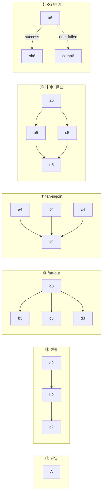

| # | 토폴로지 | 정의 | 자연 레벨 | Informatica 실현 | Airflow/NiFi 실현 | 실패·재시작 거동 |
|---|---|---|---|---|---|---|
| **1** | 단일(Singleton) | 선후행 없는 단일 실행 | L1/L2 | Session 1개 Workflow | Task 1개 DAG, `retries`/`retry_delay` | 재시도. **멱등 아니면 재시도가 중복 → §4 필수** |
| **2** | 선형 A→B→C | 앞이 끝나야 뒤 시작 | L1(체인)·L2(Asset) | 조건 없는 순차 링크 | `a>>b>>c`, 기본 `all_success` | B 실패 시 C는 `upstream_failed`. 재시작은 B부터 clear |
| **3** | fan-out A→{B,C,D} | 1선행→N후행 병렬 | L1(1소스 N타깃 복제), L2(1추출 N집계) | 한 태스크에서 여러 링크 | `a>>[b,c,d]`. 실동시성=`max_active_tasks`·pool·executor 상한 | 가지 독립. 실패 가지만 clear |
| **4** | fan-in/join {A,B,C}→D | N선행 모두(또는 일부)→후행 | **L2** | AND 시맨틱 링크 수렴 | 같은 DAG `[a,b,c]>>d` + 트리거룰. **DAG간: Asset AND `schedule=(a&b&c)`** | `all_success` 조인은 하나만 실패해도 D 막힘 → "핵심 AND+부가 OR". Asset 조인은 재시작 친화 |
| **5** | 다이아몬드 A→{B,C}→D | fan-out 후 fan-in | L1 | 자연 표현 | `a>>[b,c]; [b,c]>>d` | 조인점 D는 **`none_failed_min_one_success`**(skip 전파 방지) |
| **6** | 조건분기(성공→B, 실패→C) | 결과/값 따라 경로 | L1(failure 라우팅), L2 | 링크 조건 + Decision | 값기반=`@task.branch`; **성공/실패 기반=trigger_rule**(C에 `one_failed`) | 브랜치 하류 조인은 `none_failed_min_one_success` |
| **7** | 병렬+순차 혼합 | 일부 순차·일부 병렬 | L1×N + L2 TaskGroup | worklet 계층 조합 | TaskGroup + `[g_a,g_b]>>finalize` | 그룹 단위 clear로 부분 재시작 |
| **8** | 서브워크플로우 재사용(worklet) | 공통 로직 재사용 | L1(Parameter Context), L2(팩토리) | 재사용 worklet | `def build_group(cfg)->TaskGroup`(SubDAG 폐지) | 인스턴스별 멱등키(`update_keys`/파티션) 분리 필수 |
| **9** | 워크플로우→워크플로우 체이닝 | WF1 완료→WF2 시작 | **L2/L3** | pmcmd / Event-Raise-Wait | **Asset(권장): WF1 `outlets=[Asset]`, WF2 `schedule=[Asset]`**. 대안 `TriggerDagRunOperator`/`ExternalTaskSensor(deferrable)` | **Asset이 가장 안전** — WF1 몇 번 재시작하든 마지막 success에만 outlet → WF2 자동 트리거 |
| **10** | 데이터/이벤트 구동 | 시각 아닌 이벤트로 시작 | L1(폴링), L2(Asset/센서) | Event-Wait 파일와치 | Asset 업데이트 구동 `(a\|(b&c))`, `AssetWatcher`/`FileSensor`. NiFi `ListFile`(1분 폴링)·`QueryDatabaseTable`(워터마크) | Asset은 success 태스크만 갱신 → 오탐 적음. 외부 큐는 at-least-once → 소비자 멱등 필수 |
| **11** | 데이터셋 반복(N테이블) | 같은 처리 N회, 런타임까지 N 미상 가능 | L1(GenerateTableFetch), **L2 expand** | 파라미터 파일 반복 | **Dynamic Task Mapping** `process.expand(x=list)` | 매핑 인스턴스별 독립 재시도(200개 중 3개만 clear). 안정 정렬 필수 |

**핵심 규약 2가지**:
1. **잡 간 순서는 시각이 아니라 완료 이벤트(Asset)로**(원칙 C). `verify_target_db_landing` 성공→Asset 발행 인프라가 이미 있음(`nifi_pipelines_dynamic.py:671` `outlets=target_outlets`).
2. **조인점 트리거룰**: 브랜치/다이아몬드 하류 조인은 항상 `none_failed_min_one_success`. "무조건 실행되는 정리/정지"는 `all_done`(현행 `stop_after_run`이 line 687에서 이미 사용).

> **BranchPythonOperator 함정**(연구2 §2): 분기 뒤 조인 태스크에 기본 `all_success`를 두면 안 탄 분기가 skipped라 스킵이 하류로 전파돼 조인도 스킵된다. 반드시 `none_failed_min_one_success`. Airflow 3.x 신설 트리거룰: `all_done_min_one_success`, `all_done_setup_success`.

---

## 4. NiFi 트랜잭션 & 실패감지 심층분석 (연구3/4) + 명시적 완료 신호 프로토콜

**이 절이 사용자 질문("각 JOB이 트랜잭션 처리 가능한가")의 정곡이다.**

### 4.1 결론 요약 (TL;DR)

| 범위 | 트랜잭션 보장 | 원복(rollback) | 재실행(멱등) |
|---|---|---|---|
| **프로세서 1개 내부**(PutSQL/PutDatabaseRecord 한 개) | **가능** — ProcessSession + JDBC 트랜잭션 | **가능**(자기 배치 한정) | 프로세서 단독으론 무관 |
| **JOB=체인 전체**(trigger→extract→truncate→load→DW) | **불가능** — 프로세서 간 분산 트랜잭션 미제공 | **불가능** — 앞 프로세서 커밋은 뒤 실패로 원복 안 됨 | **설계로만 확보**(truncate-load/UPSERT) |
| **현재 설정(실측)** | 각 프로세서 `rollback-on-failure=false` + `failure/retry` 자동종료(폐기) | 체인 원복 없음, 실패 FlowFile 조용히 폐기 | truncate-load/UPSERT라 재실행은 안전한 편 |

**핵심 3줄**:
1. "각 JOB이 하나의 트랜잭션으로 원복된다"는 **성립하지 않는다.** 트랜잭션 경계는 프로세서 1개의 `onTrigger` 세션. truncate와 load는 별개 프로세서 → 별개 트랜잭션 → 각자 독립 커밋. truncate 커밋 후 load 실패 시 **테이블이 비워진 채 남는다.**
2. "다시 돌려도 문제없나"는 **대체로 예(YES)** — truncate-load/UPSERT가 멱등이라 실패로 비어도 재실행하면 복구. INSERT 전용만 중복.
3. 현재는 **"오류를 원복하는" 게 아니라 "폐기 후 재실행에 의존하는" 모델.**

### 4.2 이 프로젝트에서 실제로 확인된 설정 (실측 표본, 연구3)

`nifi/flow-exports/20260814/{DZ,DW,DZ_UPSERT,...}.json` 파싱 결과, **모든 SQL 기록 프로세서가 동일 패턴**:

```
PutSQL (truncate 단계, 예: truncate-dz-POP003L)
  putsql-sql-statement           = TRUNCATE TABLE dz_pop003l
  rollback-on-failure            = false      ← 실패해도 원복/재시도 안 함
  database-session-autocommit    = false      ← 자기 배치는 JDBC 트랜잭션으로 감쌈
  Support Fragmented Transactions= false      ← 다중 FlowFile 원자화 안 함
  autoTerminatedRelationships    = [failure, retry]   ← 실패 FlowFile "조용히 폐기"

PutDatabaseRecord (load 단계, 예: load-dz-COM001M)
  rollback-on-failure         = false
  database-session-autocommit = false
  put-db-record-statement-type= INSERT   (DZ_UPSERT 그룹만 UPSERT)
  put-db-record-max-batch-size= 1000
  autoTerminatedRelationships = [failure, retry]   ← 여기도 폐기

DBCPConnectionPool
  Max Total Connections = 8,  Max Wait Time = 500 millis,  Validation-query = (없음) ← stale 위험
```

- **트리거**: `GenerateFlowFile`의 `schedulingPeriod=3650days` = 사실상 1회성. STOPPED→RUNNING 순간 1회 발화. Airflow가 start→대기→stop으로 "배치 1회"를 흉내.
- **체인**: `trigger-dz → extract-tb → truncate-dz → load-dz → OUTPUT_PORT → DW 그룹`. **하나의 JOB이 DZ·DW 두 프로세스그룹에 걸침.**
- **Wait/Notify/InvokeHTTP/MonitorActivity 프로세서 전무** → 명시적 완료 신호 없음.

### 4.3 왜 원자적이지 않은가 + 실측 사고

프로세서 1개 = 트랜잭션 1개(NiFi Developer's Guide: *"All methods that are called on a ProcessSession happen as a transaction"*, *"Each Processor's state is stored in isolation from other Processors' state"*). `database-session-autocommit=false`라 프로세서 1개 안에서는 진짜 DB 트랜잭션이 성립(실패 시 그 배치 롤백). **그러나 truncate와 load는 별개 세션·별개 커넥션이라 이를 묶는 상위 트랜잭션이 없다.**

`Rollback On Failure`의 정확한 의미(NIFI-3415): **체인 원복이 아니라 프로세서 재시도 정책.** `true`여도 *그 프로세서*의 세션/배치만 롤백, 앞 truncate 커밋은 못 되돌림. 무한 재시도 루프 위험(Yield Duration 필수).

**실측 사고(코드 주석 기록, `nifi_pipelines_dynamic.py`의 `_fail_if_errors` 주석)**:
> *"'큐 0 + 활성 스레드 0'만으로 완료를 판정하면 실패도 완료로 보인다 — failure 관계가 자동종료(폐기)라 실패한 FlowFile이 큐에 안 남기 때문이다. 원천 Oracle이 안 떠 있어 추출이 전부 실패한 날, **truncate만 먼저 커밋돼 DZ 5개 테이블이 통째로 비었는데도 DAG는 초록불로 끝났다(2026-07-29).**"*

**TRUNCATE 자체의 DB별 함정**: Oracle `TRUNCATE`는 DDL → 암묵 COMMIT, ROLLBACK 불가. PostgreSQL `TRUNCATE`는 트랜잭션 내 롤백 가능(MVCC/WAL) — 단 현재는 truncate와 load가 별개 트랜잭션이라 이 이점을 못 씀.

### 4.4 처방 — 원자성 지점 축소 + 멱등 재실행 (세 설계안 공통 채택)

**(A) 스테이징 + 원자적 swap (표준, 가장 견고)** — `load`를 실테이블이 아닌 `*_stg`에 적재 → 성공 확인 후 **단일 DDL/트랜잭션으로 교체**:

```mermaid
sequenceDiagram
    participant AF as Airflow (job task)
    participant NF as NiFi 체인
    participant DZ as dz_*_stg (스테이징)
    participant TB as 실테이블 dz_*
    AF->>NF: start (RUNNING)
    NF->>DZ: 1) TRUNCATE staging (독립, 실테이블 무영향)
    NF->>DZ: 2) extract→load into staging (배치 트랜잭션)
    NF->>NF: 3) 완료 확인 (§4.6 콜백)
    NF->>TB: 4) 단일 트랜잭션 SWAP<br/>BEGIN; TRUNCATE dz_*; INSERT dz_* SELECT * FROM dz_*_stg; COMMIT;
    Note over TB: 실패해도 dz_*는 이전 상태 유지 (원자적)
```

- Postgres 타깃: `BEGIN; TRUNCATE real; INSERT INTO real SELECT * FROM staging; COMMIT;` 또는 파티션/테이블 `RENAME`. → "비우기+채우기"가 한 트랜잭션에 들어가 실패해도 실테이블은 이전 상태. **2026-07-29류 구멍을 근본 폐쇄.**
- Oracle 타깃: TRUNCATE 암묵 커밋이라 swap을 `ALTER TABLE ... EXCHANGE PARTITION` 또는 `DELETE`+`INSERT` 단일 트랜잭션으로 대체. → 엔진별 swap 전략을 메타(`load_pattern`)에 명시.

**(B) 멱등 재실행 (재실행이 곧 복구)**:

| 적재 모드 | 재실행 결과 | 판정 | recovery_strategy |
|---|---|---|---|
| **staging-swap / truncate-load** | 전량 재적재 | ✅ 멱등 | `RESTART`(현 기본과 일치·정당) |
| **UPSERT/MERGE**(`update_keys`) | PK 병합 | ✅ 멱등 | `RESTART` |
| **INSERT 전용**(http-ingest/logfile) | 누적 중복 | ⚠️ | `RESTART` + `ON CONFLICT`/유니크 제약 **필수** |
| **watermark 증분** | 상태컬럼 이후만 | ✅(경계중복은 UPSERT 흡수) | `RESUME`(별도 트랙, ETL 범위 밖) |

**(C) 관측 보존**: `failure/retry` 자동종료 **해제** → `*_err` 테이블/reject 큐로 라우팅(PMERR 상당) + `Rollback On Failure=true`(Yield 필수). 조용한 유실 차단.

**(추가) 컴포넌트별 함정**:
- **DBCP 견고화**: `Validation-query=SELECT 1`(stale 감지), `Max Wait Time`(현 500ms) 재검토, `Max Total Connections=8`을 체인 동시실행 수와 맞춤.
- **UPSERT 검증 사각**: UPSERT가 UPDATE만 하면 신규 INSERT 0 → 타임스탬프 기반 `verify_target_db_landing`이 적재를 놓칠 수 있음(주석 명시) → 콜백의 `step_metrics`(실제 처리행)로 보강.

### 4.5 실패 감지 — 컴포넌트별 (연구3·4)

| 메커니즘 | 근거 | 한계 |
|---|---|---|
| **failure/retry 관계** | 현재 **자동종료(폐기)** | 실패가 큐에 안 남아 **사후 추적 불가** — 조용한 유실의 근원 |
| **Bulletin Board**(`/nifi-api/flow/bulletin-board`) | 백엔드 `NifiClient.getBulletins(afterId)`, DAG `_collect_new_bulletins` | **~5분 링버퍼**. 폴링 길면 유실. 재시작 시 id 1부터 재사용 → 수집기가 별도 테이블로 이관 |
| **컴포넌트 상태 집계**(`runningCount/invalidCount`) | DAG `verify_process_group_action` | invalid 프로세서 감지엔 유효, 런타임 데이터 실패엔 무력 |
| **Back-pressure**(objectThreshold 10k/1GB) | DAG 주석 실측 | 하류 미가동 시 체인 정지(DZ만 켜고 DW 안 켜면 to-dw 큐 1GB→DZ 40개 프로세서 전체 정지). "실패"와 "정체" 구분 필요 |
| **Counters**("INSERT updates performed") | `pipeline-api` 60초 조회 | 재시작 전까지 누적 → baseline 차감 필요. FlowFile 수 ≠ 행수 |
| **Provenance / Status History** | — | **기각**: 인덱스 rollover 기본 10분이라 방금 이벤트 최대 10분 미검색(20초 후 0건). Status History 항상 빈 응답 |

이 프로젝트의 **핵심 방어선**: `_fail_if_errors`가 대기 중 ERROR bulletin을 하나라도 보면 태스크 실패 처리 — 트랜잭션이 아니라 **탐지형 보상 통제**(5분 창 안에 못 잡으면 놓침).

### 4.6 명시적 완료 신호 프로토콜 (요구 7) — 세 설계안 공통 골격

NiFi엔 native "done"이 없다(Cloudera: *"There is not really the notion of 'completed' in NiFi since it is a streaming approach with no a priori knowledge of a start and end."*).

**현재 방식(불신뢰)** — `wait_for_group_completion`(line 334): `queuedCount==0 && activeThreadCount==0`이 **연속 3회(`IDLE_SETTLE_CHECKS=3`, line 99·408)** + 최소 1회 활동 관측 후 완료 판정, grace 180s, timeout 7200s. **불신뢰 근거**: (a) 시작 직후 0/0 오판, (b) 프로세서 전환 순간 0, (c) **실패도 0/0으로 수렴** → 4.3 사고. **완료 판정과 성공 판정이 분리 안 됨.**

**처방 — 터미널 콜백 계약**: 체인 끝에 **터미널 `InvokeHTTP`**를 두어 NiFi가 "끝났다"를 명시적으로 선언. 성공 경로와 `failure` 경로에 각각 별도 콜백.

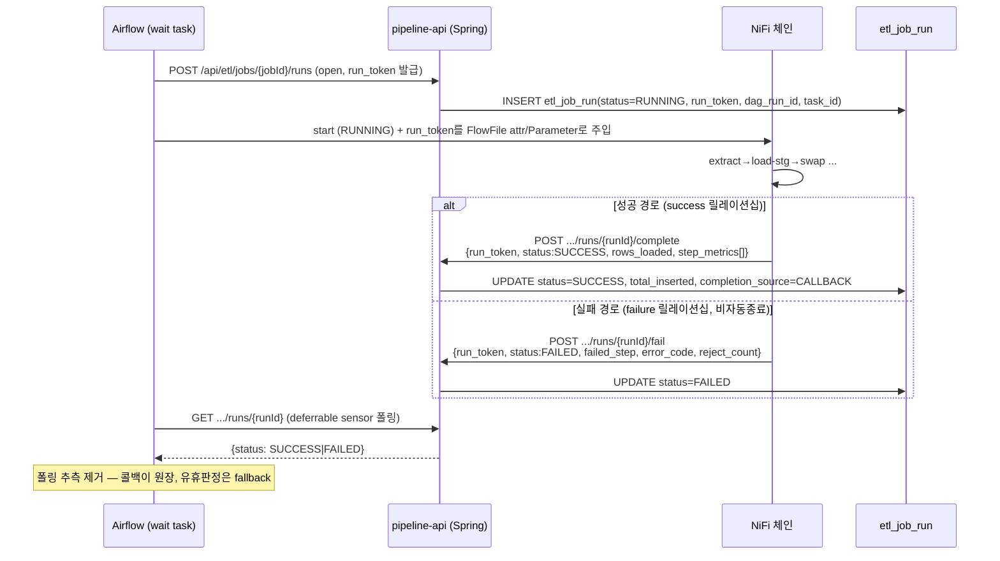

**계약 규칙(공통)**:
1. **멱등**: `idempotency_key`(또는 `run_token`)로 중복 콜백(NiFi 재시도) 무시 — 같은 키 재수신 시 200 + 기존 상태.
2. **인증**: `run_token`(1회성 nonce) 검증으로 임의 호출 차단. pipeline-api 경유라 감사 로그에 남음.
3. **터미널 보장**: 성공/실패 **양 경로 모두** 반드시 콜백. 어느 경로로도 콜백이 안 오면 timeout(7200s) fallback으로 FAILED(미결/실패, 성공 아님).
4. **NiFi 규약**: 터미널 InvokeHTTP `Remote URL=${etl.callback_base}/api/etl/jobs/${job.id}/runs/${runId}/complete`, retry 릴레이션십 재시도, 최종 실패 시 bulletin(관측 보루). run_token은 시작 시 attribute/Parameter로 주입.
5. **Airflow 대기 = deferrable sensor**(Triggerer 오프로드, 워커 슬롯 미점유)로 `GET /runs/{runId}` 폴링 → `wait_for_group_completion`의 추측을 대체, 콜백 미수신 시에만 유휴 폴링을 **fallback**으로.

> **효과**: 완료를 **선언**으로 바꿔 "빈 테이블인데 초록불"(4.3)을 원천 제거. **완료(터미널 도달)와 성공(건수·검증 통과)을 별도 신호로 분리.** 부수효과로 `etl_job_run.airflow_dag_run_id`(V18 미채움)를 채워 "누가 이 실행을 지시했나" 완결.

### 4.7 현행 코드에서 EXISTS / MISSING (연구4)

| 타깃 설계 요소 | 상태 | 근거/비고 |
|---|---|---|
| 중첩 그룹 **트리 재귀 조회** | **EXISTS** | `NifiProcessGroupTreeService.toNode` 재귀, `NifiJobMirrorService.collectInto` 재귀 |
| 중첩 그룹을 **개별 잡/DAG로 승격** | **MISSING** | DAG 열거는 root 직하 PG만(재귀 없음). 미러도 잡=최상위 PG, 하위 그룹은 스텝으로 흡수 |
| 하위 그룹 단위 **개별 스케줄** | **MISSING** | Variable 스케줄 키가 `nifi_pipeline_{최상위pgid8}_control` 단위 |
| 잡 **내부** 그래프(`etl_job_link`) | **EXISTS** | job_id 종속, from/to/relationships. `AlertEngine.chainByProcessor`가 실사용 |
| **잡 간(워크플로) 엣지** 저장·구동 | **MISSING** | `etl_job_link`는 프로세서 id 기반+job_id 종속 → 잡↔잡 의존 테이블 없음. 현재 "잡 간"은 NiFi 출력포트→DAG 체인(캔버스 의존) |
| ETL 체인 템플릿(Initial/Incremental/truncate_initial) | **EXISTS** | `Template.json` 3그룹 + `createInitialDbToDbFlow` snippet 복제 |
| 잡 템플릿 기반 신규 잡 생성 API | **EXISTS** | `POST /api/nifi/etl/initial-db-to-db`(INSERT/TRUNCATE/UPSERT) |
| 백엔드에서 PG **start/stop** | **MISSING** | 백엔드엔 없음. **오직 Airflow DAG**가 `PUT flow/process-groups {state}` |
| 백엔드 status/bulletins/counters/tree | **EXISTS** | NifiClient 전반 |
| 잡 실행 이력(`etl_job_run`) | **EXISTS(관측)** | 15초 폴링 관측, `trigger_source=OBSERVED` |
| DagRun ↔ 잡 실행 **매칭** | **MISSING** | `etl_job_run.airflow_dag_run_id` 컬럼만 존재, 미채움 |
| 신뢰성 있는 완료/실패 감지 | **부분 EXISTS** | 관측+ERROR bulletin. 한계: 폴링 15s, bulletin 5분 링버퍼, failure 자동종료 오판 |
| 잡 정의 **DB→NiFi 역푸시** | **MISSING** | `etl_job_param.sync_direction`만 미리 둠(전부 FROM_NIFI, 읽기전용) |

**핵심 갭 3가지**: ① 잡 경계가 root 직하 PG로 고정, ② 잡 간 워크플로 엣지 저장소 부재, ③ DagRun↔실행 매칭 미완. (조회 재귀는 이미 있으므로 **경계 결정 로직만** 손보면 됨.)

---

## 5. 계층 → DAG 매핑 — DAG 경계는 중간 그룹

### 5.1 세 후보 경계와 판정 (연구5 §4)

| 후보 | DAG 경계 | 판정 |
|---|---|---|
| (a) 잡(=체인 하나)마다 DAG | leaf job | ✗ 너무 잘음 — 수십~수백 DAG + 크로스-DAG 의존 폭발, 스케줄·SLA 관리 불가 |
| **(b) 중간 그룹(IMP_DAILY 등)마다 DAG** | 중간 그룹 | **✓ 정답** — 독립 주기·독립 재시작·독립 SLA를 가진 자연 단위 |
| (c) 루트 전체 하나의 DAG | 루트 | ✗ 너무 큼 — 일배치·월배치가 한 DAG에 섞여 독립 스케줄 불가 |

### 5.2 왜 (b)가 정답인가 — 원칙 B 4문 적용

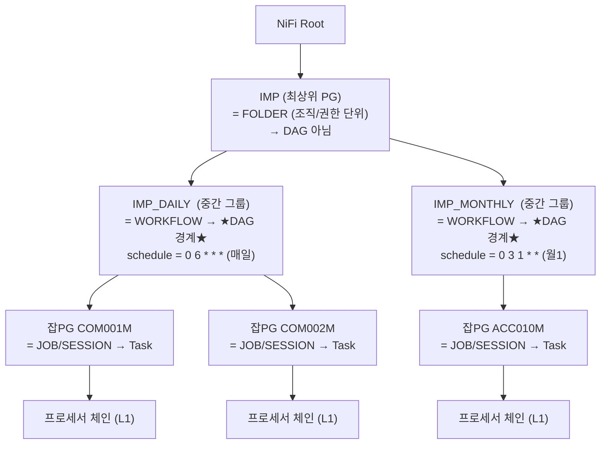

- **독립 주기**: `IMP_DAILY`는 매일, `IMP_MONTHLY`는 매월. **주기가 다른 것을 한 DAG에 담으면 schedule을 하나만 걸 수 있어 모순**(원칙 B-1). 주기 경계 = DAG 경계.
- **함께 실패/재시작**: 일배치 안 여러 테이블은 "그날 마감" 운명공동체 → 함께 재시작 자연스러움(B-2). 일↔월은 함께 재시작할 이유 없음.
- **하나의 SLA**: "일배치 07:00까지"처럼 그룹 단위가 실무 관리 단위(B-3).
- **Informatica 대응**: IMP_DAILY/IMP_MONTHLY는 전형적으로 **스케줄 보유 Workflow(folder 하위)**, 그 안 테이블별 세션/worklet은 스케줄 없는 재사용 단위 → **워크플로우→DAG, 세션/worklet→태스크(TaskGroup/매핑)로 1:1 대응.** "중간 그룹=DAG"는 이 계층을 그대로 보존한다.

### 5.3 job = 그룹 내 체인은 DAG 안에서 어떻게 실현되나

- **동형 잡 N개(의존 없음)** → **Dynamic Task Mapping** `run_job.expand(job=jobs_of_workflow())`. 부분 실패 격리 우수(200개 중 3개 실패 → 3개만 clear).
- **의존 있는 잡** → 잡간 의존 테이블을 읽어 **TaskGroup + `>>`**로 그룹 내 순서.
- **스케줄은 workflow(DAG) 하나가, 실행 반복/순서는 그 안의 task가** 책임 → 스케줄 소스 단일화(원칙 A).

### 5.4 현행 대비 변경점

현행 `nifi_pipelines_dynamic.py`는 `_flow["flow"]["processGroups"]`(루트 직하)만 열거해 **최상위 PG=DAG**(재귀 없음, `dag_id=f"nifi_pipeline_{pg_id[:8]}_control"` line 579). 이 설계는 팩토리를 **한 계층 더 내려가** "중간 그룹"을 DAG 경계로 삼는다. 조회 자체는 이미 재귀 지원(`NifiProcessGroupTreeService`, `NifiJobMirrorService`) — **경계 결정 로직만** 변경. (세 설계안이 "경계를 어떻게 선언·구동하는가"에서 갈린다: A=metaDB 순회, B=선언 등록/태그, C=published spec.)

---

## 6. 설계안 A / B / C (각각 온전한 장)

> 세 안은 §1~§5의 공통 배경(Informatica 벤치마크, 토폴로지, NiFi 트랜잭션 이론·완료 콜백 골격, 중간그룹=DAG)을 공유한다. 각 Part는 그 공통 위에서 **"이 안만의 선택"**(원장 위치, 경계 구동 방식, 객체모델 형태, 스키마·REST, 마이그레이션 순서)에 집중한다. 공통부는 반복하지 않고 §참조로 가리킨다.

---

### Part A — 제어평면형 (metaDB를 오케스트레이션 원장으로 승격)

**철학**: Informatica 리포지토리가 mapping/session/workflow/worklet/link/scheduler를 **메타DB에 정의**하고 Integration Service가 실행하듯, 잡·워크플로우·의존성·스케줄을 **Postgres 메타DB(`etl_*`)에 1급 정의**로 두고 거기서 **Airflow DAG를 자동 생성(팩토리)**한다. NiFi 캔버스는 "mapping+session의 물리 실행체"로 남지만 **오케스트레이션 원장은 메타DB로 승격**한다. 현재는 캔버스가 원장이고 메타DB가 5분 읽기전용 사본(`V17` 주석)인 방향을 **반대로 뒤집는 것**이 골자.

#### A.1 객체 모델 — 5계층, Informatica 1:1

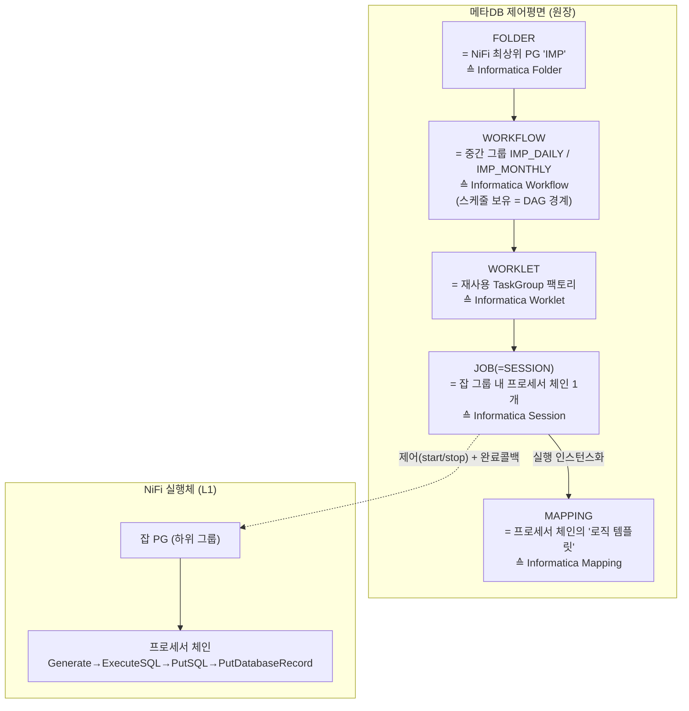

| Informatica | A의 객체 | 물리 실현 | 메타 테이블 |
|---|---|---|---|
| Repository | 제어평면 전체 | Postgres 메타DB | `etl_*` 전체 |
| **Folder** | `etl_folder`(신규) | NiFi 최상위 PG(IMP) | `etl_folder` |
| **Workflow** | `etl_workflow`(신규) | **중간그룹 = 스케줄·SLA·재시작 경계 = DAG 1개** | `etl_workflow` |
| **Worklet** | 재사용 TaskGroup | `@task_group` 팩토리 + Parameter Context | `etl_worklet_ref` |
| **Mapping** | `etl_mapping`(신규) | Template.json의 Initial/Incremental/truncate_initial 로직 템플릿 | `etl_mapping` |
| **Session** | **job**=`etl_job`(기존) | 잡 그룹 내 체인 = Airflow Task/TaskGroup | `etl_job`+`etl_job_step` |
| **Link(조건부)** | 잡간=`etl_job_dependency`(신규), 잡내=`etl_job_link`(기존) | `>>`+`trigger_rule` / NiFi 릴레이션십 | 두 테이블 |
| **Scheduler(재사용)** | `etl_workflow.schedule_cron`(단일 소스) | DAG `schedule=` | `etl_workflow`+`etl_schedule` |

**Mapping↔Session 분리(A의 핵심)**: 현재 NiFi PG에 로직+실행설정이 뭉쳐 있어 재사용하려면 PG 복제 필요(§1.9). A는 **Mapping**(Template.json 재사용 그룹 = 로직 골격)과 **Session=job**(그 mapping의 실행 인스턴스: DBCP id, `schema.table`, `update_keys`, Parameter Context 바인딩)을 분리. `createInitialDbToDbFlow`(snippet 복제+프로퍼티 치환)가 이미 "mapping 1개 → session N개" 엔진이며, A는 그 호출을 **메타DB 정의로부터 구동**. `etl_job.mapping_id`로 "이 잡은 어느 로직 템플릿의 인스턴스인가" 표현 → COM001M/COM002M류 동형 잡 = mapping 1개 + job N개.

#### A.2 계층 → DAG 생성 (metaDB 순회 팩토리)

DAG 경계 = 중간 그룹(§5). A는 팩토리의 **top-level 조회를 NiFi → metaDB로 전환**:

```python
# 모듈 top-level: 파싱마다 메타DB(원장) 조회 → workflow 1개 = DAG 1개
for wf in fetch_workflows_from_metadb():          # etl_workflow WHERE enabled
    globals()[f"etl_wf_{wf.id}_dag"] = build_workflow_dag(wf)

def build_workflow_dag(wf):
    with DAG(dag_id=f"etl_wf_{wf.id}",             # 불변 id 기반 (이름 변경에도 이력 유지)
             dag_display_name=wf.display_name,
             schedule=wf.schedule_cron,            # 메타DB 단일 소스
             catchup=False, max_active_runs=1,
             params={"action": Param("start", enum=ACTIONS)}) as dag:
        jobs = fetch_jobs(wf.id)                   # etl_job WHERE workflow_id=wf.id
        deps = fetch_job_deps(wf.id)               # etl_job_dependency
        tasks = {j.id: build_job_taskgroup(j) for j in jobs}
        wire_dependencies(tasks, deps)             # etl_job_dependency → >> + trigger_rule
    return dag
```

- **부수 이득**: top-level 조회가 NiFi가 아니라 메타DB라 **파싱 안정성 대폭 개선**(현행은 NiFi 죽으면 파싱 실패 → Variable 캐시로 방어; 메타DB는 항상 응답).

#### A.3 토폴로지 지원

§3 카탈로그를 그대로 실현하되 **잡 간 엣지를 `etl_job_dependency`에 저장**하고 `trigger_rule`로 매핑(SUCCESS=`all_success`, COMPLETED=`all_done`, FAILED=`one_failed`, JOIN=`none_failed_min_one_success`). 값기반 분기는 `condition_expr`+`@task.branch`. 워크플로우 체이닝은 Asset(§3-9). 반복은 `.expand`(§3-11).

#### A.4 트랜잭션·완료신호·실패감지·재시작

§4를 그대로 채택. 추가로 A는 메타에 **`recovery_strategy`·`error_threshold`·`staging_table`**을 명문화하고, 완료 콜백을 `etl_job_run.run_token`/`idempotency_key`/`completion_source`로 계약화(§A.5 스키마). 실패 감지 3층(컴포넌트=`*_err`+Stop on Errors 임계치 / 잡=콜백·`etl_job_run.status` / 워크플로우=task 상태·`on_failure_callback`→AlertEngine·Deadline Alerts). 재시작은 `clearTaskInstances(include_downstream)`(이미 구현, `platform.ts:439-445`) + DagRun↔run 매칭 완성.

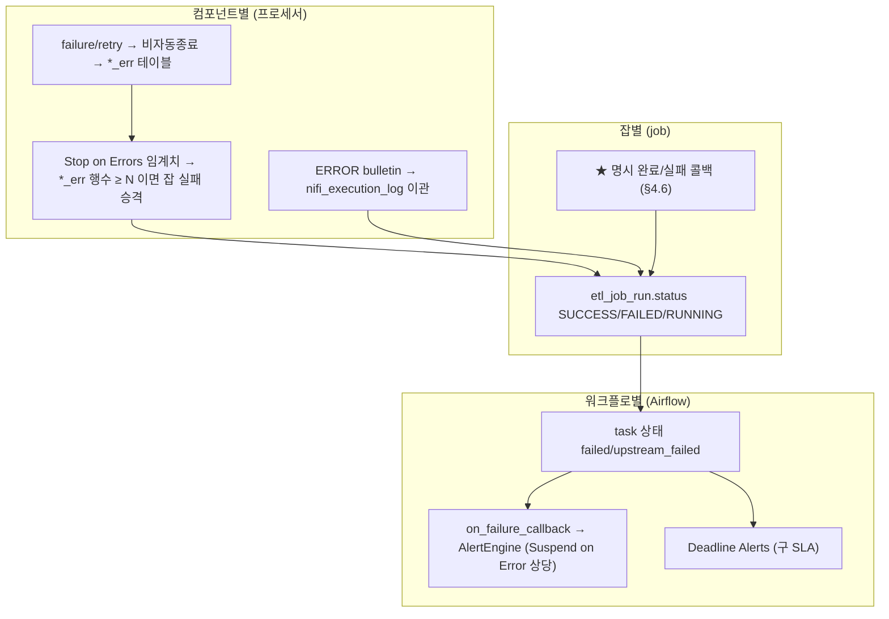

#### A.5 메타 스키마 변경 (신규 마이그레이션 V55~V59)

```sql
-- V55: 계층 승격 — folder / workflow / mapping
CREATE TABLE etl_folder (
    id BIGSERIAL PRIMARY KEY,
    nifi_pg_id VARCHAR(100) NOT NULL UNIQUE,   -- IMP
    folder_name VARCHAR(200) NOT NULL,
    deleted_at TIMESTAMP);

CREATE TABLE etl_workflow (
    id BIGSERIAL PRIMARY KEY,
    folder_id BIGINT NOT NULL REFERENCES etl_folder(id),
    nifi_pg_id VARCHAR(100) NOT NULL UNIQUE,   -- IMP_DAILY / IMP_MONTHLY
    workflow_name VARCHAR(200) NOT NULL,
    display_name VARCHAR(200) NOT NULL,
    airflow_dag_id VARCHAR(200) NOT NULL,      -- etl_wf_{id} (불변)
    schedule_cron VARCHAR(120),                -- ★ 스케줄 단일 소스 (NULL=수동)
    schedule_id BIGINT,                        -- 재사용 스케줄(선택)
    max_active_runs INTEGER NOT NULL DEFAULT 1,
    enabled BOOLEAN NOT NULL DEFAULT true,
    deleted_at TIMESTAMP);

CREATE TABLE etl_mapping (
    id BIGSERIAL PRIMARY KEY,
    mapping_type VARCHAR(30) NOT NULL,          -- INITIAL / INCREMENTAL / TRUNCATE_INITIAL
    template_group_name VARCHAR(200) NOT NULL,  -- Template.json 하위그룹명
    statement_type VARCHAR(30),                 -- INSERT/UPSERT/TRUNCATE
    description TEXT);

-- V56: etl_job 을 workflow/mapping 에 귀속 + 복구전략 + 오류임계치
ALTER TABLE etl_job ADD COLUMN workflow_id BIGINT REFERENCES etl_workflow(id);
ALTER TABLE etl_job ADD COLUMN mapping_id  BIGINT REFERENCES etl_mapping(id);
ALTER TABLE etl_job ADD COLUMN recovery_strategy VARCHAR(20) NOT NULL DEFAULT 'RESTART'; -- RESTART/FAIL_CONTINUE/RESUME
ALTER TABLE etl_job ADD COLUMN error_threshold INTEGER NOT NULL DEFAULT 0;  -- Stop on Errors (0=무한허용)
ALTER TABLE etl_job ADD COLUMN staging_table VARCHAR(200);  -- 스테이징 swap 대상

-- V57: ★ 잡 간(워크플로) 의존 — 현재 완전 부재. Informatica 조건부 링크 대응
CREATE TABLE etl_job_dependency (
    id BIGSERIAL PRIMARY KEY,
    workflow_id   BIGINT NOT NULL REFERENCES etl_workflow(id),
    from_job_id   BIGINT NOT NULL REFERENCES etl_job(id),
    to_job_id     BIGINT NOT NULL REFERENCES etl_job(id),
    trigger_rule  VARCHAR(40) NOT NULL DEFAULT 'all_success',
        -- all_success / all_done / one_failed / none_failed_min_one_success ...
    condition_expr TEXT,           -- 값기반 분기(@task.branch)용, 선택
    edge_kind VARCHAR(20) NOT NULL DEFAULT 'SEQUENCE',  -- SEQUENCE/FANOUT/JOIN/BRANCH/COMPENSATION
    CONSTRAINT uq_job_dep UNIQUE (from_job_id, to_job_id),
    CONSTRAINT ck_no_self CHECK (from_job_id <> to_job_id));
CREATE INDEX idx_job_dep_wf ON etl_job_dependency(workflow_id);

-- V58: 완료 콜백 계약 — run_token + 명시 완료
ALTER TABLE etl_job_run ADD COLUMN run_token VARCHAR(64);
ALTER TABLE etl_job_run ADD COLUMN idempotency_key VARCHAR(200);
ALTER TABLE etl_job_run ADD COLUMN completion_source VARCHAR(20) NOT NULL DEFAULT 'OBSERVED';
    -- CALLBACK(명시) / OBSERVED(유휴폴링 fallback)
CREATE UNIQUE INDEX uq_job_run_idem ON etl_job_run(idempotency_key) WHERE idempotency_key IS NOT NULL;
-- airflow_dag_run_id 는 이미 존재(V18) — 완료 콜백이 채운다

-- V59: reject/에러로그 (PMERR 상당) — 행단위 관찰가능성
CREATE TABLE etl_job_reject (
    id BIGSERIAL PRIMARY KEY,
    job_run_id BIGINT REFERENCES etl_job_run(id),
    step_id BIGINT REFERENCES etl_job_step(id),
    error_code VARCHAR(60), error_message TEXT,
    payload JSONB, occurred_at TIMESTAMP NOT NULL DEFAULT now());
CREATE INDEX idx_reject_run ON etl_job_reject(job_run_id);
```

#### A.6 REST 엔드포인트

| 메서드/경로 | 상태 | 용도 |
|---|---|---|
| `POST /api/etl/jobs/{jobId}/runs` | 신규 | run 개시, `run_token` 발급 |
| `POST /api/etl/jobs/{jobId}/runs/{runId}/complete` | 신규 | 완료 콜백(§4.6) |
| `POST /api/etl/jobs/{jobId}/runs/{runId}/fail` | 신규 | 실패 콜백 |
| `POST /api/etl/jobs/{jobId}/reject` | 신규 | 행단위 reject 적재 |
| `GET /api/etl/workflows`, `POST /api/etl/workflows/{id}/schedule` | 신규 | workflow·스케줄 관리(단일 소스) |
| `POST /api/etl/workflows/{id}/run` | 신규 | 수동 트리거(감사 경유) |
| `POST /api/etl/dags/{dagId}/dagRuns/{runId}/clearFrom` | 신규(래핑) | `clearTaskInstances` 백엔드 래핑 → DagRun↔run 매칭·감사. 프론트 `retryAirflowTaskFrom`이 이 경유로 전환 |

> 기존 `EtlJobController`(`/api/etl/jobs`)는 읽기전용이므로 **쓰기 컨트롤러 추가**. **DagRun↔잡실행 매칭**: 완료 콜백이 `dag_run_id`를 함께 실으면 `etl_job_run.airflow_dag_run_id`를 채워 `airflow_dag_run`(V29)과 조인 완성.

#### A.7 NiFi 규약 / Airflow 구성

- **NiFi**: ① 최상위 PG=folder, 직하=workflow(주기 기준 그룹핑), 그 안=잡. ② 모든 잡 체인 끝에 성공/실패 InvokeHTTP 2개. ③ truncate-load 잡은 `load→staging` 후 단일 PutSQL swap. ④ `failure/retry` 비자동종료 → `*_err`/InvokeHTTP(`/reject`), `Rollback On Failure=true`+Yield. ⑤ `run_token` 시작 시 주입. ⑥ 프로세서 자체 스케줄 금지.
- **Airflow**: 동적 팩토리(metaDB→DAG), `@task_group` 팩토리(worklet), `.expand`(반복), `trigger_rule`(의존), `@task.branch`(분기), Assets(체이닝), `clearTaskInstances`(재개), `on_failure_callback`→AlertEngine, Deadline Alerts, Variable 캐시(파싱 방어).

#### A.8 마이그레이션 (5단계, 증분·무중단)

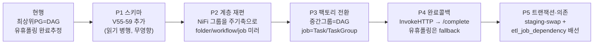

#### A.9 장단점 / 리스크

**장점**: Informatica 리포지토리 충실형(잡/워크플로/링크/스케줄이 SQL로 질의·관리되는 1급 정의); 중간그룹=DAG로 일/월 독립 스케줄·SLA·부분 재시작 자연 성립; 명시 완료콜백으로 "빈 테이블 초록불" 사고 클래스 제거; staging-swap으로 잡 원자성; 파싱 안정성↑(top-level 조회 NiFi→메타DB); Asset 배선으로 시각 결합 제거.

| 리스크 | 완화 |
|---|---|
| NiFi 그룹 재편(P2)이 캔버스 대수술 | 미러 재귀 조회 이미 있음. feature flag 병행, folder/workflow 미러를 read-only 검증 후 컷오버 |
| dag_id 전환 시 실행이력·Variable 단절 | 불변 id 기반 유지, `old↔new dag_id` 매핑 테이블로 이력 승계 |
| staging-swap 저장공간·swap 시간 | 파티션 EXCHANGE/RENAME로 최소화, staging은 잡 후 정리 |
| 완료콜백 미수신(InvokeHTTP 실패) | timeout fallback(7200s) + ERROR bulletin 보루(양다리) |
| Oracle TRUNCATE 암묵COMMIT | Postgres=트랜잭션 swap, Oracle=DELETE+INSERT/파티션 EXCHANGE |
| 메타DB 원장화 후 캔버스 드리프트 | `etl_job_snapshot` 해시로 감지, `sync_direction=TO_NIFI` 역푸시(향후) |

**A 한 줄 요약**: 오케스트레이션 원장을 캔버스에서 **메타DB로 승격**하고, **중간그룹=Workflow=DAG**를 경계로 job=Session을 Task/TaskGroup으로 내리며, 잡 원자성은 staging-swap 단일 트랜잭션, 완료는 터미널 InvokeHTTP 콜백, 잡간 순서는 `etl_job_dependency`+Asset으로 "엉키지 않는" ETL 제어평면을 Informatica 충실형으로 완성.

---

### Part B — 데이터 인식형 (Asset-driven, 안전순 이행)

**철학**: 브리핑5의 "Asset 데이터 인식형 + 트랜잭션은 DB 네이티브 staging swap"을 끝까지 밀어 **하나의 일관된 아키텍처**로 단일 결론을 낸다(선택지 나열 금지). 그리고 **마이그레이션을 안전순으로** 배치해 운영 사고 클래스를 가장 먼저 닫는다.

#### B.0 7대 결정표

| # | 결정 | Informatica 근거 | 현행 대비 |
|---|---|---|---|
| D1 | **3계층 그래프**: intra-job(NiFi)=Mapping+Session / intra-workflow(DAG)=Workflow / inter-workflow(Asset)=체이닝 | Mapping/Session/Workflow/Worklet | 현행 L1·L2만, 애매 |
| D2 | **DAG 경계 = 중간그룹**, job = 자식 PG 체인 = DAG의 task | Workflow=스케줄 소유, Session=그 안 실행 | root-직하 PG→DAG에서 한 계층 내려감 |
| D3 | **job 원자화 = staging + 단일 트랜잭션 swap**, rollback-on-failure=true, failure 비자동종료 | Target Load Order + Rollback + staging | truncate/load 2트랜잭션 → 1트랜잭션 |
| D4 | **명시적 완료 프로토콜**: 터미널 `InvokeHTTP → /complete`·`/fail` | Session success/failure email | 큐0+스레드0 추정 폐기 |
| D5 | **잡간·워크플로우간 = Asset**(outlet→schedule), 시각 오프셋 금지 | Event-Raise/Event-Wait | 캔버스 출력포트→DAG folding 의존 |
| D6 | **스케줄 단일 소스** = `etl_workflow.schedule`, NiFi 프로세서엔 크론 없음 | Reusable Scheduler | `schedule=None` 수동 전용 |
| D7 | **실패 지점 재개** = `clearTaskInstances(include_downstream)` + staging 멱등 | Recover from task | 이미 구현(`retryAirflowTaskFrom`) |

#### B.1 객체 모델 — 4계층 + **3레벨 그래프**

| Informatica | B의 객체 | 물리 실체 | 메타 저장소 |
|---|---|---|---|
| **Mapping** | 잡 템플릿(재사용 로직) | `Template.json`의 3그룹 | `etl_job_snapshot`(로직 해시)+템플릿 |
| **Session** | **잡(job)** = 인스턴스화된 자식 PG + Parameter Context | `createInitialDbToDbFlow` 결과 | `etl_job`,`etl_job_step`,`etl_job_param` |
| **Workflow** | **워크플로우** = 중간그룹 = **DAG 1개** | 중간 PG → `nifi_workflow_{pgid8}_control` | **`etl_workflow`(신설)** |
| **Worklet** | 재사용 서브플로우 = TaskGroup 팩토리 | `def build_job_group(cfg)->TaskGroup` | 코드+`etl_job_dependency` |
| **Folder** | 도메인 = 최상위 PG(IMP) | root 직하 PG | `etl_workflow.domain_pg_id` |

B는 Informatica의 Mapping/Session→Workflow→Scheduler 3분할을 **3계층 그래프**로 못박는다(A/C의 L1/L2에 L3를 명시 추가):

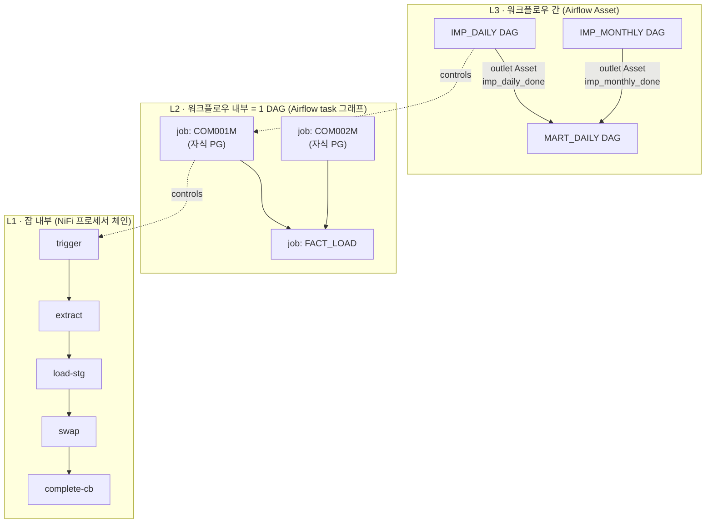

- L1 intra-job: `etl_job_step`, `etl_job_link`(잡 내부, `AlertEngine.chainByProcessor`가 실사용).
- L2 intra-workflow: 한 DAG 안 job(=자식 PG)들을 task로 엮음. 메타: **`etl_job_dependency`(신설)**.
- L3 inter-workflow: DAG 간 Asset. 메타: `etl_workflow.produces_asset_uri`.

#### B.2 DAG 경계 — **선언(declaration)**, 깊이 추론 아님

B는 경계를 코드 추론이 아니라 **선언된 사실**로 둔다(원칙 A·B 귀결). 2택(우선순위 순):
1. **메타DB 선언(권장)**: 미러가 그룹을 훑다 `etl_workflow.nifi_pg_id`에 등록된 PG를 만나면 그 PG가 DAG 경계. 운영자가 화면에서 "이 그룹을 스케줄 단위로" 지정.
2. **캔버스 규약(폴백)**: PG comment에 `@schedule-unit(cron="0 6 * * *")` 태그. 미러가 파싱해 `etl_workflow` upsert.

**job = 자식 PG 단위 제어**: 중간그룹 DAG는 그룹을 통째로 start/stop 하지 않고 **각 job(자식 PG)을 개별 start/stop 하며 완료 콜백을 받아 task로 오케스트레이션**. NiFi 2.x가 PG 단위 RUNNING/STOPPED만 지원해도 **job=자식 PG 단위로 그 API를 걸면** job별 제어가 됨(현행이 최상위 PG에 걸던 걸 자식 PG로 내림).

```python
# ── 신 팩토리 골격 (top-level) ──
workflows = fetch_workflows_from_metadb()        # etl_workflow (schedule-unit)
for wf in workflows:
    globals()[wf.airflow_dag_id] = build_workflow_dag(wf)

def build_workflow_dag(wf):
    dag_id = f"nifi_workflow_{wf.nifi_pg_id[:8]}_control"   # 불변 id 규칙 유지
    schedule = wf.schedule or Variable.get(f"{dag_id}__schedule", default_var=None)
    produces = [Asset(wf.produces_asset_uri)] if wf.produces_asset_uri else []
    upstream_assets = fetch_upstream_assets(wf)             # L3: schedule=[assetA & assetB]
    with DAG(dag_id=dag_id, schedule=(upstream_assets or schedule),
             catchup=wf.catchup, max_active_runs=wf.max_active_runs,
             deadline=deadline_from(wf.sla_minutes), ...):
        jobs = fetch_child_jobs(wf.nifi_pg_id)             # 자식 PG = job
        deps = fetch_job_dependencies(wf.id)
        tasks = {j.id: build_job_taskgroup(j, outlets=[]) for j in jobs}
        wire_by_dependency(tasks, deps)
        publish = publish_workflow_asset(outlets=produces)  # 그룹 완료 시 Asset 발행
        [t for t in tasks.values()] >> publish
```

각 job task 내부(재사용 worklet TaskGroup): `open_run → start_child_pg → await_completion(deferrable sensor) → stop_child_pg → verify`.

#### B.3 토폴로지

§3 카탈로그 채택. 부가 강조: DAG 간 join은 `schedule=(assetA & assetB & assetC)`(센서보다 워커슬롯 안 잡아 유리). 조인점 `none_failed_min_one_success`, 정리 `all_done`, 실패보상 `one_failed`.

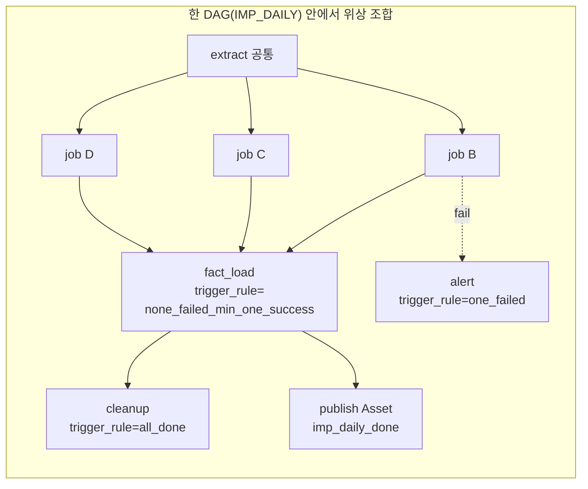

#### B.4 job 트랜잭션 — staging swap (엔진별)

§4.4 채택. 표준 job 체인:

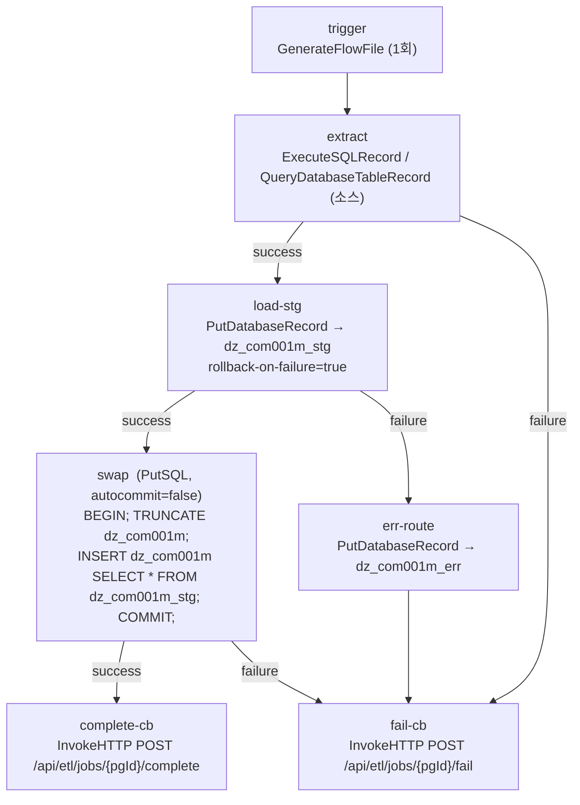

멱등 모드는 `etl_job.load_pattern`(SNAPSHOT_SWAP/UPSERT/INSERT_APPEND/INCREMENTAL)에 명시. 다중 테이블 FK 순서 = `etl_job_dependency`(부모→자식) → DAG task 의존성 = Target Load Plan.

#### B.5 실패 감지

권위 신호 = 완료 프로토콜(§4.6). 정상=`complete-cb`, 실패=`fail-cb`(failure 관계를 자동종료하지 않고 funnel), 타임아웃=deadline. 보조 탐지선: `dz_*_err`(PMERR), Bulletin ERROR 폴링, invalid_count, Counters, Stop on Errors 임계치. **완료 판정과 성공 판정 분리.**

#### B.6 재시작

§4·§6 채택. 워크플로우 내부=`clearTaskInstances(include_downstream)`(선행 성공 유지, Dynamic Task Mapping이면 실패 인스턴스만 clear). 워크플로우 간=WF1 재성공 시 outlet Asset 재발행→WF2 자동 재트리거(`TriggerDagRunOperator` 중복 트리거 위험 회피). Suspend on Error=실패 정지+`on_failure_callback`→AlertEngine, 수정 후 clear로 이어받기.

#### B.7 완료 프로토콜 (정확한 REST)

```
(1) 개시: POST /api/etl/jobs/{nifiPgId}/runs
    body {dagId, dagRunId, taskId, mapIndex, triggerSource:AIRFLOW}
    201 → {runId, runToken}   -- 백엔드가 airflow_dag_run_id/task_id 채움(V18 갭 해소)
(2) 성공: POST /api/etl/jobs/{nifiPgId}/complete   (X-Etl-Run-Token 헤더)
    body {status:SUCCESS, rowsInserted, rowsUpdated, rowsRejected, batchId, finishedAt}
    -- 0건+SUCCESS는 정상(증분). completion_source=NIFI_CALLBACK
(3) 실패: POST /api/etl/jobs/{nifiPgId}/fail
    body {status:FAILED, stage, errorCode, message, rowsRejected}
(4) 폴링: GET /api/etl/runs/{runId}  → {status:RUNNING|SUCCESS|FAILED|TIMEOUT, ...}
```

Airflow 완료 대기 = **deferrable sensor**(Triggerer 오프로드). NiFi가 콜백에 쓸 자기 정보는 Parameter Context로 주입(`#{etl.callback.base}`, `#{job.pg.id}`, `#{etl.run.token}`). `verify_target_db_landing` success일 때만 outlet Asset 발행 → 실패가 하류로 전파 안 됨.

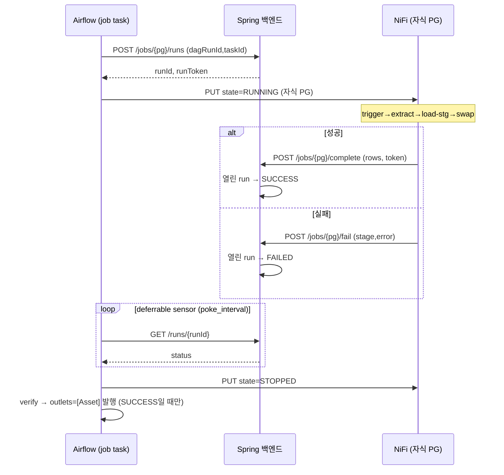

#### B.8 스케줄 단일 소스 + 무결성

한 워크플로우 시작은 **오직 `etl_workflow.schedule`(→ Variable `{dag_id}__schedule`)**. NiFi 프로세서에 크론/Timer 금지(GenerateFlowFile `3650days` 유지). 일=`0 6 * * *`, 월=`0 3 1 * *`. "엉키지 않는" 3원칙(§2.2) 적용. DAG 간은 Asset로만.

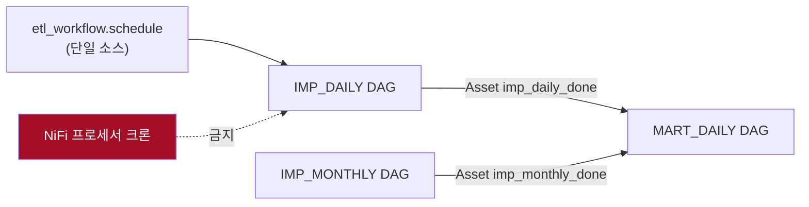

#### B.9 메타 스키마 (V55~V57)

```sql
-- V55 — etl_workflow (DAG 경계 = 중간그룹)
CREATE TABLE etl_workflow (
  id                  BIGSERIAL PRIMARY KEY,
  nifi_pg_id          VARCHAR(100) NOT NULL,          -- 중간그룹 PG (IMP_DAILY)
  workflow_name       VARCHAR(200) NOT NULL,
  domain_pg_id        VARCHAR(100),                   -- 상위 폴더(IMP)
  airflow_dag_id      VARCHAR(200) NOT NULL,          -- nifi_workflow_{pgid8}_control
  schedule            VARCHAR(100),                   -- cron; NULL=수동/이벤트
  schedule_kind       VARCHAR(20),                    -- DAILY/MONTHLY/EVENT/MANUAL
  produces_asset_uri  VARCHAR(400),                   -- 완료 시 발행 Asset
  consumes_asset_expr VARCHAR(400),                   -- L3 구독식: (a & b) | c
  sla_minutes         INTEGER,                        -- Deadline Alert 기준
  max_active_runs     INTEGER NOT NULL DEFAULT 1,
  catchup             BOOLEAN NOT NULL DEFAULT false,
  enabled             BOOLEAN NOT NULL DEFAULT true,
  deleted_at TIMESTAMP, created_at TIMESTAMP NOT NULL DEFAULT now(),
  updated_at TIMESTAMP NOT NULL DEFAULT now());
CREATE UNIQUE INDEX uq_etl_workflow_pg ON etl_workflow (nifi_pg_id);

ALTER TABLE etl_job ADD COLUMN workflow_id       BIGINT REFERENCES etl_workflow(id);
ALTER TABLE etl_job ADD COLUMN recovery_strategy VARCHAR(20) NOT NULL DEFAULT 'RESTART'; -- RESTART/FAIL_CONTINUE
ALTER TABLE etl_job ADD COLUMN load_pattern      VARCHAR(20) NOT NULL DEFAULT 'SNAPSHOT_SWAP';
                                                  -- SNAPSHOT_SWAP / UPSERT / INSERT_APPEND / INCREMENTAL

-- V56 — etl_job_dependency (잡 간 워크플로우 엣지 = 현재 MISSING)
CREATE TABLE etl_job_dependency (
  id          BIGSERIAL PRIMARY KEY,
  workflow_id BIGINT NOT NULL REFERENCES etl_workflow(id),
  from_job_id BIGINT NOT NULL REFERENCES etl_job(id),
  to_job_id   BIGINT NOT NULL REFERENCES etl_job(id),
  condition   VARCHAR(20) NOT NULL DEFAULT 'SUCCESS',  -- SUCCESS/COMPLETED/FAILED → trigger_rule
  created_at  TIMESTAMP NOT NULL DEFAULT now());
CREATE UNIQUE INDEX uq_etl_job_dep ON etl_job_dependency (from_job_id, to_job_id);
CREATE INDEX idx_etl_job_dep_wf ON etl_job_dependency (workflow_id);

-- V57 — etl_job_run 확장 (DagRun↔실행 매칭 완성 = 현재 MISSING)
ALTER TABLE etl_job_run ADD COLUMN airflow_task_id   VARCHAR(200);
ALTER TABLE etl_job_run ADD COLUMN run_token         VARCHAR(64);
ALTER TABLE etl_job_run ADD COLUMN rows_inserted     BIGINT;
ALTER TABLE etl_job_run ADD COLUMN rows_updated      BIGINT;
ALTER TABLE etl_job_run ADD COLUMN rows_rejected     BIGINT;
ALTER TABLE etl_job_run ADD COLUMN completion_source VARCHAR(20);     -- NIFI_CALLBACK / OBSERVED / TIMEOUT
ALTER TABLE etl_job_run ADD COLUMN fail_stage        VARCHAR(200);
ALTER TABLE etl_job_run ADD COLUMN fail_error_code   VARCHAR(100);
```

> `etl_job_link`(잡 내부)는 잡 간에 재사용 불가(프로세서 id 기반+job_id 종속) → 별도 `etl_job_dependency`. `condition`→`trigger_rule`: SUCCESS=`all_success`, COMPLETED=`all_done`, FAILED=`one_failed`. 관측 기반(`NifiProcessorRunTracker` 15초 폴링)은 `completion_source='OBSERVED'` 폴백으로 남기고 콜백 도착 시 `NIFI_CALLBACK` 우선.

#### B.10 REST / NiFi 규약 / Airflow

- **REST**: `POST /jobs/{pg}/runs`, `GET /runs/{runId}`, `POST /jobs/{pg}/complete|fail`(신설); `POST /api/nifi/process-groups/{pgId}/state`(자식 PG start/stop 감사 경유, 액추에이터는 Airflow 유지); 기존 `/airflow/dag-catalog/{dagId}/run`(트리거 감사), `clearTaskInstances`(재개), `/api/nifi/process-group-tree`(트리 조회).
- **NiFi**: 종단 성공/실패 InvokeHTTP; `load-stg`+`swap`(엔진별); Mapping/Session 분리(Template 공유+Parameter Context); 프로세서 스케줄 금지; DAG 경계 선언.
- **Airflow**: 팩토리를 `etl_workflow` 순회로; job TaskGroup(worklet); trigger rule; Asset; Deadline Alerts; 불변 dag_id/`catchup=False`/캐시 Variable 유지.

#### B.11 마이그레이션 — **안전순(B의 차별점)**

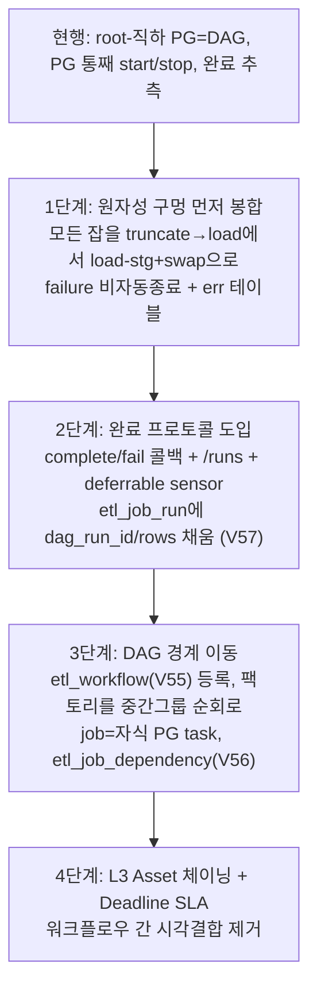

> **1·2단계는 현행 DAG 구조를 안 바꾸고** 안전성만 올린다(구멍 봉합·완료 신뢰). 3단계에서 경계 이동, 기존/신 dag_id 병행 후 그룹 재편 끝난 도메인부터 컷오버. → **A/C가 "구조 전환"을 먼저 요구하는 것과 달리 B는 "사고 클래스 제거"를 먼저** 한다.

#### B.12 장단점 / 리스크

| 구분 | 내용 |
|---|---|
| **장점** | 일·월 독립 스케줄·SLA·부분 재시작; 원자성 구멍 봉합; 완료 명시로 실패 초록불 소멸·0건/고장 구분; DagRun↔실행 매칭; 시각 결합 제거; Mapping/Session 분리. **+ 안전순 이행으로 초기 위험 최소** |
| **단점** | NiFi 캔버스 재편+잡별 콜백/staging = 초기 개발량; 콜백 계약이 flow에 침투(InvokeHTTP 2개/잡); 자식 PG 단위 제어로 PG 수 증가 |
| **리스크·완화** | R1 콜백 유실→sensor 타임아웃+관측 폴백(`OBSERVED`) 이중화. R2 동시 run 상관→`max_active_runs=1`+`uq_etl_job_run_open`+run_token. R3 Oracle TRUNCATE→EXCHANGE PARTITION/MERGE. R4 staging 스토리지 2배→`_stg` 잡 후 회수. R5 Asset `logical_date` None 가정 금지. R6 dag_id 변경 이력 단절→불변 `[:8]`+병행 |

**B 한 줄 요약**: "중간그룹=DAG(스케줄 단위), job=자식 PG 체인=task(원자적 staging swap), 완료는 InvokeHTTP 콜백으로 명시 선언, 잡·워크플로우 간은 Asset로만 배선" — **그리고 원자성·완료부터 먼저 봉합하는 안전순 이행.**

---

### Part C — 비주얼 컴파일러형 (Workflow Studio, 캔버스 → Airflow 컴파일)

**철학**: "비주얼 워크플로우 캔버스 → Airflow 컴파일". 사용자는 (1) 먼저 **job**(재사용 변환 단위)을 만들고, (2) `IMP_DAILY`/`IMP_MONTHLY` **워크플로우 캔버스**에 job들을 **참조로 드래그·연결**하고, (3) 시스템이 그래프를 **워크플로우당 DAG 1개**로 컴파일한다. Informatica의 "mapping 만들고 → workflow 캔버스에 session 얹어 링크로 엮고 → 스케줄" UX를 그대로 재현.

**핵심 결정 3가지**:
1. **직교 분리(dual-truth 제거)**: NiFi는 **job(프로세서 체인)만** 보유. **잡 간 오케스트레이션 그래프(엣지·순서·조건)는 NiFi 출력포트가 아니라 메타DB 캔버스가 원장.** 현행 `build_group_chain`(line 263)의 출력포트 흡수는 오케스트레이션 원장에서 **폐기**(데이터 이동용 연결로만 잔존). → 연구4 "잡 간 워크플로 엣지 저장소 부재"를 근본 해결.
2. **DAG 경계 = 중간 그룹 = 워크플로우 캔버스 1개**(§5). 팩토리는 "루트 직하 PG"가 아니라 **published workflow spec**를 열거.
3. **완료는 추측이 아니라 신호**(§4.6).

#### C.1 객체 모델 — 3계층 + Informatica 1:1

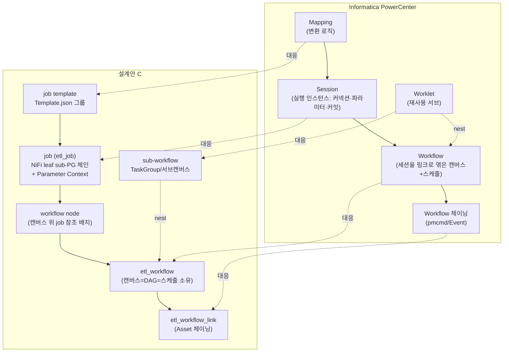

| 계층 | Informatica | C의 객체 | 물리 원장 | 스케줄 |
|---|---|---|---|---|
| L0 job template | Mapping/Mapplet | `Template.json` 3그룹 + `createInitialDbToDbFlow` | NiFi Template 그룹 | 없음 |
| L1 job(instance) | Session | `etl_job`=NiFi leaf sub-PG 체인(+Parameter Context) | NiFi 캔버스 | 없음(캔버스가 켜야 돎) |
| L2 workflow | Workflow(+Folder) | `etl_workflow`=캔버스(노드=job 참조, 엣지=조건 링크) | **메타DB = 원장** | **여기 1곳** |
| L2.5 sub-workflow | Worklet | 캔버스 안 TaskGroup/서브캔버스 | 메타DB | 상위 상속 |
| L3 chaining | pmcmd/Event | `etl_workflow_link`(ASSET 우선) | 메타DB | 이벤트(Asset) |

#### C.2 계층 → DAG 경계 & 생성

DAG 경계 = 중간 그룹(§5). **생성 전략 전환**: "루트 직하 PG" → "published workflow spec". 백엔드가 캔버스를 컴파일해 **Airflow Variable에 spec를 publish**:
- 인덱스 Variable: `etl_wf_index` = `["impdaily","impmonthly",...]`
- 스펙 Variable: `etl_wf_spec__impdaily` = 컴파일된 JSON(노드·엣지·job pg_id·스케줄·재시작전략).

팩토리는 top-level에서 `etl_wf_index`를 읽고 각 spec으로 `build_workflow_dag(spec)`를 `globals()`에 등록. **NiFi REST 직접 조회 안 함** → 파싱이 NiFi 가용성에 안 묶임. dag_id=`etl_wf_{workflow_key}`(불변), legacy는 `dag_id_override`로 연속성.

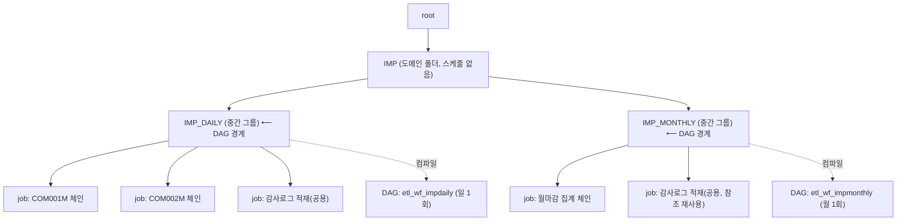

#### C.3 워크플로우 캔버스 메타 모델 + job 재사용(참조 vs 인스턴스)

**메타 스키마 (V55~)**:

```sql
-- V55__create_etl_workflow_canvas.sql
CREATE TABLE etl_workflow (
    id                BIGSERIAL PRIMARY KEY,
    workflow_key      VARCHAR(80)  NOT NULL,        -- 불변 key. dag_id/Asset/Variable의 축
    name              VARCHAR(200) NOT NULL,
    nifi_group_pg_id  VARCHAR(100),                 -- 대응 NiFi 중간 그룹(논리 그룹이면 NULL)
    schedule_cron     VARCHAR(120),                 -- 스케줄의 단일 소스(원칙 A)
    timezone          VARCHAR(64)  NOT NULL DEFAULT 'Asia/Seoul',
    catchup           BOOLEAN      NOT NULL DEFAULT false,
    max_active_runs   INTEGER      NOT NULL DEFAULT 1,
    recovery_strategy VARCHAR(20)  NOT NULL DEFAULT 'RESTART',   -- 노드가 override
    suspend_on_error  BOOLEAN      NOT NULL DEFAULT true,
    owner_role        VARCHAR(80),
    published_spec    JSONB,                        -- 컴파일 성공본. published_at 이후만 팩토리가 읽음
    published_at      TIMESTAMP,
    dag_id_override   VARCHAR(200),                 -- legacy id 연속성용
    deleted_at        TIMESTAMP,
    created_at        TIMESTAMP    NOT NULL DEFAULT now(),
    updated_at        TIMESTAMP    NOT NULL DEFAULT now());
CREATE UNIQUE INDEX uq_etl_workflow_key ON etl_workflow (workflow_key) WHERE deleted_at IS NULL;

CREATE TABLE etl_workflow_node (          -- 캔버스 위 job "배치"(placement)
    id                 BIGSERIAL PRIMARY KEY,
    workflow_id        BIGINT       NOT NULL REFERENCES etl_workflow (id),
    node_key           VARCHAR(80)  NOT NULL,       -- 캔버스 내 불변 key = TaskGroup id 축
    node_type          VARCHAR(20)  NOT NULL DEFAULT 'JOB',  -- JOB/BRANCH/JOIN/START/END/SUBWF
    ref_mode           VARCHAR(12)  NOT NULL DEFAULT 'INSTANCE',  -- REFERENCE/INSTANCE
    job_id             BIGINT       REFERENCES etl_job (id),  -- REFERENCE 모드
    job_template_key   VARCHAR(80),                          -- INSTANCE 모드
    parameter_context_id VARCHAR(100),                        -- INSTANCE 모드 실행설정
    sub_workflow_id    BIGINT       REFERENCES etl_workflow (id),  -- SUBWF(worklet 재사용)
    trigger_rule       VARCHAR(40)  NOT NULL DEFAULT 'ALL_SUCCESS',
    branch_expr        TEXT,                        -- node_type=BRANCH일 때
    retries            INTEGER      NOT NULL DEFAULT 0,
    retry_delay_sec    INTEGER      NOT NULL DEFAULT 60,
    recovery_strategy  VARCHAR(20),                 -- 워크플로우 기본 override
    display_x DOUBLE PRECISION, display_y DOUBLE PRECISION,
    deleted_at TIMESTAMP, created_at TIMESTAMP NOT NULL DEFAULT now(),
    updated_at TIMESTAMP NOT NULL DEFAULT now());
CREATE UNIQUE INDEX uq_etl_wf_node ON etl_workflow_node (workflow_id, node_key) WHERE deleted_at IS NULL;

CREATE TABLE etl_workflow_edge (          -- 조건 링크(Informatica link condition)
    id             BIGSERIAL PRIMARY KEY,
    workflow_id    BIGINT       NOT NULL REFERENCES etl_workflow (id),
    from_node_id   BIGINT       NOT NULL REFERENCES etl_workflow_node (id),
    to_node_id     BIGINT       NOT NULL REFERENCES etl_workflow_node (id),
    condition_type VARCHAR(20)  NOT NULL DEFAULT 'ON_SUCCESS',  -- ON_SUCCESS/ON_FAILURE/ON_COMPLETE/ALWAYS/EXPRESSION
    condition_expr TEXT,
    branch_label   VARCHAR(80),
    created_at     TIMESTAMP    NOT NULL DEFAULT now());
CREATE INDEX idx_etl_wf_edge_wf ON etl_workflow_edge (workflow_id);
CREATE INDEX idx_etl_wf_edge_from ON etl_workflow_edge (from_node_id);

CREATE TABLE etl_workflow_link (          -- 워크플로우 간 체이닝(WF→WF), 기본 Asset
    id               BIGSERIAL PRIMARY KEY,
    from_workflow_id BIGINT      NOT NULL REFERENCES etl_workflow (id),
    to_workflow_id   BIGINT      NOT NULL REFERENCES etl_workflow (id),
    mode             VARCHAR(12) NOT NULL DEFAULT 'ASSET',   -- ASSET/TRIGGER
    condition_type   VARCHAR(20) NOT NULL DEFAULT 'ON_SUCCESS',
    created_at       TIMESTAMP   NOT NULL DEFAULT now());
```

> `etl_job_link`(V17)는 **잡 내부(프로세서 간)** 그래프로 유지(AlertEngine 실사용). 위 4표가 **잡 간(캔버스)** 그래프. 두 레벨을 물리적으로 분리.

**job 재사용: 참조(REFERENCE) vs 인스턴스(INSTANCE)** — C의 최대 차별점:

| 모드 | 의미 | Informatica 대응 | 물리 | 동시성 | 언제 |
|---|---|---|---|---|---|
| **INSTANCE(기본)** | template를 Parameter Context로 새 PG로 찍음 | Mapping→Session | 배치마다 별개 NiFi PG | 락 불필요, 완전 병렬 | 대부분 동형 추출-적재(COM001M…) |
| **REFERENCE** | 같은 물리 PG를 여러 캔버스가 공유 | 재사용 Worklet(중첩) | 단일 NiFi PG 공유 | **run-lock 필수** | 공용 유틸 job(감사로그·정합검증) |

- INSTANCE: 캔버스에 template 드래그 → `POST /api/nifi/etl/initial-db-to-db`로 새 PG+전용 Parameter Context. "같은 로직, 다른 소스/타깃/스케줄" 재사용이 간섭 없이 됨.
- REFERENCE: 같은 `job_id`를 daily·monthly가 가리킴 → 물리 PG 하나라 **동시 기동 시 mid-run 덮어쓰기/이중기동 사고**(연구4 §7). 방어: `uq_etl_job_run_open`(잡당 열린 실행 1개)을 자연 뮤텍스로 + 컴파일러가 REFERENCE 노드를 **Airflow Pool(`etl_job_lock__{jobKey}`, slots=1)**에 배치해 직렬화. run_token은 공유 컨텍스트가 아니라 flowfile 속성/콜백 URL 상수 + open-run 상관으로.

#### C.4 캔버스 → DAG 컴파일 규약

`build_workflow_dag(spec)`가 노드/엣지를 결정론적으로 렌더:
- **노드(JOB) → TaskGroup 1개**: `start_job`(PUT PG RUNNING + run_token 주입) → `await_complete`(완료신호 대기, §4.6) → (옵션)`stop_job`(`all_done`). `await_complete` 성공 시 노드 Asset outlet 발행.
- **엣지 → 의존성+조건**: ON_SUCCESS→`A>>B`; ON_FAILURE→target `one_failed`; ON_COMPLETE→`all_done`; EXPRESSION/BRANCH→`@task.branch`.
- **조인 노드**: `none_failed_min_one_success`. **SUBWF 노드**→서브캔버스를 TaskGroup 팩토리로 인라인. **스케줄**=`spec.schedule_cron`→Variable.

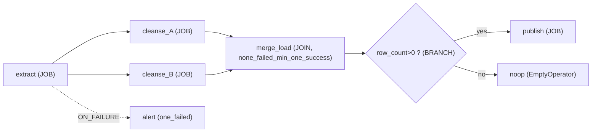

#### C.5 토폴로지

§3 카탈로그를 캔버스 표현→컴파일로 전부 커버(단일=노드1, 선형=ON_SUCCESS 체인, fan-out=다중 엣지, fan-in=trigger_rule, 조건분기=ON_SUCCESS+ON_FAILURE 또는 BRANCH 노드, 혼합=SUBWF, worklet=SUBWF/`.expand`, WF체이닝=`etl_workflow_link(ASSET)`, 이벤트=Asset/센서, 반복=`.expand`). WF→WF는 시각 아닌 Asset로만.

#### C.6 트랜잭션·완료·실패·재시작

§4 채택(staging-swap, 터미널 InvokeHTTP `/complete`·`/fail`, 3계층 실패감지, 노드 단위 `clearTaskInstances`). C의 특성: **캔버스 노드=TaskGroup 1개라 노드 단위 부분 재시작이 자연스럽다.** UI에서 실패 노드 우클릭→"이 job부터 재실행"→백엔드가 pipeline-api 감사 후 `clearTaskInstances`(`/airflow/dag-catalog/.../retry-from`로 래핑해 "누가 재실행" 기록). 완료 신호는 노드 `await_complete`가 받고, 타임아웃 시에만 idle-detection을 **안전망(성공 판정 아님)**으로.

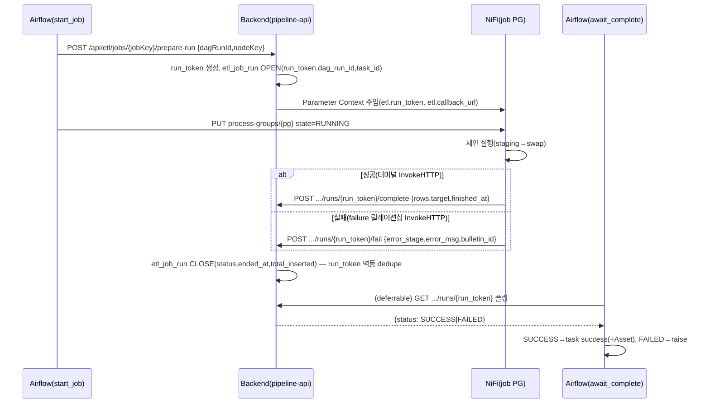

#### C.7 스케줄 단일 소스 + 원장 직교

- **원칙 A**: 스케줄은 **오직 `etl_workflow.schedule_cron`**→publish 시 Variable 주입. NiFi 프로세서 Timer/Cron 금지.
- **원칙 B**: 중간 그룹 1개=워크플로우 1개=DAG 1개.
- **원칙 C**: WF 간은 Asset 완료 이벤트로만.
- **원장 직교(C의 4번째 엉킴 방지)**: NiFi=job만, 메타=오케스트레이션만. 출력포트 기반 잡간 제어(`build_group_chain`)는 오케스트레이션 원장에서 폐기. 한 물리 PG는 한 워크플로우만 제어(REFERENCE는 run-lock).

#### C.8 변경 총정리 (REST / NiFi / Airflow)

- **메타**: 신규 `etl_workflow`/`etl_workflow_node`/`etl_workflow_edge`/`etl_workflow_link`(V55~); 확장 `etl_job_run`에 `run_token UNIQUE`·`airflow_task_id`, `airflow_dag_run_id` 실사용(V56); `*_err` 표준 테이블(V57).
- **REST**(신규 `EtlWorkflowController`): 캔버스 CRUD(`/api/etl/workflows`, `.../{id}/nodes`, `.../{id}/edges`); 발행 `POST .../{id}/publish`(컴파일 검증→`published_spec`+`etl_wf_index`/`etl_wf_spec__{key}` Variable); 실행 `POST /api/etl/jobs/{jobKey}/prepare-run`, `.../runs/{runToken}/complete|fail`, `GET .../runs/{runToken}`; 재실행 `POST .../workflows/{id}/runs/{dagRunId}/retry-from/{nodeKey}`; job 인스턴스화(기존 `initial-db-to-db`); 트리거(기존 `/airflow/dag-catalog/{dagId}/run`). 기존 `EtlJobController`(읽기전용) 유지, 쓰기는 새 컨트롤러.
- **NiFi**: 1회성 GenerateFlowFile + staging-swap + 말단 성공/실패 InvokeHTTP + `failure/retry` 비자동종료 + `Rollback On Failure=true` + DBCP `Validation-query=SELECT 1`. Parameter Context로 `etl.run_token`/`etl.callback_url`/소스·타깃·update_keys 주입.
- **Airflow**: `nifi_pipelines_dynamic.py`→`etl_workflow_dynamic.py`(`etl_wf_index`/spec 열거→`build_workflow_dag`). 노드=TaskGroup, 엣지=`>>`+trigger_rule, BRANCH=`@task.branch`, SUBWF=팩토리, 반복=`.expand`, WF체이닝=Asset, 스케줄=Variable. `catchup=False`.

#### C.9 마이그레이션 (4 Phase)

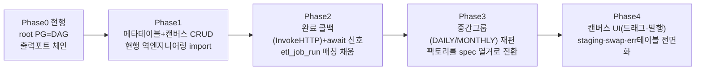

- **P1**: 신규 테이블 + 현행 root PG 각각을 `etl_workflow` 1개로, 출력포트 연결을 엣지로 **역엔지니어링 import**(무중단, 기존 DAG 병행).
- **P2**: NiFi job에 콜백 InvokeHTTP + await 센서(idle-detection은 안전망으로 강등) = 2026-07-29류 사고 종결.
- **P3**: NiFi 그룹을 주기별로 재편 **또는** 물리 재편 없이 메타에서만 논리 그룹화. 팩토리 열거 축 root-child→spec. dag_id override로 이력 연속.
- **P4**: 캔버스 UI + staging-swap + reject 테이블 표준화 전면.

#### C.10 장단점 / 리스크

| 구분 | 내용 | 완화 |
|---|---|---|
| **장점** | Informatica 충실 UX; 스케줄 단일소스; 신뢰성 완료신호; 안전 부분재시작; 그룹별 독립스케줄; job 재사용(REFERENCE/INSTANCE); **원장 직교로 엉킴 원천 제거** | — |
| **이중 원장 리스크** | 캔버스(메타) vs NiFi 형상 불일치 | NiFi=job만·메타=오케스트레이션만(겹침 0). 미러 5분으로 drift 감지 |
| **컴파일 지연** | 발행→Variable→파싱 반영 수분 | 기존 캐시 패턴과 동일 |
| **REFERENCE 동시성** | 공유 PG 이중기동 | INSTANCE 기본 + REFERENCE Pool(slots=1)+open-run 뮤텍스 |
| **NiFi 그룹 재편 침습** | P3 물리 재편 부담 | 논리 그룹만으로도 가능 |
| **콜백 경로/인증** | NiFi→backend 네트워크·인증 | pipeline-api 내부 경유 + run_token 서명, 실패 시 idle 안전망 |
| **잔여 격차** | "Resume from checkpoint" 여전히 없음 | RESTART/멱등으로 정당화, 증분은 워터마크 별도 트랙 |

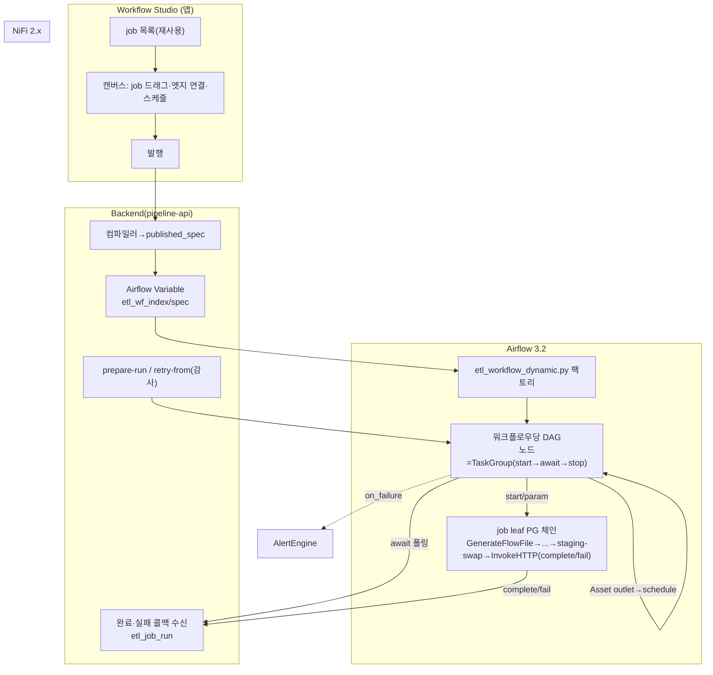

**C 한 줄 요약**: 중간 그룹을 **워크플로우 캔버스=DAG=스케줄 단위**로, **NiFi는 job만·메타DB 캔버스는 오케스트레이션만** 보유하도록 원장을 직교 분리. job은 template(Mapping)/instance(Session)로 나눠 재사용(기본 INSTANCE, 공용은 REFERENCE+run-lock), 캔버스는 노드=job 참조·엣지=조건 링크로 모든 토폴로지를 Airflow로 컴파일.

---

## 7. 비교 매트릭스 + 권장안

### 7.1 세 안의 근본 차이 축

세 안은 §1~§5(벤치마크·토폴로지·트랜잭션·완료콜백·중간그룹=DAG)를 **공유**한다. 실제로 갈리는 지점은 4개뿐이다:

| 축 | A (제어평면) | B (데이터인식) | C (비주얼컴파일러) |
|---|---|---|---|
| **오케스트레이션 원장** | 메타DB(`etl_*`)로 승격 | 메타DB 선언 + NiFi 구조 병존(하이브리드) | 메타DB 캔버스(직교, dual-truth 제거) |
| **DAG 경계 구동** | `etl_workflow` 순회 | 선언 등록/`@schedule-unit` 태그 | published spec Variable |
| **잡 간 엣지** | `etl_job_dependency`(trigger_rule) | `etl_job_dependency`(condition) | `etl_workflow_edge`(condition_type)+node/link |
| **UX/이행 강조** | 객체모델 충실(무겁게 한 번에) | **안전순 이행**(사고부터 봉합) | **캔버스 UI**(가장 큰 신규 개발) |

### 7.2 요구 충족도 매트릭스 (◎ 매우강 / ○ 강 / △ 보통)

| 평가 기준 | A | B | C | 비고 |
|---|---|---|---|---|
| **Informatica 충실성** | ◎ | ○ | ◎ | A=folder/workflow/mapping/session/link 1급 테이블. C=Workflow Manager 캔버스 UX+mapping/session 재사용. B=workflow 객체는 있으나 mapping 테이블 없이 스냅샷 해시로 대체 |
| **트랜잭션 안전(원자성)** | ○ | ○ | ○ | 셋 다 staging-swap 단일 트랜잭션 채택(§4.4). 동일 |
| **실패 감지** | ○ | ○ | ○ | 셋 다 3층(컴포넌트 `*_err`+임계치 / 잡 콜백 / 워크플로우 task·Deadline). 동일 |
| **재시작(실패 지점부터)** | ○ | ○ | ◎ | 셋 다 `clearTaskInstances(include_downstream)`. C는 노드=TaskGroup이라 "노드 우클릭 재실행" UX가 가장 자연 |
| **완료 신호 신뢰성** | ○ | ○ | ○ | 셋 다 터미널 InvokeHTTP `/complete`·`/fail`+deferrable sensor. 동일 |
| **토폴로지 커버리지** | ○ | ○ | ◎ | 셋 다 §3 전 위상 커버. C는 캔버스로 **시각적 저작**까지(BRANCH/JOIN/SUBWF 노드 타입) |
| **계층/스케줄(독립 주기)** | ◎ | ◎ | ◎ | 셋 다 중간그룹=DAG, 스케줄 단일 소스. 동일 |
| **데이터흐름 명료성(엉킴 방지)** | ○ | ○ | ◎ | C의 원장 직교(NiFi=job, 메타=오케스트레이션)가 dual-truth를 원천 제거해 가장 명료. A는 메타 원장이나 캔버스 드리프트 관리 필요. B는 하이브리드라 경계 선언 규율에 의존 |
| **구현 난이도(낮을수록 유리)** | △(높음) | ○(가장 낮음/점진) | △(가장 높음: 캔버스 UI+컴파일러+4테이블+신규 컨트롤러) | B는 1·2단계가 현행 구조를 안 바꾸고 안전성만 올림 |
| **파싱 안정성** | ◎ | ○ | ◎ | A/C는 top-level 조회가 metaDB/Variable(NiFi 비의존). B는 metaDB 선언 조회로 개선되나 자식 PG 열거에 NiFi 참조 잔존 |
| **초기 위험/롤백 용이성** | △ | ◎ | △ | B는 phase별 독립 가치·병행 운영. A/C는 구조 전환이 앞단에 필요 |

### 7.3 권장안 — **B를 백본으로, A의 객체모델을 목표로, C를 최종 UX로 (단계적 수렴)**

세 안은 배타적이지 않다. **같은 아키텍처(중간그룹=DAG, staging-swap, 터미널 콜백, Asset 배선)의 서로 다른 투자 수준·원장 위치**다. 따라서 "하나만 고르기"보다 **수렴 로드맵**이 옳다.

**권장 이유**:

1. **지금 당장은 B** — 현행의 실측 사고(2026-07-29 빈 테이블 초록불)와 최대 위험은 **원자성 구멍·완료 추측**이다. 이 둘은 **설계 선택과 무관하게(design-agnostic)** 세 안 모두 같은 처방(staging-swap + 터미널 콜백)을 쓴다. B의 **안전순 이행(1단계 원자성 봉합 → 2단계 완료 프로토콜)**은 **DAG 구조를 안 바꾸고** 사고 클래스를 먼저 닫으므로, 초기 위험이 가장 낮고 롤백이 쉽다. → **P1·P2는 사실상 "어느 안을 택하든 먼저 해야 할 공통 작업"**이다.

2. **목표 스키마는 A** — 장기적으로 "잡/워크플로/링크/스케줄을 SQL로 질의·관리"하는 Informatica 리포지토리 충실형이 운영·감사·거버넌스에 가장 강하다. B의 `etl_workflow`+`etl_job_dependency`는 A의 `etl_folder`/`etl_workflow`/`etl_mapping`/`etl_job_dependency`의 **부분집합**이므로, B로 시작해 A로 **확장**하는 경로가 자연스럽다(재작업 없음). `etl_mapping`(로직 템플릿 1급화)과 `etl_folder`는 재사용·권한이 본격 요구될 때 추가.

3. **최종 UX·원장 직교는 C** — 운영자가 "job을 드래그해 캔버스로 워크플로우를 조립"하는 C의 UX와 **원장 직교(dual-truth 제거)**는 데이터흐름 명료성(엉킴 방지)에서 최고점이다. 단 캔버스 UI+컴파일러는 신규 개발이 크므로, 백본(B)과 스키마(A)가 안정된 뒤 얹는 것이 리스크가 낮다. C의 `etl_workflow_node`(REFERENCE/INSTANCE)·`etl_workflow_edge`는 A의 `etl_job_dependency`를 **시각 저작 계층으로 감싸는** 상위호환이다.

**즉 결론**: **B(v1 백본) → A(목표 스키마) → C(최종 UX)**. 세 안의 공통 P1·P2(원자성 swap + 완료 콜백)를 **무조건 먼저** 하고, 그 위에 중간그룹=DAG(B P3=A P2·P3=C P3)와 잡간 의존 테이블을 올린 뒤, 거버넌스 요구에 맞춰 A의 folder/mapping을, 운영 UX 요구에 맞춰 C의 캔버스를 얹는다. "단 하나만 빌드"라면 **B**.

> 반대 관점: 만약 조직이 **처음부터 운영자 셀프서비스 캔버스**를 최우선한다면 C를 먼저 택할 수 있다(단, C도 내부적으로 B의 P1·P2를 포함하므로 시작점은 동일). 만약 **거버넌스·감사(누가 무엇을 언제)**가 최우선이고 캔버스는 불필요하다면 A를 목표로 직행한다. 세 경우 모두 **첫 스프린트는 staging-swap + 터미널 콜백**으로 같다.

---

## 8. 현행 → 권장안 마이그레이션 경로 (통합 단계별)

세 안의 마이그레이션을 수렴 로드맵으로 통합한다. 각 단계는 **독립 가치**를 갖고 이전 단계 위에서만 진행한다(무중단·병행·롤백 가능).

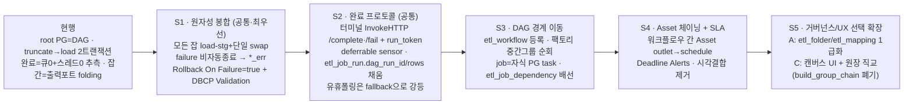

**단계별 상세**

- **S1 원자성 봉합 (공통, 최우선·최저위험)**: 현행 DAG 구조를 **안 바꾸고** NiFi flow만 수정. `truncate-dz→load-dz`를 `load-stg(→dz_*_stg) → swap(단일 PutSQL, autocommit=false)`로. `failure/retry` 자동종료 해제 → `dz_*_err` 라우팅. `Rollback On Failure=true`(Yield 필수). DBCP `Validation-query=SELECT 1`. **→ 2026-07-29 사고 클래스 종결.** 엔진별 swap(Postgres TRUNCATE-INSERT / Oracle EXCHANGE PARTITION·MERGE).
- **S2 완료 프로토콜 (공통)**: 백엔드에 쓰기 컨트롤러 + `POST /runs`·`/complete`·`/fail`·`GET /runs/{id}`. NiFi 잡 종단에 InvokeHTTP 2개. Airflow `wait_for_group_completion`을 deferrable sensor(`GET /runs/{id}`)로 교체하고 유휴판정은 fallback. `etl_job_run`에 `run_token`/`airflow_dag_run_id`/`airflow_task_id`/rows/`completion_source` 컬럼 추가(A의 V58 = B의 V57). **→ 완료·성공 판정 분리, DagRun↔실행 매칭 완성.**
- **S3 DAG 경계 이동**: `etl_workflow` 테이블(A V55 / B V55 / C V55) + `etl_job.workflow_id`. 팩토리를 "루트 직하 PG" → "중간그룹(workflow) 순회"로. dag_id는 불변 규칙 유지(`nifi_pipeline_{pgid8}` 또는 `etl_wf_{id}` + override 매핑). `etl_job_dependency`로 잡간 순서/조인/분기를 Airflow `trigger_rule`로 승격. 기존/신 DAG 병행 후 도메인별 컷오버. NiFi 그룹을 **주기 기준**(IMP_DAILY/IMP_MONTHLY)으로 재편(또는 논리 그룹만).
- **S4 Asset 체이닝 + SLA**: `etl_workflow.produces_asset_uri`/`consumes_asset_expr`로 워크플로우 간을 Asset(`schedule=(a&b)`)로만 배선. Deadline Alerts(구 SLA, 3.1+/3.2). **→ 시각 결합 제거, 지연 강건.**
- **S5 거버넌스/UX 확장 (선택)**: 거버넌스 우선이면 A의 `etl_folder`/`etl_mapping` 1급화 + 메타DB 원장 승격. 운영 셀프서비스 우선이면 C의 캔버스 UI(`etl_workflow_node`/`edge`/`link`) + 원장 직교(`build_group_chain` 오케스트레이션 폐기, 데이터 이동용만 잔존).

**불변식(전 단계 공통)**: 불변 dag_id(`[:8]`), `catchup=False`, NiFi 조회 실패 시 Variable 캐시(`PG_CACHE_VARIABLE_KEY`), top-level 무거운 조회 회피 — 현행 방어책(연구2 §9.3) 유지.

---

## 9. 열린 질문 / 리스크

### 9.1 아키텍처 결정 대기

1. **원장 위치**: 최종적으로 메타DB를 오케스트레이션 원장으로 승격(A/C)할 것인가, NiFi 구조 병존(B)을 유지할 것인가? → 드리프트 감지(`etl_job_snapshot` 해시)·역푸시(`sync_direction=TO_NIFI`) 성숙도에 좌우. 역푸시는 현재 전부 FROM_NIFI(읽기전용)이므로 원장 승격 전 검증 필요.
2. **NiFi 그룹 물리 재편 vs 논리 그룹**: 중간그룹=DAG를 위해 캔버스를 주기별로 물리 재편할지(정공법, 침습적), 메타에서만 논리 그룹화할지(C가 지원). 물리 재편은 dag_id/이력 연속성 관리가 관건.
3. **job = 자식 PG 단위 제어의 부담**: B/C처럼 자식 PG 단위로 start/stop하면 PG 수·Parameter Context 수가 증가. NiFi 관리 부담과 병렬성 이득의 트레이드오프.

### 9.2 기술 리스크

4. **Oracle TRUNCATE 원복 불가**: DDL 암묵 커밋이라 staging-swap의 완전 원자성은 Postgres 타깃에서만. Oracle은 EXCHANGE PARTITION/MERGE로 대체 — 파티션 구조·권한 사전 확보 필요. 소스/타깃 DB 엔진 매트릭스를 `load_pattern`으로 관리.
5. **완료 콜백 유실**: NiFi→백엔드 네트워크/인증 실패 시 콜백 미도달 → timeout fallback(7200s)+ERROR bulletin 보루로 이중화하되, 이 fallback이 다시 "추측"으로 회귀하지 않도록 fallback 결과는 SUCCESS가 아닌 **미결/FAILED**로만.
6. **REFERENCE 모드 동시성(C)**: 공유 PG 이중기동 방어(Pool slots=1 + `uq_etl_job_run_open`)가 실제 부하에서 데드락/대기 없이 직렬화되는지 검증 필요. 기본은 INSTANCE로 두고 REFERENCE는 공용 유틸에 한정.
7. **UPSERT 검증 사각**: UPSERT가 UPDATE만 하면 신규 INSERT 0 → 타임스탬프 기반 `verify_target_db_landing`이 적재를 놓침. 콜백 `step_metrics`(실제 처리행)로 보강하되, 증분의 "0건=정상"과 진짜 고장을 계속 구분해야.
8. **Asset logical_date None(Airflow 3.x)**: 수동/Asset 트리거 run은 `logical_date`가 None일 수 있음 → `data_interval`을 logical_date에서 유도하는 코드 금지. 멱등 경계 계산은 `dag_run.start_date` 기준 유지(현행 `verify_target_db_landing`이 이미 이 방식).

### 9.3 범위 밖(별도 트랙)

9. **Resume from checkpoint(중단 지점 재개)**: Informatica의 최대 강점이지만 우리 ETL은 RESTART(전량 재적재)로 확정(정당). 대용량 증분 요구 시 CDC(offset/LSN)+워터마크+멱등 UPSERT를 **별도 트랙**으로. Kafka CDC 파이프라인(`kafka_pipelines_dynamic.py`)이 이 방향의 실물.
10. **행 단위 관찰가능성(PMERR) 성숙도**: `*_err` 테이블은 격리까지. Stop on Errors 임계치를 NiFi 체인에서 카운터+RouteOnAttribute로 구현하는 부분이 네이티브가 아니라 커스텀 — 운영 검증 필요.
11. **권한/감사와의 정합**: 워크플로우 저작·트리거·재실행 권한을 기존 authz(V48)·감사 로그와 어떻게 엮을지(특히 C의 캔버스 발행 권한). MSA 포털↔Cerebro 인가(메모리 참조)와의 정합.

---

## 부록 — 근거 URL & 코드 경로

### Informatica (연구1·5)
- 객체 계층·태스크·링크: datacadamia PowerCenter Workflow/Repository Objects/Workflow Links; docs.informatica.com Workflows Overview(10.5), Control/Decision/Timer/Event-Wait/Assignment Task(10.4~10.5), Workflow Links / Link Conditions / Linking Tasks Sequentially / Defining a Link Condition
- 스케줄: Workflow Schedulers(10.4), Creating a Reusable Scheduler / Scheduler Tab(10.5)
- 복구/재시작: Task Recovery Strategies / Configuring Recovery to Resume from the Last Checkpoint / Suspending the Workflow / Workflow Recovery Overview / Suspension Email(10.5)
- 트랜잭션/로딩: Commit Points Overview / Source-Based·Target-Based Commits / Understanding Transaction Control / Constraint-Based Loading / Target Load Order / Setting the Target Load Order; disoln Constraint-Based Loading
- 에러: Threshold Errors / Row Error Logging Overview; disoln Error Handling
- IICS: Informatica Cloud Mappings and Tasks Overview; thinketl Overview of Taskflows in IICS

### Apache NiFi (연구3)
- Developer's Guide(ProcessSession 트랜잭션·commit/rollback·세션 격리·SupportsBatching): https://nifi.apache.org/docs/nifi-docs/html/developer-guide.html
- PutDatabaseRecord 컴포넌트 문서 / NIFI-3415 Rollback on Failure / NIFI-12993·13103 AutoCommit·Batch / NIFI-7424 PutSQL autocommit
- MonitorActivity / Wait-Notify(ijokarumawak) / Cloudera "no notion of completed"(Community 137037)
- TRUNCATE 트랜잭션성(Postgres 롤백 가능 vs Oracle DDL 암묵 커밋): rockdata.net, datasunrise.com

### Apache Airflow 3.x (연구2·5)
- DAGs 코어(trigger rules·branch·TaskGroup): https://airflow.apache.org/docs/apache-airflow/stable/core-concepts/dags.html
- Dynamic Task Mapping / Asset-Aware Scheduling / Assets / Event-driven scheduling / DAG Run(catchup·backfill·logical_date)
- ShortCircuit·Branch(standard providers) / Deadline Alerts(3.2) / SLA→Deadline 마이그레이션 / Task SDK(airflow.sdk)
- AIP-86 Deadline Alerts / airflow-client-python 3.0 CHANGELOG(clearTaskInstances reset_dag_runs 기본 True) / Astronomer cross-DAG·trigger rules·branching·error notifications

### 프로젝트 코드 (실측 확인)
- **DAG 팩토리·완료추정·Asset·trigger_rule·재시작 근거**: `/home/user/data-pipeline/airflow/dags/nifi_pipelines_dynamic.py` — `dag_id=f"nifi_pipeline_{pg_id[:8]}_control"`(L579), `schedule=Variable.get(f"{dag_id}__schedule")`(L584), `catchup=False`(L620), `outlets=target_outlets`(L671), `trigger_rule="all_done"`(L687), `IDLE_SETTLE_CHECKS=3`(L99), `wait_for_group_completion`(L334), `_fail_if_errors`(L206, 2026-07-29 사고 주석), `build_group_chain`(L263), `build_dag`(L566)
- **재시작 REST**: `/home/user/data-pipeline/web/cerebroetl-ui/src/api/platform.ts` — `AIRFLOW_API_BASE="/airflow/api/v2"`(L353), `retryAirflowTaskFrom`(L438) → `clearTaskInstances { include_downstream:true(L443), reset_dag_runs:true(L445) }`
- **메타 스키마**: `.../db/migration/V17__create_etl_job_catalog.sql`, `V18__create_etl_job_run.sql`, `V19`(airflow dag catalog), `V29`(airflow mirror) — 현행 최신 마이그레이션 **V54**(신규 테이블은 V55~)
- **백엔드**: `NifiClient.java`(getBulletins 5분 링버퍼·getCounters·createInitialDbToDbFlow snippet 복제·PG start/stop MISSING), `NifiJobMirrorService`(collectInto 재귀·잡=최상위 PG), `NifiProcessGroupTreeService`(toNode 재귀), `EtlJobController`(`/api/etl/jobs` 읽기전용), `EtlJobLink.java`, `AlertEngine.java`(chainByProcessor L608), `NifiProcessorRunTracker.java`(15초 폴링)
- **ETL 템플릿**: `/home/user/data-pipeline/Template.json`(Initial/Incremental/truncate_initial), flow-exports `nifi/flow-exports/20260814/{DZ,DW,DZ_UPSERT,...}.json`(프로세서 실측 설정)
- **참고 문서**: `/home/user/data-pipeline/개선방향_CDC.md`(§5-5 계층트리), `WORK_LOG.md`

---

*끝. 이 문서는 검토용 초안이며, §7 권장(B 백본 → A 스키마 → C UX 수렴)과 §8 통합 이행경로의 S1·S2(원자성 swap + 완료 콜백)를 최우선 공통 작업으로 제안한다.*
