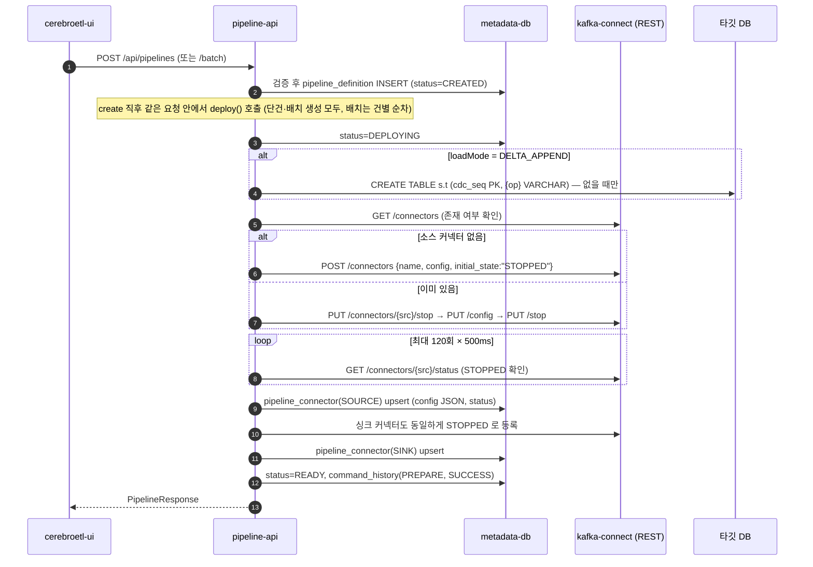
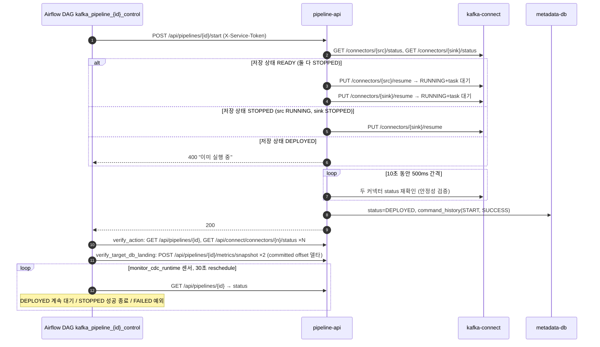

# Kafka 흐름 상세 — 현재 코드 기준 (2026-09-03)

> 이 문서는 `msa-integration` 브랜치의 **현재 소스 코드**를 기준으로 Kafka 데이터 흐름을 정리한 것이다.
> 각 항목마다 근거 파일을 적었다. 코드와 문서가 어긋나는 오래된 문서(`docs/kafka-cdc-pipeline.md`, `README.md` 일부)는 §14에 따로 표시했다.
>
> 범위: Kafka 브로커, Kafka Connect(Debezium 소스 / JDBC 싱크), Filebeat, pipeline-api(제어·관측), Airflow(실행 제어), 프론트 화면.
> **NiFi는 현재 Kafka를 전혀 쓰지 않는다**(§3.8 참고). 

---

## 목차

1. [한눈에 보는 전체 흐름](#1-한눈에-보는-전체-흐름)
2. [컨테이너 구성과 의존 관계](#2-컨테이너-구성과-의존-관계)
3. [프로세스(컴포넌트)별 기능](#3-프로세스컴포넌트별-기능)
4. [흐름 ① 파이프라인 생성 → 준비(PREPARE)](#4-흐름--파이프라인-생성--준비prepare)
5. [흐름 ② 실행 제어 (Airflow DAG → start / stop / restart)](#5-흐름--실행-제어-airflow-dag--start--stop--restart)
6. [흐름 ③ 데이터 플레인: 소스 DB → Debezium → Topic → JDBC Sink → 타깃 DB](#6-흐름--데이터-플레인-소스-db--debezium--topic--jdbc-sink--타깃-db)
7. [흐름 ④ 로그 파일: Filebeat → Kafka → JDBC Sink](#7-흐름--로그-파일-filebeat--kafka--jdbc-sink)
8. [흐름 ⑤ 관측·모니터링: 상태 동기화, 지표 수집, 처리 로그, 알림](#8-흐름--관측모니터링-상태-동기화-지표-수집-처리-로그-알림)
9. [흐름 ⑥ DLQ 조회와 재처리](#9-흐름--dlq-조회와-재처리)
10. [흐름 ⑦ 삭제와 정리](#10-흐름--삭제와-정리)
11. [이름 규칙 총정리 (토픽 / 커넥터 / 컨슈머 그룹)](#11-이름-규칙-총정리-토픽--커넥터--컨슈머-그룹)
12. [상태 기계](#12-상태-기계)
13. [주기·타임아웃·재시도 표](#13-주기타임아웃재시도-표)
14. [알려진 한계와 코드 불일치](#14-알려진-한계와-코드-불일치)
15. [참고 파일 목록](#15-참고-파일-목록)

---

## 1. 한눈에 보는 전체 흐름

```
 [사용자]
    │ ① 생성 (화면 마법사)                                   ⑤ 관측 (화면 폴링)
    ▼                                                          ▲
 ┌──────────────┐  REST /api/pipelines  ┌─────────────────────┴──────────────────┐
 │ cerebroetl-ui│ ─────────────────────►│  pipeline-api (Spring Boot, 제어 플레인) │
 └──────────────┘                       │  · PipelineService / PipelineDeployService│
                                        │  · KafkaConnectClient (REST)             │
 ┌──────────────┐  ② start/stop/restart │  · AdminClient / Consumer / Producer     │
 │  Airflow DAG │ ─────────────────────►│  · @Scheduled 관측 잡                    │
 │ kafka_pipeline_{id}_control          └───┬───────────┬───────────┬─────────────┘
 └──────────────┘                           │           │           │
        ▲ Variables(cdc_pipeline_index/spec)│ Connect   │ AdminClient│ 파일 쓰기
        └───────────────────────────────────┘ REST      │ Consumer   │ (inputs.d/*.yml)
                                            ▼           │ Producer   ▼
                                   ┌────────────────┐   │    ┌─────────────┐
                                   │ kafka-connect  │   │    │  filebeat   │
                                   │ (Worker :8083) │   │    │ output.kafka│
                                   │ ┌────────────┐ │   │    └──────┬──────┘
   [소스 DB] ───redo/WAL/binlog───►│ │ Debezium   │ │   │           │ ④ 로그 라인
   Oracle / Postgres / MySQL       │ │ Source     │─┼───┼──────┐    │  ({"schema","payload"})
                                   │ └────────────┘ │   │      ▼    ▼
                                   │ ┌────────────┐ │   │  ┌────────────────────────┐
   [타깃 DB] ◄───JDBC upsert/insert┼─│ JDBC Sink  │◄┼───┼──│  kafka (KRaft, 1 broker)│
   Oracle / Postgres / MySQL       │ └────────────┘ │   │  │  {prefix}.{schema}.{tbl}│
                                   └────────────────┘   └─►│  log-{id} / dlq.pipeline-{id}
                                          ③ 데이터 플레인   │  schema-changes.{connector}│
                                                            └────────────────────────┘
```

- **제어 플레인**은 pipeline-api 하나다. 백엔드는 커넥터 설정을 만들어 Kafka Connect에 등록하고, 브로커에는 관측/정리 목적으로만 직접 붙는다. 비즈니스 데이터를 타깃 DB에 쓰는 주체는 항상 Kafka Connect(JDBC Sink)다 (`WORK_LOG.md` §157 원칙).
- **실행 지시(start/stop/restart)는 Airflow DAG만 한다.** 화면에는 배포·시작·중지 버튼이 없고 생성/삭제만 있다 (`web/cerebroetl-ui/src/pages/PipelinesPage.tsx:294-297`).
- **데이터 플레인**은 Debezium 소스 → Kafka 토픽 → Debezium JDBC Sink 이고, 로그 파일은 Filebeat가 소스 커넥터 대신 브로커에 직접 쓴다.

---

## 2. 컨테이너 구성과 의존 관계

`docker-compose.yml` 기준. `depends_on: condition: service_healthy` 체인:

```
kafka (KRaft 단일 노드, broker+controller)
 ├─► kafka-connect (Confluent cp-kafka-connect 7.7.1 + Debezium 3.6.0 플러그인)
 │     └─► pipeline-api  (+ metadata-db, nifi 도 healthy 요구)
 ├─► filebeat   (Connect를 거치지 않으므로 kafka 에만 의존)
 └─► nifi       (depends_on 만 남은 잔재 — Kafka 관련 env 0개, 실제 미사용)

airflow-apiserver / airflow-scheduler / airflow-dag-processor
   (kafka 와 무관, pipeline-api REST 만 호출)
```

| 서비스 | 이미지 | Kafka 관련 핵심 설정 | 근거 |
|---|---|---|---|
| `kafka` | `${KAFKA_IMAGE}` (= `apache/kafka:3.8.0`) | `KAFKA_PROCESS_ROLES: broker,controller`, `KAFKA_NODE_ID: 1`, `KAFKA_CONTROLLER_QUORUM_VOTERS: 1@kafka:9093`, `KAFKA_ADVERTISED_LISTENERS: PLAINTEXT://kafka:9092`, `KAFKA_OFFSETS_TOPIC_REPLICATION_FACTOR: 1`, `KAFKA_LOG_DIRS: /var/lib/kafka/data` → `kafka-data` 볼륨 | `docker-compose.yml:77-118` |
| `kafka-connect` | `data-pipeline-kafka-connect:${APP_VERSION}` (자체 빌드) | `CONNECT_BOOTSTRAP_SERVERS: kafka:9092`, 내부 토픽 `_connect-configs/_connect-offsets/_connect-status` (RF 1), key/value 컨버터 `JsonConverter` + `schemas.enable=true`, `CONNECT_PRODUCER_COMPRESSION_TYPE: zstd`, REST 8083 **호스트 미노출** | `docker-compose.yml:123-182` |
| `filebeat` | `docker.elastic.co/beats/filebeat:8.15.3` | `filebeat.yml` 의 `output.kafka.hosts: ["kafka:9092"]`, `inputs.d/*.yml` 10초 reload | `docker-compose.yml:487-517`, `filebeat/filebeat.yml` |
| `pipeline-api` | 자체 빌드 | `KAFKA_CONNECT_URL: http://kafka-connect:8083`, `KAFKA_BOOTSTRAP_SERVERS: kafka:9092`, `FILEBEAT_INPUTS_DIR: /filebeat-inputs`, `kafka-data:/observed/kafka:ro`(디스크 관측용) | `docker-compose.yml:311-424` |
| `airflow-*` | apache/airflow 3.2.2 | Kafka 직접 접속 없음. `PIPELINE_SERVICE_TOKEN` 으로 pipeline-api 호출 | `docker-compose.yml:538-722` |

Kafka Connect 이미지에 설치되는 플러그인 (`kafka-connect/Dockerfile`):

| 플러그인 디렉터리 | 내용 | 용도 |
|---|---|---|
| `debezium-debezium-connector-oracle` | Debezium Oracle(LogMiner) + `ojdbc11` (번들 ojdbc8 제거) | Oracle 소스 |
| `debezium-debezium-connector-postgres` | Debezium PostgreSQL(pgoutput) | Postgres 소스 |
| `debezium-debezium-connector-mysql` | Debezium MySQL(binlog) | MySQL 소스 |
| `debezium-debezium-connector-jdbc` | Debezium JDBC Sink + `postgresql`/`ojdbc11`/`mysql-connector-j` 드라이버 | 모든 싱크(CDC·로그·델타) |

플러그인별 클래스로더가 격리되어 있어 싱크 디렉터리에도 Oracle 드라이버를 별도로 넣는다(Dockerfile 주석).

---

## 3. 프로세스(컴포넌트)별 기능

### 3.1 kafka (브로커)

- KRaft 모드 단일 노드. 브로커와 컨트롤러 역할을 한 프로세스가 겸한다.
- 하는 일: 토픽 저장, 컨슈머 그룹 오프셋(`__consumer_offsets`) 관리, Kafka Connect 내부 토픽 3개 저장.
- 토픽은 **명시적으로 생성하지 않는다.** 소스 커넥터가 첫 이벤트를 발행하거나 클라이언트가 메타데이터를 요청할 때 브로커 자동 생성에 의존한다 (`docs/2026-07-23-cdc-pipeline-topic-qa.md` §2). 파티션 수·retention은 브로커 기본값.
- 헬스체크: `kafka-broker-api-versions.sh --bootstrap-server localhost:9092`.

### 3.2 kafka-connect (Worker)

- 분산 모드 워커 1개. 커넥터 설정/오프셋/상태를 각각 `_connect-configs`, `_connect-offsets`, `_connect-status` 토픽에 보관한다. 즉 **커넥터 정의의 실제 원본은 Kafka 토픽**이고 metadata-db의 `pipeline_connector`는 그 사본이다.
- 메시지 형식: 키/값 모두 `JsonConverter` + `schemas.enable=true`. Debezium JDBC Sink가 `primary.key.mode=record_key`/`schema.evolution=basic`으로 동작하려면 키·값 양쪽에 Connect 스키마가 있어야 하기 때문 (`docker-compose.yml:149-151`).
- 프로듀서 압축 `zstd`. 행 1건 5,333B 중 스키마 블록이 4,284B라 압축률이 매우 높다(실측 199KB → 6.7KB, `docker-compose.yml:154-159`).
- REST(8083)는 인증이 없어 호스트에 열지 않는다. 과거 호스트에서 curl로 직접 조작하다 커넥터 7개가 앱 모르게 사라진 사고가 있었다 (`WORK_LOG.md:236`).
- 내부에서 도는 두 종류의 태스크:
  - **Debezium Source Task**: 소스 DB 로그(redo/WAL/binlog)를 읽어 `{prefix}.{schema}.{table}` 토픽에 CDC 이벤트를 발행.
  - **JDBC Sink Task**: 토픽을 구독(컨슈머 그룹 `connect-{sink커넥터명}`)해 타깃 DB에 upsert/insert.

### 3.3 filebeat

- 로그 파일 파이프라인의 **소스 역할**. Kafka Connect를 거치지 않고 브로커에 직접 produce.
- `inputs.d/*.yml` 을 10초마다 다시 읽어, pipeline-api가 써 넣는 `pipeline-{id}.yml` 을 컨테이너 재시작 없이 반영한다.
- script 프로세서로 Kafka Connect 스키마 봉투 `{"schema":..,"payload":..}` 를 직접 만들어 보낸다 (§7).

### 3.4 pipeline-api — 제어 플레인 (패키지 `pipeline`, `connector`, `logpipeline`)

| 클래스 | 기능 |
|---|---|
| `PipelineController` | `/api/pipelines/**` REST. `@RequirePermission(system = KAFKA)`. |
| `PipelineService` | 생성 검증·저장(`pipeline_definition`), 삭제 오케스트레이션. |
| `PipelineBatchCreateService` | 다중 테이블(최대 50) 일괄 생성. |
| `PipelineDeployService` | PREPARE(배포), start/stop/pause/restart. 커넥터 설정 렌더링 → Kafka Connect 등록 → 상태 검증. `@Transactional` 을 일부러 걸지 않음(외부 부작용 롤백 불가). |
| `ConnectorConfigRenderer` | 소스 DB 타입별 템플릿 선택. |
| `DebeziumOracleTemplate` / `DebeziumPostgresTemplate` / `DebeziumMysqlTemplate` | 소스 커넥터 설정 생성. |
| `JdbcSinkTemplate` | 싱크 커넥터 설정 생성 (UPSERT / DELTA_APPEND / LOG). DLQ 설정 포함. |
| `ConnectorNaming` | 커넥터·토픽·slot 이름 규칙 단일 공식. |
| `KafkaConnectClient` | Kafka Connect REST 호출. 조회용(read 5s)/제어용(read 60s) 클라이언트 분리. |
| `DeltaTargetTableService` | DELTA_APPEND 모드에서 타깃 델타 테이블 뼈대(`cdc_seq` + 구분컬럼) 선생성. |
| `KafkaTopicCleanupService` | 삭제 시 AdminClient 로 데이터 토픽·Oracle 스키마 이력 토픽 삭제. |
| `PostgresReplicationCleanupService` | 삭제 시 소스 Postgres 의 publication/replication slot 제거(백엔드가 소스 DB에 DDL 을 실행하는 유일한 예외). |
| `FilebeatConfigRenderer` / `FilebeatInputFileService` | 로그 파이프라인의 Filebeat 입력 yml 렌더링·파일 쓰기/삭제. |
| `CdcDagSpecPublisher` | 60초마다 파이프라인 목록을 Airflow Variables 에 게시(DAG 팩토리 입력). |
| `PipelineRuntimeStatusService` / `PipelineConsistencyService` | 저장 상태 vs 실측 판정, 통계 기반 행 수 비교. |
| `PipelineCommandHistoryRecorder` | `pipeline_command_history` 기록(`REQUIRES_NEW`). |

### 3.5 pipeline-api — 관측 플레인 (패키지 `monitoring`, `alert`, `heartbeat`)

| 클래스 | 주기 | 기능 |
|---|---|---|
| `KafkaPipelineStateSynchronizer` | 10초 | 커넥터 실상태(`GET /connectors/{n}/status`) ↔ `pipeline_definition.status` 동기화, 3회 연속 불일치 시 FAILED, 자동 복구. |
| `KafkaPipelineMetricScheduler` | 20초 | 싱크 컨슈머 그룹 오프셋/lag 스냅샷(`pipeline_metric_snapshot`), 일/시간 롤업, `kafka-metrics` 하트비트. |
| `PipelineMetricSnapshotService` + `KafkaTopicOffsetReader` | (호출형) | AdminClient 로 committed/earliest/end offset 합산, lag 계산. |
| `KafkaBrokerHealthChecker` | (호출형) | `describeCluster` 3초 타임아웃 헬스체크. |
| `CdcLogService` / `CdcLogController` | (조회형) | 스냅샷을 1분 버킷으로 접어 "처리 로그" 파생. Kafka 직접 읽기 없음. |
| `DlqReadService` / `DlqReplayService` | (조회/실행형) | `dlq.pipeline-{id}` 토픽 KafkaConsumer 로 직접 조회, 승인 후 KafkaProducer 로 원본 토픽 재발행. |
| `RealtimePipelineMetricService`, `HourlyLoadMetricService`, `PipelineDailyLoadMetricService` | (조회형) | 처리율, 시간대별/일별 건수. |
| `DashboardController` | (조회형) | `kafkaConnectHealthy`, `kafkaBrokerHealthy`, 커넥터 drift(메타DB엔 있는데 Connect 엔 없는 커넥터). |
| `AlertEngine` | 20초 | `CDC_LAG`(lag>50,000 5분 지속), `CONNECTOR_FAILED`(즉시). DB 스냅샷만 본다. |
| `HeartbeatComponentRegistry` / `WatchdogService` | 60초 | `kafka-metrics` 수집기 결측 감시(20초 기대). |

### 3.6 Airflow

- `airflow/dags/kafka_pipelines_dynamic.py` 가 Airflow Variables(`cdc_pipeline_index`, `cdc_pipeline_spec__{id}`)를 읽어 파이프라인마다 `kafka_pipeline_{id}_control` DAG 를 동적으로 만든다.
- DAG 는 `action` 파라미터(`deploy | start | stop | monitor`)로 pipeline-api 에 `POST /api/pipelines/{id}/{action}` 을 호출하고, 결과를 Kafka Connect 상태와 컨슈머 오프셋으로 검증한 뒤, `monitor_cdc_runtime` 센서로 30초마다 파이프라인 상태를 감시한다 (§5).
- pipeline-api 의 `AirflowDagCatalogSyncService`(30초)가 DAG 목록을 `dag_catalog` 로 미러링하고, 화면의 "실행"은 `POST /api/airflow/dag-catalog/{dagId}/run` 을 거쳐 감사 로그를 남긴다.

### 3.7 cerebroetl-ui (프론트)

- `/cdc/create` 5단계 마법사(기본 → 연결 → 대상 → 옵션 → 검토)로 생성. 1건이면 `POST /api/pipelines`, 2건 이상이면 `POST /api/pipelines/batch`.
- `/cdc/pipelines` 목록: 런타임 상태(10초), 커넥터 drift(30초), Lag(20초) 폴링. 삭제·정합성 검증만 가능.
- `/cdc/logs` 처리 이력 / 오류·상태 이력 / DLQ(재처리 요청·승인).
- `/dashboard` CDC 요약 카드(미처리 건수, 해소 예상, 처리율, 장애).

### 3.8 NiFi — Kafka 미사용

- 모든 flow 스냅샷(`nifi-conf-backup/jsh_260811/conf/flow.json.gz`, `nifi/backup/*.json.gz`, `nifi/flow-exports/**`)에 `ConsumeKafka`/`PublishKafka` 프로세서가 **0개**. 백엔드 `nifi` 패키지에도 Kafka 참조 0건.
- 현재 NiFi 는 HTTP 수집, 파일 로그 수집(ListFile/FetchFile), Oracle 배치 동기화(QueryDatabaseTable → PutDatabaseRecord UPSERT)만 담당하며 전부 Kafka 를 거치지 않는다 (`docs/project-demo-guide.md:145-157`).
- `README.md:29-30` 과 `docker-compose.yml:184` 의 "NiFi 가 Kafka 토픽을 구독" 서술은 **낡은 문장**이다.

---

## 4. 흐름 ① 파이프라인 생성 → 준비(PREPARE)

### 4.1 시퀀스



### 4.2 단계별 설명

| 단계 | 하는 일 | 근거 |
|---|---|---|
| 생성 검증 | 이름 중복, 연결 존재, **Oracle 소스는 `C##` 공통 사용자만 허용**(LogMiner 는 CDB 레벨), 제외/마스킹 컬럼 중복 금지, `snapshotMode`/`loadMode` 정규화. `topicPrefix` 는 `topic_name` 컬럼에 저장(전체 토픽명이 아니라 prefix). | `pipeline/PipelineService.java:84-136` |
| 상태 DEPLOYING | 파이프라인별 `ReentrantLock` 으로 동시 배포 방지. | `pipeline/PipelineDeployService.java:109-123` |
| 델타 테이블 선생성 | DELTA_APPEND 면 커넥터 등록 **이전에** `cdc_seq`(자동증가 PK) + 구분컬럼만 있는 뼈대 테이블 생성. 이미 있으면 구분컬럼 존재만 검사. 소스 컬럼은 싱크의 `schema.evolution=basic` 이 첫 이벤트 때 `ALTER ADD`. 이유: 싱크가 테이블을 만들면 op 컬럼이 맨 뒤로 가는데 요구는 맨 앞. | `pipeline/DeltaTargetTableService.java` |
| 소스 커넥터 등록 | `ConnectorConfigRenderer.renderSource()` 로 DB 타입별 설정 생성 → `prepareStoppedConnector()`. 신규면 `POST /connectors` 에 `initial_state: STOPPED`(KIP-980), 기존이면 stop → config upsert → stop. | `PipelineDeployService.java:149-177, 222-247` |
| 싱크 커넥터 등록 | `JdbcSinkTemplate.render()` → 동일 절차. | 같음 |
| 상태 READY | 두 커넥터 모두 STOPPED 로 등록됨. **데이터는 아직 흐르지 않는다.** 실행은 Airflow 가 지시. 명령 이력엔 `PREPARE` 로 기록. | `PipelineDeployService.java:116-134` |
| 실패 | 어느 단계든 예외면 `FAILED` + `PREPARE/FAILED` 기록. 소스 성공·싱크 실패 시 소스 커넥터는 Connect 에 남는다(비원자적). | `PipelineDeployService.java:135-144` |

`POST /api/pipelines/log-file` (로그 파이프라인)은 생성만 하고 deploy 를 호출하지 않는다. 이후 Airflow 의 `deploy` 액션 또는 `POST /api/pipelines/{id}/deploy` 가 PREPARE 를 수행한다 (`pipeline/PipelineController.java:57-72, 110-113`).

### 4.3 렌더링되는 소스 커넥터 설정

공통: `tasks.max=1`, `topic.prefix={topicPrefix}`, `table.include.list={schema}.{table}`, `snapshot.mode=initial|no_data`.

| 키 | Oracle (`DebeziumOracleTemplate`) | PostgreSQL (`DebeziumPostgresTemplate`) | MySQL (`DebeziumMysqlTemplate`) |
|---|---|---|---|
| `connector.class` | `io.debezium.connector.oracle.OracleConnector` | `io.debezium.connector.postgresql.PostgresConnector` | `io.debezium.connector.mysql.MySqlConnector` |
| 캡처 방식 | `database.connection.adapter=logminer`, `log.mining.strategy=online_catalog`, `log.mining.archive.log.only.mode=${ORACLE_ARCHIVE_LOG_ONLY}` | `plugin.name=pgoutput`, `slot.name`=`publication.name`=`dbz_{정규화한 커넥터명}`, `publication.autocreate.mode=filtered` | binlog, `database.server.id = 54000 + (pipelineId mod 100000)` |
| DB 지정 | `database.dbname=${ORACLE_CDB_NAME}`(기본 XE), `database.pdb.name=serviceName` | `database.dbname=databaseName` | `database.include.list={schema}` |
| 스키마 이력 토픽 | `schema.history.internal.kafka.topic=schema-changes.{커넥터명}`, bootstrap **`kafka:9092` 하드코딩** | 없음(pgoutput 불필요) | Oracle 과 동일 |
| 컬럼 정책 | `column.exclude.list`, `column.mask.with.8.chars` (`schema.table.col` 형식) | 동일 | **미적용** (§14) |
| 기타 | `lob.enabled=true`, `include.schema.changes=true`, `tombstones.on.delete=false`, `decimal.handling.mode=double`, `schema.history.internal.skip.unparseable.ddl=true`, `event.processing.failure.handling.mode=warn` | — | `include.schema.changes=true`, `tombstones.on.delete=false`, `decimal.handling.mode=double`, `event.processing.failure.handling.mode=warn` |

소스 쪽엔 `errors.*`/DLQ, signal 테이블, heartbeat 토픽 설정이 **없다.**

### 4.4 렌더링되는 싱크 커넥터 설정 (`connector/JdbcSinkTemplate.java`)

| 키 | UPSERT (기본) | DELTA_APPEND | LOG_FILE |
|---|---|---|---|
| `connector.class` | `io.debezium.connector.jdbc.JdbcSinkConnector` | 동일 | 동일 |
| `topics` | `ConnectorNaming.topicName(prefix, 소스DB, schema, table)` | 동일 | `log_pipeline_source.topic_name` 그대로 |
| `connection.url` | `jdbc:postgresql://h:p/db` / `jdbc:oracle:thin:@h:p/svc` / `jdbc:mysql://h:p/db` | 동일 | 동일 |
| `insert.mode` | `upsert` | `insert` | `insert` |
| `primary.key.mode` | `record_key` | `none` | `none` |
| `schema.evolution` | `basic` | `basic` | `basic` |
| `table.name.format` | `{targetSchema}.{targetTable}` | 동일 | 동일 |
| `delete.enabled` | 요청값(`deleteEnabled`) | `false` | `false` |
| SMT | 없음 | `transforms=unwrap,dropDeleted` → `ExtractNewRecordState`(`add.fields=op:{구분컬럼}`, `add.fields.prefix=""`, `delete.tombstone.handling.mode=rewrite`) + `ReplaceField$Value exclude=__deleted` | 없음 |
| `key.converter` | 워커 기본(JsonConverter) | 동일 | `StringConverter` 오버라이드(키가 없음) |
| DLQ 공통 | `errors.tolerance=all`, `errors.deadletterqueue.topic.name=dlq.pipeline-{id}`, `…replication.factor=1`, `…context.headers.enable=true`, `errors.log.enable=true`, `errors.log.include.messages=false` | 동일 | 동일 |

- UPSERT SQL 을 직접 넣는 속성은 없다. upsert 문은 Debezium JDBC Sink 가 방언별로 생성한다. (커밋 `7884769` 의 "UPSERT 프로퍼티" 는 NiFi 경로다.)
- 컬럼 매핑 기능은 없다. 컬럼 정책은 소스 쪽 제외/마스킹 두 가지뿐이다.

---

## 5. 흐름 ② 실행 제어 (Airflow DAG → start / stop / restart)

### 5.1 시퀀스 (`action=start`)



### 5.2 액션별 동작 (`pipeline/PipelineDeployService.java`)

| 액션 | 엔드포인트 | Kafka Connect 호출 | 저장 상태 | 비고 |
|---|---|---|---|---|
| deploy | `POST /{id}/deploy` | §4 와 동일 (stop → config → stop 또는 STOPPED 생성) | `READY` | 재배포 시 설정만 갱신 |
| start | `POST /{id}/start` | TABLE_CDC: READY 면 소스→싱크 순 `resume`, STOPPED 면 싱크만 `resume`. LOG_FILE: 모든 커넥터 `resume` | `DEPLOYED` | **안정성 검증** 10초(`pipeline.cdc.start-stability-millis`, 500ms 폴링) 동안 RUNNING 유지해야 성공. Oracle 스냅샷 `LOCK TABLE` 실패가 RUNNING 직후 드러나는 것을 잡기 위함. 실패 시 이전 안전 상태로 되돌리는 `compensateFailedStart()` |
| stop | `POST /{id}/stop` | TABLE_CDC: **싱크만** `PUT /stop`, 소스는 계속 RUNNING. LOG_FILE: 모든 커넥터 `stop` | `STOPPED` | 소스를 멈추면 Oracle redo 유실 위험이 있어 소스는 계속 토픽에 쌓고 싱크만 멈춘다 → 이 동안 lag 가 증가 |
| pause | `POST /{id}/pause` | 모든 커넥터 `PUT /pause` | `PAUSED` | Airflow DAG 의 액션 목록에는 없음 |
| restart | `POST /{id}/restart` | 모든 커넥터 `POST /tasks/0/restart` (`tasks.max=1`) | `DEPLOYED` | Airflow DAG 액션 목록에는 없음 |
| monitor | (DAG 전용) | 없음 | 변화 없음 | 감시 센서만 재부착 |

### 5.3 DAG 의 기대 상태 판정 (`airflow/dags/kafka_pipelines_dynamic.py:111-118`)

| action | 기대 |
|---|---|
| `deploy` | 전 커넥터 STOPPED |
| `start` | 소스·싱크 RUNNING + 모든 task RUNNING |
| `stop` | 소스 RUNNING 유지, 싱크 STOPPED |

LOG_FILE 파이프라인은 SINK 만 있는 것이 정상(소스는 Filebeat). 검증 재시도 6회 × 5초.

### 5.4 DAG 가 만들어지는 경로

```
pipeline_definition ──(60초, CdcDagSpecPublisher)──► Airflow Variables
                                                       cdc_pipeline_spec__{id} 먼저, cdc_pipeline_index 마지막
                                                          │
                          dag-processor 파싱 ◄────────────┘  (pipeline-api 를 호출하지 않음)
                                                          │
                                                          ▼
                                       DAG kafka_pipeline_{id}_control (display: CDC_{name} / LOG_{name})
                                                          │
             AirflowDagCatalogSyncService(30초) ◄─────────┘ → dag_catalog (business_group=CDC, folder=Kafka)
```

이전에는 DAG 파일이 파싱 때마다 `GET /api/pipelines` 를 직접 호출했고, 백엔드가 잠깐 죽으면 CDC DAG 가 통째로 사라져 감시 센서가 죽었다(2026-08-24 실장애, `pipeline/CdcDagSpecPublisher.java:19-36`). 그래서 Variables 경유로 바꿨다.

중복 감시 차단: `action` 이 `monitor`/`start` 인 같은 conf 의 DagRun 이 이미 running 이면 거부한다. `max_active_runs=2` 의 남은 자리를 감시 Run 이 채우면 stop 이 막히기 때문 (`airflowdashboard/AirflowDagCatalogController.java:82-115`).

---

## 6. 흐름 ③ 데이터 플레인: 소스 DB → Debezium → Topic → JDBC Sink → 타깃 DB

### 6.1 흐름도

```
 Oracle: 커밋 → redo log → LogMiner(online_catalog) ─┐
 Postgres: 커밋 → WAL → pgoutput(slot dbz_…)        ─┼─► Debezium Source Task (tasks.max=1)
 MySQL: 커밋 → binlog(ROW)                          ─┘        │
                                                              │ key = PK(struct+schema)
                                                              │ value = {schema, payload:{before,after,source,op,ts_ms}}
                                                              │ zstd 압축
                                                              ▼
                                        Topic  {topicPrefix}.{SCHEMA}.{TABLE}   (자동 생성, 기본 파티션/retention)
                                        (+ Oracle/MySQL: schema-changes.{커넥터명}, 그리고 DDL 이벤트용 {topicPrefix} 토픽)
                                                              │
                              consumer group connect-sink-{id}-{db}-{schema}-{table}
                                                              ▼
                                            Debezium JDBC Sink Task (tasks.max=1)
                       ┌──────────────────────────────┼──────────────────────────────┐
              UPSERT 모드                      DELTA_APPEND 모드                  실패 레코드
      op c/u/r → UPSERT(PK)               ExtractNewRecordState                errors.tolerance=all
      op d     → DELETE (delete.enabled)   → 행 1건 = 이벤트 1건 INSERT           → dlq.pipeline-{id}
      schema.evolution=basic                 (cdc_seq 자동증가, {op}=c/u/d/r)     (헤더에 원본 토픽·예외 포함)
                       ▼                              ▼
              타깃 테이블 {targetSchema}.{targetTable} (Oracle / Postgres / MySQL)
```

### 6.2 단계별 설명

1. **소스 캡처**: 커넥터가 `resume` 되면 `snapshot.mode` 에 따라 동작한다. `initial` 이면 테이블 전체를 읽어 `op=r` 이벤트로 발행한 뒤 스트리밍으로 넘어가고, `no_data` 면 변경분만 스트리밍한다. Oracle 은 LogMiner 가 online redo 를 읽고(ARCHIVELOG 모드·SUPPLEMENTAL LOG 필요), Postgres 는 `dbz_{커넥터명}` slot/publication 이 자동 생성되며, MySQL 은 binlog ROW 형식과 고유 server_id 가 필요하다.
2. **토픽 발행**: 토픽명은 `ConnectorNaming.topicName()` 규칙으로 **Oracle 은 스키마/테이블 대문자, Postgres 는 소문자, MySQL 은 입력 그대로**다. Debezium 이 실제로 만드는 토픽은 DB 카탈로그의 대소문자를 따르기 때문이며, 이 규칙이 어긋나면 싱크가 존재하지 않는 토픽을 구독해 데이터가 조용히 멈춘다 (`connector/ConnectorNaming.java:24-40`). 메시지는 키·값 모두 스키마 봉투 포함, zstd 압축.
3. **싱크 소비**: JDBC Sink 는 `connect-{싱크커넥터명}` 컨슈머 그룹으로 구독한다. 이 그룹의 committed offset 이 관측 플레인의 모든 "처리 건수" 계산의 기준이 된다 (§8).
4. **UPSERT 적재**: `primary.key.mode=record_key` 로 Kafka 키(=소스 PK)를 기준으로 upsert. `delete.enabled` 가 true 면 `op=d` 를 DELETE 로 반영. `schema.evolution=basic` 이라 타깃 테이블·누락 컬럼을 커넥터가 만든다(계정에 DDL 권한 필요).
5. **DELTA_APPEND 적재** (2026-09-03 신규, 미커밋): 같은 토픽·같은 메시지 형식을 쓰고 **싱크 설정만 분기**한다. `ExtractNewRecordState` 가 envelope 을 평탄화하고 `add.fields=op:{구분컬럼}` 으로 op 코드를 컬럼에 싣는다. delete 는 `rewrite` 모드라 마지막 값 + `__deleted=true` 로 살아남고, `ReplaceField` 가 `__deleted` 를 제거해 타깃 형태를 "구분컬럼 + 소스컬럼 N" 으로 맞춘다. `cdc_seq` 순서 보장 근거는 **토픽 단일 파티션 + 싱크 태스크 1** 이다(파티션을 늘리면 깨진다). Postgres 소스는 delete 행에 PK 외 컬럼을 담으려면 `REPLICA IDENTITY FULL` 이 필요하다 (`WORK_LOG.md` §30).
6. **실패 처리** (Debezium 3.6.0 실측 기준, §6.5 참고): 실패 단계에 따라 결과가 다르다.
   - **컨버터/SMT 단계 실패**(JSON 파싱 불가, 스키마 봉투 누락 등): `errors.tolerance=all` 이라 태스크를 죽이지 않고 `dlq.pipeline-{id}` 로 보낸다. 커넥터는 RUNNING 유지.
   - **DB 쓰기 단계 실패**(NOT NULL 위반, 타입 불일치, 길이 초과, ALTER 권한 부족 등): 3.6.0 의 JDBC Sink 는 `ErrantRecordReporter` 를 쓰지 않아 DLQ 로 가지 않고 **싱크 태스크가 FAILED** 된다. 통신 예외만 `flush.max.retries`(기본 5) 만큼 재시도. 이후 `KafkaPipelineStateSynchronizer` 가 3회(약 30초) 후 파이프라인을 FAILED 로 바꾸고 `CONNECTOR_FAILED` 알림이 뜬다.

### 6.3 메시지 형식 예 (UPSERT 경로, 값)

```json
{
  "schema": { "type": "struct", "fields": [ ...before/after/source/op/ts_ms 스키마... ], "name": "oracle-cdc.APPUSER.CUSTOMERS.Envelope" },
  "payload": {
    "before": null,
    "after": { "ID": 1, "NAME": "..." },
    "source": { "connector": "oracle", "scn": "...", "table": "CUSTOMERS", ... },
    "op": "c",
    "ts_ms": 1756880000000
  }
}
```

스키마 블록이 값의 대부분을 차지한다(실측 5,333B 중 4,284B). 스키마를 끄면 JDBC Sink 가 깨지므로 압축으로 대응한다.

### 6.4 소스 테이블 컬럼이 바뀌면(DDL) 어떻게 되나

싱크의 `schema.evolution=basic` 이 하는 일은 **"레코드에는 있는데 타깃 테이블에 없는 컬럼을 `ALTER TABLE … ADD` 하는 것"뿐**이다. 컬럼 삭제, 타입 변경, 이름 변경은 하지 않는다(Debezium 문서: "changing column data types, dropping columns, and adjusting primary keys … the connector is prohibited from performing these operations"). 타깃 메타데이터는 캐시하지 않고 매번 DB 에서 다시 읽으므로 사용자가 타깃에 직접 한 DDL 은 즉시 인식된다.

| 소스 DDL | 타깃(aa)에 아무것도 안 했을 때 | 타깃에 같은 작업을 해줬을 때 |
|---|---|---|
| **컬럼 추가** | ✅ 자동 반영. 첫 이벤트 때 `ALTER TABLE aa ADD 컬럼 타입 [DEFAULT …] NULL/NOT NULL`. 조건: 싱크 계정에 ALTER 권한, 새 컬럼이 nullable 이거나 default 가 있을 것. 권한 없으면 태스크 FAILED. 타입은 Debezium 매핑(`decimal.handling.mode=double` 이라 NUMBER → double). `column.exclude.list` 에 없으므로 무조건 전송된다. | ✅ 동작. 이미 있으면 ALTER 안 함. 값이 들어갈 수 있는 타입이어야 함. **타깃 먼저 → 소스** 순서 권장(반대면 싱크가 먼저 ADD 해서 수동 ADD 가 "이미 존재" 오류). |
| **컬럼 삭제** | ⚠️ 타깃 컬럼이 남는다. 새 행은 그 컬럼이 NULL/default, 기존 행은 옛 값이 그대로 남는다. **타깃 컬럼이 NOT NULL(default 없음)이면 실패** — Postgres 는 `INSERT … ON CONFLICT DO UPDATE` 가 기존 행 갱신이어도 NOT NULL 검사에 걸리고(실측 확인), Oracle 은 신규 행 INSERT 에서 ORA-01400 → 태스크 FAILED. 싱크가 자동 생성한 컬럼은 소스가 NOT NULL 이었으면 NOT NULL 로 만들어져 있으므로 이 경우가 흔하다. | ✅ 동작. 단 **순서: 소스 DROP → lag 0 확인 → 타깃 DROP**. 타깃을 먼저 지우면 아직 남아 있는 옛 이벤트(컬럼 포함)를 싱크가 보고 컬럼을 다시 ADD 한다. |
| **타입/길이 변경** | ⚠️ 싱크는 타입을 안 바꾼다. 넓히기(VARCHAR 50→200)는 50 을 넘는 값이 올 때까지 돌다가 "value too long"/ORA-12899 → FAILED. 성격이 다른 타입 변경(NUMBER→VARCHAR 등)은 바인딩 오류 → FAILED. 숫자 정밀도 변경은 double 매핑이라 대체로 영향 없음. | ✅ 동작. 싱크는 값만 바인딩하므로 타깃 컬럼이 값을 받을 수 있으면 됨. **타깃 먼저(넓히기) → 소스** 순서가 안전. |
| **컬럼 이름 변경** | ❌ 사실상 깨짐. Debezium 은 "옛 컬럼 삭제 + 새 컬럼 추가"로 본다 → 싱크가 새 이름 컬럼을 ADD, 옛 컬럼은 남음 → 이후 값은 새 컬럼에만, 기존 행의 값은 옛 컬럼에 남아 데이터가 두 컬럼으로 갈라진다. 옛 컬럼이 NOT NULL 이면 FAILED. | ⚠️ 순서를 잘못 잡으면 위와 같아진다. 소스 먼저면 싱크가 새 컬럼을 이미 ADD 해서 타깃 rename 이 실패하고, 타깃 먼저면 옛 이름 이벤트 때문에 옛 컬럼이 다시 ADD 된다. 안전한 절차: 소스 DML 정지 → lag 0 확인 → `stop` → 타깃 rename → 소스 rename → `start`. 실무적으로는 "새 컬럼 추가 → 값 이관 → 옛 컬럼 삭제" 나 파이프라인 재생성이 더 안전하다. |

소스 DB 별 추가 주의:

- **Oracle (LogMiner, `online_catalog`)**: Debezium 문서는 이 전략에서 DDL 과 DML 이 뒤섞이면 파싱을 보장하지 못한다고 하며, "기존 DML 이 모두 캡처될 때까지 기다린 뒤 DDL → 그 DDL 이 캡처될 때까지 기다린 뒤 DML 재개" 절차를 요구한다. 이 프로젝트의 템플릿은 `schema.history.internal.skip.unparseable.ddl=true` + `event.processing.failure.handling.mode=warn` 이라, 파싱 실패 시 커넥터가 죽는 대신 **해당 이벤트를 경고만 남기고 건너뛴다(조용한 유실)**. 테이블 보충 로깅이 `ALL COLUMNS` 면 새 컬럼도 자동 포함된다.
- **PostgreSQL (pgoutput)**: 로지컬 디코딩은 DDL 자체를 이벤트로 내보내지 않지만, 다음 DML 의 relation 메시지에서 새 스키마를 읽어 재시작 없이 반영한다. publication 은 `FOR TABLE` 이라 새 컬럼이 자동 포함된다. `REPLICA IDENTITY` 는 before 이미지에만 영향.
- **MySQL (binlog)**: DDL 을 binlog 에서 파싱해 스키마 이력 토픽에 기록. Oracle 과 같은 `warn` 모드.
- DDL 이벤트 자체는 `include.schema.changes=true` 로 `{topicPrefix}` 토픽에 발행되지만 싱크는 그 토픽을 구독하지 않으므로 무관하다(이 프로그램에서 소비하는 곳도 없다).

### 6.5 실패가 이 프로그램에서 드러나는 방식과 복구

```
 싱크 DB 쓰기 실패 → 통신 예외만 5회 재시도 → 태스크 FAILED (커넥터 RUNNING, task FAILED)
   → 10초 주기 KafkaPipelineStateSynchronizer 가 3회 연속 불일치 → pipeline_definition.status = FAILED
   → AlertEngine CONNECTOR_FAILED(CRITICAL) → Airflow monitor 센서 AirflowException
   → 화면: 상태 FAILED, Connector 탭에 trace(첫 줄 500자)
 복구: 타깃 DDL 을 맞춘 뒤 Airflow DAG `deploy`(stop → config → stop, READY) → `start`  또는 POST /api/pipelines/{id}/restart
       (컨슈머 오프셋은 커밋된 곳부터 이어가므로 실패한 배치부터 재처리된다)
```

---

## 7. 흐름 ④ 로그 파일: Filebeat → Kafka → JDBC Sink

### 7.1 흐름도

```
 POST /api/pipelines/log-file ──► pipeline_definition(LOG_FILE) + log_pipeline_source (topic_name 기본 log-{id})
                                   (deploy 는 하지 않음)
 Airflow deploy / POST /{id}/deploy
   ├─► JdbcSinkTemplate.renderForLogPipeline → 싱크 커넥터 STOPPED 등록 (소스 커넥터 없음)
   └─► FilebeatConfigRenderer.render → /filebeat-inputs/pipeline-{id}.yml  (볼륨 filebeat-inputs)
                                                │ 10초 reload
                                                ▼
                                   filebeat filestream input (id: pipeline-{id})
                                     paths: {filePath}[/{filePattern}], tail_files: readFrom!=BEGINNING
                                     script 프로세서 → kafka_value_json = {"schema":{...4개 string 필드...},"payload":{...}}
                                                │ output.kafka  topic='%{[fields.kafka_topic]}', codec.format.string='%{[kafka_value_json]}', acks=1, key 없음
                                                ▼
                                   Topic log-{id}  (또는 사용자가 지정한 topicName)
                                                │
                                   JDBC Sink (insert / primary.key.mode=none / key.converter=StringConverter)
                                                ▼
                                   {targetSchema}.{targetTable}  컬럼: message, log_timestamp, source_file, agent_host
```

### 7.2 요점

- Filebeat 가 Kafka Connect 스키마 봉투를 **직접** 만든다. 워커 기본 컨버터(`schemas.enable=true`)를 CDC 커넥터와 공유하므로 로그만 위해 바꿀 수 없기 때문이다 (`logpipeline/FilebeatConfigRenderer.java:9-19`).
- 봉투는 최상위 키가 `schema`, `payload` 둘뿐이어야 한다. `fields.kafka_topic` 은 라우팅에만 쓰고 봉투에 넣지 않는다.
- `log_timestamp` 는 로그 라인의 시각이 아니라 **Filebeat 처리 시각**(`new Date().toISOString()`).
- 타깃 테이블 컬럼은 봉투의 4개 필드와 암묵적으로 맞아야 한다. 검증 코드는 없으며, 안 맞으면 전 레코드가 조용히 DLQ 로 빠진다 (§14).
- Filebeat 의 읽은 위치는 `filebeat-registry` 볼륨에 보존된다. 파일 경로는 filebeat 컨테이너 기준(`./log-sources` → `/var/log/app`).
- 삭제 시 `pipeline-{id}.yml` 을 지우면 10초 안에 입력이 내려간다.

---

## 8. 흐름 ⑤ 관측·모니터링: 상태 동기화, 지표 수집, 처리 로그, 알림

### 8.1 흐름도

```
                      ┌─ 10초 ─ KafkaPipelineStateSynchronizer ─► GET /connectors/{n}/status ──┐
                      │            ├─ pipeline_connector.status / last_status_json 갱신          │
                      │            ├─ 기대 ≠ 실측 3회 연속 → pipeline_definition=FAILED           │
                      │            └─ FAILED 인데 실측 정상 → DEPLOYED/STOPPED 자동 복구           │
 pipeline-api         │                                                                        │ kafka-connect
 @Scheduled ──────────┤                                                                        │
                      ├─ 20초 ─ KafkaPipelineMetricScheduler                                    │
                      │            └─ PipelineMetricSnapshotService                             │
                      │                 ├─ GET /connectors/{sink}/config → topics ──────────────┘
                      │                 └─ KafkaTopicOffsetReader (AdminClient) ──► kafka
                      │                       listConsumerGroupOffsets(connect-{sink})  = committed
                      │                       listOffsets(earliest / latest)             = earliest / end
                      │            lag = max(0, end − max(committed, earliest))
                      │            delta = max(0, committed − max(prev.committed, prev.earliest))
                      │            ├─ pipeline_metric_snapshot INSERT (1행/20초/파이프라인)
                      │            ├─ pipeline_load_rollup (MIN5/HOUR/DAY), pipeline_daily_load_metric
                      │            └─ heartbeat.beat("kafka-metrics")
                      │
                      ├─ 20초 ─ AlertEngine ── pipeline_metric_snapshot 만 조회
                      │            ├─ CDC_LAG: 최근 10분 최신 lag > 50,000 이 300초 지속 → WARNING
                      │            └─ CONNECTOR_FAILED: source/sink/connector state = FAILED → CRITICAL 즉시
                      │
                      ├─ 60초 ─ WatchdogService: kafka-metrics 결측(기대 20초 ×3) → collector_outage
                      ├─ 60초 ─ CdcDagSpecPublisher → Airflow Variables (§5.4)
                      ├─ 5분  ─ DiskBreakdownService: du /observed/kafka (sparse 인덱스라 블록 기준)
                      ├─ 1시간─ RetentionService: pipeline_metric_snapshot 30일, PARTITION_DROP
                      └─ 6시간─ PartitionMaintenanceService: 월 파티션 3개월치 선생성

 조회 API ─── CdcLogService: 스냅샷 → 1분 버킷 "처리 로그" (processed = committed 증분, DELAYED = lag ≥ 1,000)
          ─── RealtimePipelineMetricService: 최근 2 스냅샷으로 throughput, 해소 예상 초
          ─── DashboardController: kafkaConnectHealthy(GET /connectors), kafkaBrokerHealthy(describeCluster 3초), connectorDrift
          ─── ProcessHealthService: Kafka Broker / Connect Worker / Source / Sink 헬스
```

### 8.2 상태 동기화 규칙 (`monitoring/KafkaPipelineStateSynchronizer.java`)

| 저장 상태 | 기대 실측 |
|---|---|
| `DEPLOYED` | 소스 RUNNING + 모든 task RUNNING, 싱크 RUNNING + task RUNNING |
| `STOPPED` | 소스 **RUNNING 유지**, 싱크 STOPPED |
| `FAILED` | 실측이 DEPLOYED/STOPPED 기대와 맞으면 그 상태로 자동 복구 |

- 조회 자체가 실패(타임아웃 등)하면 판정을 보류하고 실패 카운터도 올리지 않는다. 2026-07-27 호스트 메모리 고갈 때 정상 파이프라인이 FAILED 로 찍힌 사고가 근거.
- `FAILURE_THRESHOLD=3` 은 JVM 메모리 카운터라 재기동 시 리셋된다.
- LOG_FILE 은 소스가 Filebeat 라 SINK 만 검사한다.

### 8.3 "처리 건수"의 정의

- 처리 건수 = **싱크 컨슈머 그룹 committed offset 의 증가분**이다. 타깃 DB 의 실제 INSERT/UPDATE 행 수도, E2E 지연도 아니다 (`docs/cdc-processing-log.md`).
- earliest offset 을 하한으로 두는 이유: retention 으로 지워진 구간을 lag/처리 건수로 세면 과대 집계된다(2026-08-25 실측: 실제 10만 건인데 20만 표시).
- `RealtimePipelineMetricService` 의 throughput 은 이 하한 보정 없이 raw committed 델타를 쓴다(정의 불일치, §14).

### 8.4 화면에서 보는 것

| 화면 | 데이터 | 폴링 |
|---|---|---|
| `/cdc/pipelines` | `GET /api/pipelines/runtime-statuses`(저장 vs 실측 판정), `GET /api/dashboard/summary`(drift), `GET /api/metrics/daily-load/realtime`(lag) | 10s / 30s / 20s |
| `/cdc/logs` | `GET /api/cdc/logs/processing`, `/events`, `/dlq` | 기본 30s |
| `/dashboard` | `GET /kafka-connect-api/connectors?expand=status`(프록시, `expand=info` 금지 — 평문 비밀번호), summary, realtime, trends | 15s / 30s / 20s |

---

## 9. 흐름 ⑥ DLQ 조회와 재처리

```
 JDBC Sink 실패 레코드 ──► dlq.pipeline-{id}  (헤더: __connect.errors.topic / connector.name / exception.class.name / exception.message)
                                   │
   GET /api/cdc/logs/dlq ──► DlqReadService: 요청마다 새 KafkaConsumer<byte[],byte[]>
                               group.id=pipeline-api-dlq-read-{UUID}, enable.auto.commit=false
                               assign 전 파티션 → offsetsForTimes(from) → poll(500ms) 루프, 최대 200건, payload 1MB 절단
                                   │
   POST /api/cdc/logs/dlq/replay-requests ──► DlqReplayService
                               중복(topic,partition,offset) 차단
                               위험도: payload 에 "op":"d" 또는 "__deleted":true → HIGH
                               상태: APPROVED_SELF(관리자 본인, 즉시 실행) / PENDING_ADMIN / PENDING_SECOND_ADMIN(HIGH, 타 관리자)
                               → dlq_replay_request 테이블
                                   │ approve (요청자 본인 불가)
                                   ▼
                               KafkaProducer<byte[],byte[]> (enable.idempotence=true, acks=all)
                               → 헤더 __connect.errors.topic 이 가리키는 원본 토픽으로 key/value 그대로 produce
                                 (DLQ 헤더는 복사하지 않음) → SUCCEEDED / FAILED 기록
```

- DLQ 는 상시 적재가 아니라 **조회 시점에 토픽을 직접 읽는다.** Kafka 기본 보존(7일)이 지나면 사라진다.
- **3.6.0 에서 DLQ 로 가는 것은 컨버터/SMT 단계 실패뿐이다.** DB 쓰기 실패는 싱크 태스크 FAILED 로 드러난다(§6.2 6항, §6.5). 최신 Debezium 문서는 쓰기 실패도 DLQ 로 보내는 기능을 설명하지만, 컨테이너의 `debezium-connector-jdbc-3.6.0.Final.jar` 와 `debezium-sink-3.6.0.Final.jar` 에는 `ErrantRecordReporter` 참조가 없음을 확인했다.
- `alert` 패키지에 DLQ 참조가 없어 **자동 알림이 없다.** 사람이 화면을 열어야 알 수 있다.
- 재처리는 멱등성 키가 없고 원본 토픽에 다시 발행하므로 중복·순서 역전 위험이 있다. 그래서 delete 이벤트는 2인 승인이다.

---

## 10. 흐름 ⑦ 삭제와 정리

`DELETE /api/pipelines/{id}` (`pipeline/PipelineService.java:207-236`) 순서:

```
 1. DELETE /connectors/{name}  (모든 커넥터, BusinessException 무시하고 계속)
 2. Postgres 소스면 PostgresReplicationCleanupService: DROP PUBLICATION, pg_drop_replication_slot (소스 DB 에 직접 JDBC)
 3. KafkaTopicCleanupService (AdminClient):
      · 데이터 토픽 (다른 파이프라인이 같은 토픽을 쓰면 남김)
      · Oracle 소스면 schema-changes.{커넥터명}
      · deleteTopics → 3초 대기 → listTopics 재확인, 최대 4회
        (커넥터 DELETE 후 남은 컨슈머 스레드가 allow.auto.create.topics=true 로 토픽을 되살리는 레이스 대응)
 4. pipeline_connector 행 삭제
 5. LOG_FILE 이면 /filebeat-inputs/pipeline-{id}.yml 삭제 + log_pipeline_source 삭제
 6. pipeline_metadata_archive 에 이름/경로 보관 (처리 로그에 "(삭제됨)" 표시용, 31+1일)
 7. pipeline_definition 삭제
 (60초 이내) CdcDagSpecPublisher 가 cdc_pipeline_index 에서 id 제거 → DAG 소멸 → dag_catalog enabled=false
```

Airflow 화면에서 지우는 경우 `DELETE /api/airflow/dag-catalog/kafka_pipeline_{id}_control` 이 위 삭제를 호출한 뒤 Airflow DAG 도 지운다 (`airflowdashboard/AirflowDagCatalogDeletionService.java`).

**정리되지 않는 것**: `dlq.pipeline-{id}` 토픽, MySQL 의 `schema-changes.*` 토픽, `cdc_pipeline_spec__{id}` Variable(인덱스에 없으면 무시됨), `pipeline_metric_snapshot` 행(30일 보존으로만 삭제).

---

## 11. 이름 규칙 총정리 (토픽 / 커넥터 / 컨슈머 그룹)

| 종류 | 규칙 | 생성 주체 | 근거 |
|---|---|---|---|
| 소스 커넥터 | `source-{id}-{oracle\|postgres\|mysql}-{schema}-{table}` (소문자) | pipeline-api | `connector/ConnectorNaming.java:16-18` |
| 싱크 커넥터 | `sink-{id}-{postgresql\|oracle\|mysql}-{targetSchema}-{targetTable}` (소문자) | pipeline-api | `:20-22` |
| CDC 데이터 토픽 | `{topicPrefix}.{schema}.{table}` — Oracle 대문자, Postgres 소문자, MySQL 그대로 | Debezium (자동 생성) | `:31-40` |
| Debezium 스키마 이력 | `schema-changes.{소스커넥터명}` (Oracle, MySQL) | Debezium | `DebeziumOracleTemplate.java:70`, `DebeziumMysqlTemplate.java:40` |
| DDL 변경 이벤트 토픽 | `{topicPrefix}` 자체 (`include.schema.changes=true` 의 Debezium 동작) | Debezium | — |
| 로그 토픽 | 사용자 지정 `topicName`, 없으면 `log-{id}` | Filebeat | `pipeline/PipelineService.java:175-178` |
| DLQ | `dlq.pipeline-{id}` | Kafka Connect 에러 핸들러 | `connector/JdbcSinkTemplate.java:137` |
| Connect 내부 | `_connect-configs`, `_connect-offsets`, `_connect-status` | Worker | `docker-compose.yml:141-143` |
| 싱크 컨슈머 그룹 | `connect-{싱크커넥터명}` | Connect 기본 규칙 | `monitoring/PipelineMetricSnapshotService.java:50-51` |
| DLQ 조회 컨슈머 그룹 | `pipeline-api-dlq-read-{UUID}` (호출마다 새로) | pipeline-api | `monitoring/DlqReadService.java:103` |
| Postgres slot/publication | `dbz_{소스커넥터명을 [a-z0-9_] 로 정규화}` | Debezium | `ConnectorNaming.java:46-58` |
| Airflow DAG | `kafka_pipeline_{id}_control` (표시명 `CDC_{name}` / `LOG_{name}`) | DAG 팩토리 | `airflow/dags/kafka_pipelines_dynamic.py:260-277` |
| Airflow Variables | `cdc_pipeline_index`, `cdc_pipeline_spec__{id}` | `CdcDagSpecPublisher` | `pipeline/CdcDagSpecPublisher.java:44-46` |

주의: 소스 커넥터의 Postgres 슬러그는 `postgres`, 싱크는 `postgresql` 로 비대칭이다.

---

## 12. 상태 기계

### 12.1 저장 상태 `PipelineStatus` (`pipeline/PipelineStatus.java`)

```
 CREATED ──(deploy)──► DEPLOYING ──성공──► READY ──(start)──► DEPLOYED ──(stop)──► STOPPED
                          │                                     ▲   │                  │
                          └──실패──► FAILED ◄───────────────────┘   └──(pause)──► PAUSED  (start 로 복귀)
                                       ▲  │                                            
    (StateSynchronizer 3회 불일치) ─────┘  └── 실측 정상이면 DEPLOYED / STOPPED 로 자동 복구
```

- `READY`: 두 커넥터가 STOPPED 로 등록되어 Airflow 의 최초 start 를 기다림.
- `STOPPED`: 소스는 RUNNING, 싱크만 STOPPED. 다음 start 에서 싱크만 resume.
- STOPPING/DELETING 같은 전이 중 상태는 없다(Connect 호출이 동기식).

### 12.2 커넥터 실측으로 판정하는 런타임 상태 (`pipeline/PipelineRuntimeStatusService.java`)

| 실측 조합 | runtimeStatus |
|---|---|
| 커넥터 없음 + CREATED | `NOT_DEPLOYED` |
| 필수 커넥터 메타 누락 | `MISSING` (mismatch) |
| task 중 FAILED | `FAILED` |
| 둘 다 PAUSED | `PAUSED` |
| 소스 STOPPED + 싱크 STOPPED | `READY` |
| 소스 RUNNING + 싱크 STOPPED | `STOPPED` |
| 둘 다 RUNNING | `RUNNING` |
| 그 외 | `DEGRADED` / `UNKNOWN` |

저장 상태의 기대값과 다르면 화면에 "저장 상태 불일치" 배지가 붙는다. 이 서비스는 Kafka Connect 를 호출하지 않고 `pipeline_connector.last_status_json`(10초 동기화 결과)만 읽는다.

---

## 13. 주기·타임아웃·재시도 표

| 항목 | 값 | 근거 |
|---|---|---|
| Kafka Connect REST connect timeout | 2s (조회·제어 공통) | `connector/KafkaConnectClient.java:56-61` |
| Kafka Connect REST read timeout | 조회 5s / 제어(`PUT config`, `POST`, pause/resume/stop, DELETE, restart) 60s | `:27-53` (2026-08-26 `PUT /config` 타임아웃 사고) |
| 제어 호출 타임아웃 처리 | 재시도 없음. `KafkaConnectTimeoutException`("요청은 반영됐을 수 있음") → 상태 재조회로 판정 | `:159-185`, `PipelineDeployService.java:514-521` |
| 커넥터 상태 대기 | 500ms × 120회 = 60s, 커넥터/task FAILED 면 즉시 중단 | `PipelineDeployService.java:56-57, 523-564` |
| start 안정성 검증 | 10,000ms 동안 500ms 폴링 (`pipeline.cdc.start-stability-millis`, application.yml 미지정 → 기본값) | `:77-81, 386-417` |
| 상태 동기화 | 10s (`pipeline.cdc.runtime-monitor.interval-millis`), FAILED 확정 3회 | `monitoring/KafkaPipelineStateSynchronizer.java:53, 75-77` |
| 지표 수집 | 20s 고정 | `monitoring/KafkaPipelineMetricScheduler.java:50` |
| AdminClient (offset) | `request.timeout.ms=5000`, 호출별 `get(5s)` | `monitoring/KafkaTopicOffsetReader.java:36-41` |
| AdminClient (헬스) | `request.timeout.ms=3000`, `default.api.timeout.ms=5000`, `get(3s)` | `monitoring/KafkaBrokerHealthChecker.java:21-28` |
| AdminClient (토픽 삭제) | `request.timeout.ms=5000`, 4회 × 3s 재확인 | `connector/KafkaTopicCleanupService.java:36-46` |
| DLQ Consumer | `default.api.timeout.ms=5000`, `request.timeout.ms=5000`, poll 500ms, 빈 poll 2회면 중단, 최대 200건 | `monitoring/DlqReadService.java:30, 100-110` |
| DLQ Producer | `enable.idempotence=true`, `acks=all`, 동기 `get()` + `flush()` | `monitoring/DlqReplayService.java:78-84` |
| 알림 평가 | 20s (initial 45s) | `alert/AlertEngine.java:182` |
| CDC_LAG 임계 | lag > 50,000 이 300s 지속, 해소 < 10,000 | `:163-164` |
| 하트비트 기대 | `kafka-metrics` 20s → 60s 초과 DEGRADED, 100s 초과 DOWN | `heartbeat/HeartbeatComponentRegistry.java:21-26` |
| DAG spec 게시 | 60s (initial 20s) | `pipeline/CdcDagSpecPublisher.java:65` |
| DAG 카탈로그 동기화 | 30s | `airflowdashboard/AirflowDagCatalogSyncService.java` |
| DAG 검증 | 6회 × 5s; 센서 30s reschedule | `airflow/dags/kafka_pipelines_dynamic.py:66-68` |
| Filebeat reload | 10s | `filebeat/filebeat.yml:8` |
| 스냅샷 보존 | 30일, PARTITION_DROP, 매 1시간 sweep | `retention/RetentionService.java`, `V23` |
| 파티션 선생성 | 6시간마다, 월 파티션 3개월치 | `retention/PartitionMaintenanceService.java` |

---

## 14. 알려진 한계와 코드 불일치

### 14.1 구조적 한계

1. **단일 브로커, RF=1.** `kafka-data` 볼륨 하나가 손상되면 `_connect-offsets`(Debezium SCN/LSN 위치), `_connect-configs`(커넥터 정의), `__consumer_offsets` 가 함께 사라진다. 복제본이 없어 복구 불가. 완화책은 별도 디스크 + 정기 백업 (`docs/2026-08-26-closed-network-readiness.md:61-79`).
2. **DLQ 무통보.** 컨버터/SMT 단계 실패 레코드는 조용히 DLQ 로 가고 파이프라인은 정상으로 표시된다. 알림 규칙이 없고, 7일 뒤 유실된다. (DB 쓰기 실패는 3.6.0 에서 태스크 FAILED 로 드러나므로 여기 해당하지 않는다 — §6.5. `docs/2026-08-26-closed-network-readiness.md:80-95` 의 "쓰기 실패가 조용히 DLQ 로" 서술은 이 버전에서는 맞지 않는다.)
3. **파티션·retention·압축 수준을 앱에서 제어하지 않는다.** 토픽은 자동 생성, retention 은 브로커 기본. 설계서의 "Partition/Retention/DLQ 사용 여부" 입력란은 미구현.
4. **스키마 봉투 오버헤드.** 모든 메시지에 스키마가 실린다. 압축으로만 대응.
5. **배포 비원자성.** 소스 성공·싱크 실패 시 소스 커넥터와 토픽이 남는다.
6. **DELTA_APPEND 의 순서 보장은 단일 파티션 전제.** 실 데이터 e2e 는 미검증(단위 테스트 + `config/validate` 까지).
7. **Filebeat 봉투 ↔ 타깃 컬럼 암묵 계약.** 검증 코드 없음. 컬럼이 안 맞으면 싱크가 `ALTER ADD` 를 시도하고, 권한이 없거나 NOT NULL 충돌이면 태스크 FAILED.
8. **조용한 유실 사례.** Debezium 트랜잭션 ID 재사용으로 10만 건이 스킵됐는데 커넥터는 RUNNING 이었다 (`개선방향_CDC.md:299-301`).

### 14.2 코드 안에서 발견한 불일치 (수정하지 않음, 보고만)

| # | 내용 | 위치 |
|---|---|---|
| 1 | 명령 이력에는 `PREPARE` 만 기록되는데 대시보드 "최근 배포"는 `DEPLOY` 를 조회 → 항상 빈 목록 | `monitoring/DashboardController.java:90` vs `pipeline/PipelineDeployService.java:120` |
| 2 | `DebeziumMysqlTemplate` 은 `excludedColumns`/`maskedColumns` 를 무시 → MySQL 소스는 마스킹이 조용히 미적용 | `connector/DebeziumMysqlTemplate.java` |
| 3 | `KafkaTopicCleanupService` 가 Oracle 스키마 이력 토픽만 정리 → MySQL `schema-changes.*`, 모든 `dlq.pipeline-*` 누적 | `connector/KafkaTopicCleanupService.java:35, 72-75` |
| 4 | `PipelineDeployService.deployConnector()` 는 호출자 없는 dead code | `pipeline/PipelineDeployService.java:202-216` |
| 5 | `CdcDagSpecPublisher.publishNow()`/`forget()` 호출자 없음 → 삭제 반영은 60초 주기에만 의존 | `pipeline/CdcDagSpecPublisher.java:107-120` |
| 6 | `pipeline_connector.connector_config_json` 에 DB 비밀번호 평문 저장 | `pipeline/PipelineDeployService.java:243` |
| 7 | `KafkaPipelineMetricScheduler` 는 전 파이프라인 수집이 실패해도 `beat("kafka-metrics")` 를 무조건 호출 → 자가진단 UP | `monitoring/KafkaPipelineMetricScheduler.java:57-66` |
| 8 | `KafkaPipelineStateSynchronizer` 는 하트비트 컴포넌트가 아니라 잡이 죽어도 자가진단에 안 잡힘 | `heartbeat/HeartbeatComponentRegistry.java` |
| 9 | throughput(`RealtimePipelineMetricService`)은 earliest 하한 보정 없음, 스케줄러 delta 는 보정 있음 → "처리 건수" 정의 2종 | `monitoring/RealtimePipelineMetricService.java:74` |
| 10 | `V27` 주석은 일 파티션 + 존재하지 않는 `MetricSnapshotPartitionService` 언급, 실제는 월 파티션 | `V27__partition_metric_snapshot.sql:4-10` |
| 11 | 스키마 이력 토픽 bootstrap 이 `kafka:9092` 하드코딩(설정 `kafka.bootstrap-servers` 미사용) | `DebeziumOracleTemplate.java:23`, `DebeziumMysqlTemplate.java:21` |
| 12 | DLQ 탭 상단 Alert 문구 "재처리는 제공하지 않습니다" 인데 같은 화면에 재처리 UI 존재 | `web/cerebroetl-ui/src/pages/CdcLogsPage.tsx:441` |
| 13 | `api/pipelines.ts` 의 `deployPipeline` 은 정의만 있고 호출부 없음 | `web/cerebroetl-ui/src/api/pipelines.ts:64` |
| 14 | `docker-compose.yml:181-182` 의 connect-init 주석은 삭제된 서비스의 고아 주석 | — |

### 14.3 낡은 문서 (현재 코드와 다름)

| 문서 | 낡은 내용 | 현재 |
|---|---|---|
| `docs/kafka-cdc-pipeline.md` | `connect-init` 컨테이너, `scripts/register-connector.sh`, `kafka-connect/connectors/*.json.template` 3종 자동 등록 | 전부 커밋 `84a7a7d`(2026-07-25)에서 삭제. 커넥터는 배포 시 Java 템플릿으로 렌더링해 REST 등록 |
| `README.md:29-30`, `docker-compose.yml:184` | NiFi 가 Kafka 토픽을 구독 | NiFi 는 Kafka 미사용 (§3.8) |
| `docs/2026-07-23-cdc-pipeline-topic-qa.md` §2.4 | 파이프라인 삭제해도 토픽은 남는다 | `KafkaTopicCleanupService` 가 삭제 |
| `docs/kafka-webservice-design.md` | start/pause/stop API 를 화면이 호출, Partition/Retention 입력, 컬럼 매핑, 상태 `VALIDATED/RUNNING/STOPPING/DELETING` | 실행은 Airflow 전담, 파티션 입력 없음, 컬럼 매핑 없음, 상태 enum 7종 |
| `개선방향_CDC.md` §2-2 | snapshot.mode 미설정, DLQ 미설정, 다중 테이블 없음 | 셋 다 구현됨 |
| `nifi/FLOW_RUNBOOK.md:7-8` | 존재하지 않는 `kafka-connect/connectors/*.template` 참조 | 파일 없음 |

---

## 15. 참고 파일 목록

**인프라**
- `docker-compose.yml` — kafka(77-118), kafka-connect(123-182), pipeline-api(311-424), filebeat(487-517)
- `kafka-connect/Dockerfile` — Debezium/JDBC 플러그인 설치
- `filebeat/filebeat.yml` — 동적 입력 reload, output.kafka
- `.env.example` — `KAFKA_IMAGE`, `KAFKA_CLUSTER_ID`, `CONNECT_GROUP_ID`, `DEBEZIUM_VERSION`, `CONNECT_COMPRESSION_TYPE`

**백엔드 제어 플레인** (`web/backend/src/main/java/com/company/pipeline/`)
- `pipeline/PipelineController.java`, `PipelineService.java`, `PipelineDeployService.java`, `PipelineDefinition.java`, `PipelineStatus.java`, `PipelineLoadMode.java`, `PipelineSnapshotMode.java`, `DeltaTargetTableService.java`, `CdcDagSpecPublisher.java`, `PipelineRuntimeStatusService.java`, `PipelineConsistencyService.java`
- `connector/KafkaConnectClient.java`, `ConnectorConfigRenderer.java`, `ConnectorNaming.java`, `DebeziumOracleTemplate.java`, `DebeziumPostgresTemplate.java`, `DebeziumMysqlTemplate.java`, `JdbcSinkTemplate.java`, `KafkaTopicCleanupService.java`, `PostgresReplicationCleanupService.java`
- `logpipeline/FilebeatConfigRenderer.java`, `FilebeatInputFileService.java`, `LogPipelineSource.java`
- `resources/application.yml` — `kafka-connect.base-url`, `kafka.bootstrap-servers`, `oracle-cdc.*`, `filebeat.inputs-dir`
- `resources/db/migration/V65__add_pipeline_load_mode.sql`

**백엔드 관측 플레인**
- `monitoring/KafkaPipelineStateSynchronizer.java`, `KafkaPipelineMetricScheduler.java`, `PipelineMetricSnapshotService.java`, `KafkaTopicOffsetReader.java`, `KafkaBrokerHealthChecker.java`, `CdcLogService.java`, `DlqReadService.java`, `DlqReplayService.java`, `RealtimePipelineMetricService.java`, `DashboardController.java`
- `alert/AlertEngine.java`, `heartbeat/HeartbeatComponentRegistry.java`, `infra/ProcessHealthService.java`

**Airflow**
- `airflow/dags/kafka_pipelines_dynamic.py`, `airflow/dags/_pipeline_svc_auth.py`
- `airflowdashboard/AirflowDagCatalogSyncService.java`, `AirflowDagCatalogDeletionService.java`, `AirflowDagCatalogController.java`, `workflow/AirflowVariableClient.java`

**프론트** (`web/cerebroetl-ui/src/`)
- `pages/CdcCreatePage.tsx`, `PipelinesPage.tsx`, `CdcLogsPage.tsx`, `DashboardPage.tsx`
- `api/pipelines.ts`, `api/cdcLogs.ts`, `api/dashboard.ts`, `api/platform.ts`, `types/pipeline.ts`

**관련 문서**
- `docs/cdc-processing-log.md` (현재 코드와 가장 잘 맞음), `docs/2026-07-23-cdc-pipeline-topic-qa.md`, `docs/2026-08-26-closed-network-readiness.md`, `WORK_LOG.md` §30 (DELTA_APPEND)
