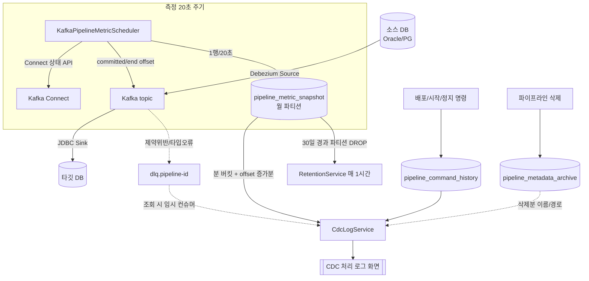

# CDC 처리로그 — 측정 · 관리 · 데이터 흐름

> 대상 화면: **CDC > 처리 로그** (탭: 처리 이력 / 오류·상태 이력 / DLQ)
> 최종 정리: 2026-08-24

## 0. 한 줄 요약

CDC 처리로그는 **전용 로그 테이블이 아니다.** 백엔드가 **20초마다** Kafka 커넥터/컨슈머 지표를 `pipeline_metric_snapshot`에 스냅샷으로 적재하고, 화면 조회 시 그 스냅샷을 **분(minute) 단위로 묶어 committed offset 증가분을 "처리 건수"로 파생**해 보여준다.

---

## 1. 측정 — 무엇을, 어떻게 재나

### 1.1 수집기

- **클래스**: `KafkaPipelineMetricScheduler.checkDeployedPipelines()`
- **주기**: `@Scheduled(fixedRate = 20_000)` → **20초마다**
- **대상**: `status IN (DEPLOYED, STOPPED)` 파이프라인
  - `STOPPED`도 수집한다 — Sink만 멈추고 Source는 계속 Kafka에 쌓으므로 lag 증가를 계속 관측해야 하기 때문.
  - `READY`(Source/Sink 모두 정지)는 수집 대상 아님.
- 대상이 0건이어도 주기는 완주하며 `heartbeat.beat("kafka-metrics")`로 생존 신호를 남긴다.

### 1.2 스냅샷 1건에 담기는 것 (`PipelineMetricSnapshotService.recordSnapshot`)

| 항목 | 소스 | 의미 |
|---|---|---|
| `committed_offset` | 컨슈머 그룹 `connect-{sink커넥터명}`의 topic별 커밋 offset 합계 (`KafkaTopicOffsetReader.getCommittedOffsetSum`) | Sink가 **지금까지 소비(적재)한** 누적 레코드 수 |
| `end_offset` | topic의 최신(끝) offset 합계 | Source가 Kafka에 **지금까지 쌓은** 누적 레코드 수 |
| `consumer_lag` | `max(0, end_offset − committed_offset)` | 아직 타깃에 반영 안 된 **미처리 건수(추정)** |
| `source_connector_state` | Kafka Connect 상태 API의 source 커넥터 status | RUNNING/FAILED/… (로그 파이프라인은 filebeat라 null) |
| `sink_connector_state` | Kafka Connect 상태 API의 sink 커넥터 status | RUNNING/STOPPED/PAUSED/FAILED/… |
| `partition_count`, `error_count`, `topic_name`, `last_error_message` | Kafka Connect / topic 메타 | 부가 정보 |

### 1.3 "처리 건수"의 정의

- **처리 건수(processed) = 이번 스냅샷 committed_offset − 직전 스냅샷 committed_offset** (`Math.max(0, …)`).
- 즉 **Sink 컨슈머가 커밋한 offset 증가량** 기준의 **추정치**다. 타깃 DB에 실제로 몇 건이 INSERT/UPDATE 됐는지의 정확값도, E2E 지연 시간도 아니다.
- UPSERT의 UPDATE 경로 등은 offset은 증가하지만 화면 "적재 건수"와 정의가 다를 수 있음에 유의.

---

## 2. 저장 — 어디에

### 2.1 `pipeline_metric_snapshot` (원천 테이블)

- 정의: `V5__create_pipeline_metric_snapshot.sql`, **월 단위 RANGE 파티션으로 전환**: `V27__partition_metric_snapshot.sql`
- 파티션 키: `collected_at` (RANGE). 파티션 예: `..._p202609`, `..._pdefault` 등.
- **1 파이프라인 × 20초 = 1행**. 변화가 없어도 계속 쌓인다("0건 관측"과 "미관측"을 구분하기 위한 의도).

### 2.2 파생/보조 저장소

| 테이블 | 용도 | 쓰는 곳 |
|---|---|---|
| `pipeline_command_history` | **오류·상태 이력 탭**의 소스(DEPLOY/START/STOP/DISMISS_DRIFT 등 명령 이력) | `PipelineDeployService` → `PipelineCommandHistoryRecorder.record(...)` |
| `pipeline_daily_load_metric` | 대시보드 일자별 적재 건수(rollup) | `KafkaPipelineMetricScheduler` → `dailyLoadMetricService.incrementLoadedCount` (delta>0일 때) |
| `pipeline_metadata_archive` | **삭제된 파이프라인**의 표시용 메타(이름·경로) 보존 | `PipelineService.delete` → 삭제 직전 save (V50) |
| DLQ Kafka topic `dlq.pipeline-{id}` | **DLQ 탭**의 소스 | `DlqReadService`가 조회 시 임시 `KafkaConsumer`로 직접 읽음 |

---

## 3. 조회 — 스냅샷을 처리로그로 변환

### 3.1 처리 이력 탭 (`CdcLogService.processingLogs`)

1. 조회 대상 파이프라인 = **현존 파이프라인 + 최근 삭제분(아카이브, 스냅샷 보존창 내)**.
2. 기간 내 스냅샷을 파이프라인별로 조회 → **분(minute) 단위 버킷**으로 묶음(20초 3건 → 분당 1건 대표).
3. 각 버킷에서 `processed = committed − 직전 committed`, `lag`, source/sink 상태, `status` 계산.
4. **노출 규칙(무변화 heartbeat 억제)** — 아래 중 하나라도 참일 때만 로그 행 생성:
   - `processed > 0` (적재 발생), 또는
   - `lag > 0`, 또는
   - 상태 변화(source/sink state 바뀜), 또는
   - `status != SUCCESS` (오류/정지/지연), 또는
   - **해당 파이프라인의 가장 최근 분 버킷(latestBucket)** ← *변화가 없어도 "현재 상태" 1행은 항상 노출되는 이유*

### 3.2 상태(status) 판정

| status | 조건 |
|---|---|
| `FAILED` | source/sink state가 FAILED·ERROR 이거나 `error_count > 0` |
| `STOPPED` | sink state가 STOPPED·PAUSED |
| `DELAYED` | `lag ≥ 1000` (임계) |
| `SUCCESS` | 그 외 |

### 3.3 오류·상태 이력 탭 (`CdcLogService.eventLogs`)

- 소스 = `pipeline_command_history` (스냅샷 아님).
- 현존 + 최근 삭제 파이프라인의 명령 이력을 조회.

### 3.4 DLQ 탭

- `DlqReadService`가 조회 시점에 `dlq.pipeline-{id}` 토픽을 임시 컨슈머로 직접 읽는다(상시 적재 아님).

---

## 4. 관리 — 보존/파티션/삭제

### 4.1 보존정리 (`RetentionService`)

- 주기: `@Scheduled(fixedRate = 3_600_000)` → **매 1시간**(기동 후 5분 뒤 첫 실행).
- `pipeline_metric_snapshot`: **retention_days = 30**, **purge_mode = PARTITION_DROP** (30일 지난 **월 파티션을 통째로 DROP**).
- `retention_policy` 테이블의 화이트리스트 대상만 정리.

### 4.2 파티션 유지 (`PartitionMaintenanceService`)

- 주기: `@Scheduled(fixedRate = 21_600_000)` → **매 6시간**.
- 미래 월 파티션을 미리 생성. (당월 전용 파티션이 없으면 데이터는 `DEFAULT` 파티션으로 들어감 — 동작엔 무방하나 PARTITION_DROP 대상은 아님)

### 4.3 파이프라인 삭제 시 로그 (중요)

- 처리로그는 스냅샷을 **현존/최근삭제 파이프라인 기준으로 파생**한다.
- **삭제해도 스냅샷 행은 지워지지 않는다** — `pipeline_metric_snapshot`엔 FK CASCADE·삭제코드 없음. **보존정리(30일)로만** 지워진다.
- 과거엔 삭제 즉시 이름·경로 메타가 사라져 로그가 화면에서 안 보였으나, **V50(`pipeline_metadata_archive`)** 도입으로 **삭제 시 표시 메타를 보존** → 보존정리 전까지 `이름 (삭제됨)` 형태로 계속 조회 가능.

---

## 5. 데이터 흐름도

---

## 6. 화면 필드 ↔ 소스 매핑 (처리 이력 탭)

| 화면 컬럼 | 소스 |
|---|---|
| 파이프라인명 / 소스·타깃 경로 | 현존: `pipeline_definition` / 삭제분: `pipeline_metadata_archive` (`(삭제됨)` 표기) |
| Topic | `pipeline_metric_snapshot.topic_name` |
| 처리 건수 | committed_offset 증가분(분 버킷) |
| 누적(일별) | 당일 처리 건수 합계 |
| 미처리(Lag) | `consumer_lag` (end − committed) |
| 소스/Sink 상태 | `source_connector_state` / `sink_connector_state` |
| 상태 | 위 §3.2 판정 |

---

## 7. 특성·주의사항

- **추정치**: 처리 건수·Lag는 Sink committed offset 기준 추정이며, 타깃 DB 실제 반영 건수·E2E 지연이 아니다.
- **무변화에도 최신 1행**: 각 파이프라인의 최신 분 버킷은 항상 노출된다(현재 상태 표시).
- **수집 대상이 없으면 빈 화면**: `DEPLOYED/STOPPED` 파이프라인이 0개면 스냅샷이 안 쌓여 로그도 비어 있다(삭제·보존정리 때문이 아님).
- **삭제 후 조회**: V50 이후 보존정리(30일) 전까지 삭제 파이프라인 로그도 조회 가능. 단 스냅샷이 보존정리로 사라지면 그 시점부터 안 보인다.

---

## 8. 관련 코드/마이그레이션

- 수집기: `web/backend/.../monitoring/KafkaPipelineMetricScheduler.java`
- 스냅샷 기록: `web/backend/.../monitoring/PipelineMetricSnapshotService.java`
- 조회/파생: `web/backend/.../monitoring/CdcLogService.java`
- 컨트롤러: `web/backend/.../monitoring/CdcLogController.java` (`/api/cdc/logs/*`)
- 보존정리/파티션: `web/backend/.../retention/RetentionService.java`, `PartitionMaintenanceService.java`
- 삭제 메타 보존: `web/backend/.../pipeline/PipelineService.java`(delete) + `PipelineMetadataArchive.java`
- 마이그레이션: `V5`(테이블), `V27`(파티션), `V50`(삭제 메타 아카이브)
- 화면: `web/cerebroetl-ui/src/pages/CdcLogsPage.tsx`
