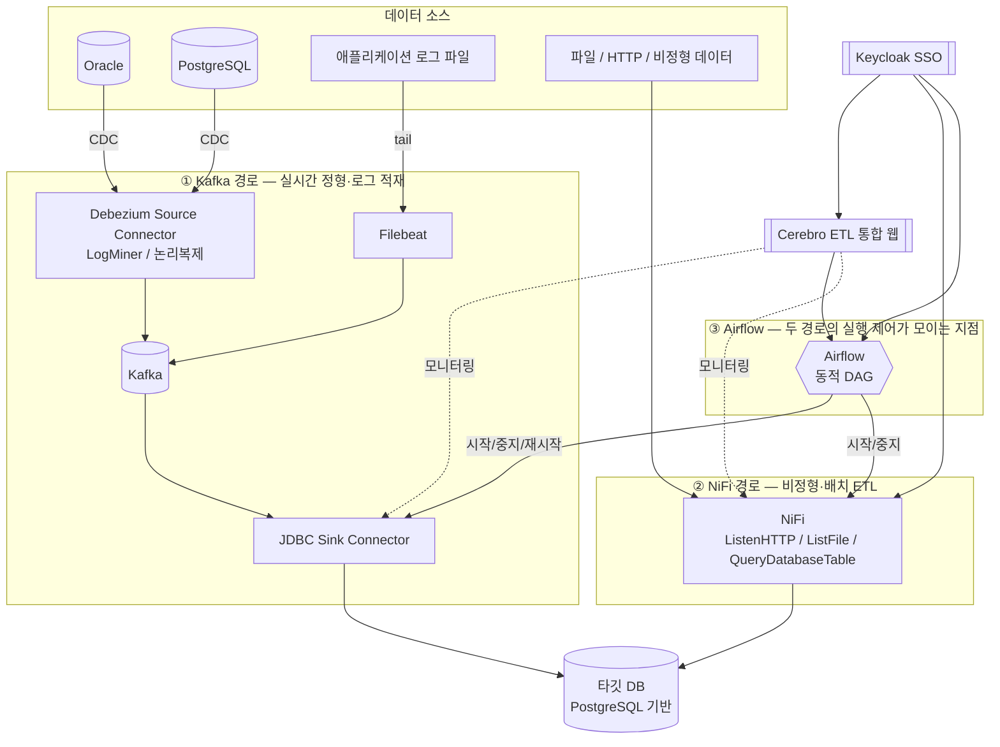
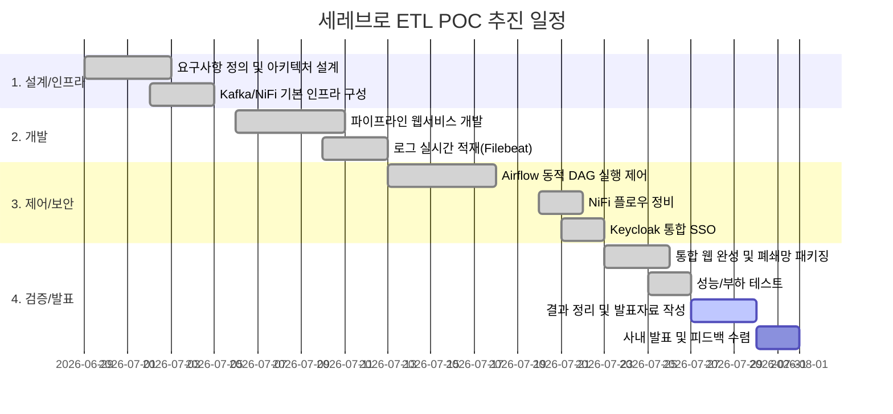

# 세레브로(Cerebro) ETL 솔루션 POC 발표자료

> 발표 대상: 프로젝트 관계자 / 의사결정자
> 기준 브랜치: `msa-integration` (2026-07-26 기준 스택 실측)
> 작성 방식: 본 문서의 아키텍처·기능 설명은 실제 코드/설정을 조사해 작성했고, 4장의 성능 수치는 로컬 POC 스택(Kafka, Kafka Connect, NiFi, PostgreSQL)에 실제로 10만 건을 적재하며 직접 측정한 결과입니다.

---

## 1. 개요

### 1.1 배경 및 필요성

- 현업 데이터가 **Oracle(정형 트랜잭션), 로그 파일(반정형), 파일/이미지/문서(비정형)** 등 서로 다른 형태와 서로 다른 시스템에 흩어져 있고, 이를 옮기는 방식도 배치 스크립트, 수작업 추출, 개별 연동 등으로 제각각이었습니다.
- 시스템 간 데이터 연계가 필요할 때마다 **개별 연동 프로그램을 새로 개발**해야 했고, 이는 이관 지연·중복 개발·운영 부담 증가로 이어졌습니다.
- 실시간성이 필요한 데이터(예: 트랜잭션 변경분)와 배치성 데이터(예: 야간 정산 데이터), 비정형 데이터(문서, 로그)를 **하나의 운영 체계로 통합 관리**할 필요성이 제기되었습니다.
- 이에 따라 검증된 오픈소스 조합(Kafka, NiFi, Airflow)을 기반으로 한 **통합 데이터 파이프라인 플랫폼의 실현 가능성을 검증**하기 위해 본 POC를 진행했습니다.

### 1.2 목적

1. **실시간 데이터 연동 검증**: Oracle/PostgreSQL의 변경 데이터(CDC)를 Kafka 기반으로 실시간 전달할 수 있는지 검증
2. **이기종 ETL 처리 검증**: 정형(DB), 반정형(로그), 비정형(파일/HTTP) 데이터를 하나의 플랫폼에서 적재할 수 있는지 검증
3. **운영 자동화 검증**: Kafka·NiFi 파이프라인의 시작/중지/재시작을 Airflow로 통제하고, 통합 웹에서 상태를 모니터링할 수 있는지 검증
4. **성능 및 안정성 확인**: 실제 대량 데이터(10만 건) 적재 시 처리 시간과 한계점을 측정
5. **향후 확산 가능성 검토**: 사내 실제 시스템(Oracle, 타란툴라DB 등)에 적용하기 위한 로드맵 도출

### 1.3 주요 내용

| 구분 | 내용 |
|---|---|
| 실시간 CDC | Debezium 기반 Oracle/PostgreSQL 변경 데이터 캡처 → Kafka → 타깃 DB 적재 |
| 로그 적재 | Filebeat로 로그 파일을 tailing하여 Kafka로 실시간 전송 후 적재 |
| 비정형/배치 ETL | NiFi로 HTTP·파일 기반 비정형 데이터 수집 및 Oracle 배치 동기화 |
| 실행 제어 | Airflow 동적 DAG로 Kafka Connect/NiFi 파이프라인 시작·중지·재시작 |
| 통합 웹/SSO | Cerebro ETL 포털에서 연결정보·파이프라인·대시보드 통합 제공, Keycloak 기반 단일 로그인 |
| 폐쇄망 대응 | 외부망 이미지 빌드 → tar 반입 → 폐쇄망 `docker load` 방식의 배포 패키징 |

### 1.4 기대효과

- **연동 개발 기간 단축**: 신규 테이블/로그/파일 연동 시마다 프로그램을 새로 짜지 않고, 화면에서 설정만으로 파이프라인 생성 가능
- **실시간성 확보**: 배치 주기(일/시간 단위) 의존 없이 변경 발생 즉시 데이터 반영 → 데이터 최신성 개선
- **운영 표준화**: 파이프라인 시작/중지/재시작/이력 조회가 Airflow·통합 대시보드로 일원화되어 장애 대응 시간 단축
- **이기종 시스템 대응력**: Oracle ↔ PostgreSQL(타란툴라DB 대체) 등 서로 다른 DB 간 연계 구조를 검증했으므로, 향후 다른 이기종 조합에도 동일 패턴 적용 가능
- **단계적 사내 확산 기반 마련**: 폐쇄망 배포 패키징까지 검증되어 있어 사내망 반입 시 추가 개발 없이 배포 가능

---

## 2. 아키텍처 및 구성

### 2.1 전체 구성도

Kafka 경로(실시간 정형/로그 데이터)와 NiFi 경로(비정형·배치 데이터)가 각각 별도로 수집을 시작하고, **두 실행 엔진의 시작·중지·재시작 같은 운영 제어는 Airflow로 모여** 하나의 오케스트레이션 체계로 관리됩니다. 실제 데이터 적재는 각 경로가 타깃 DB로 직접 반영합니다.



> **참고(정확한 이해를 위해)**: Airflow로 "모이는" 것은 데이터 자체가 아니라 **실행 제어(시작/중지/재시작)와 상태 확인**입니다. 실제 데이터는 Kafka Connect와 NiFi가 각각 타깃 DB로 직접 적재하며, Airflow는 이 두 실행 엔진을 동일한 방식(동적 DAG)으로 통제하는 컨트롤 플레인 역할을 합니다.

### 2.2 컴포넌트별 책임

| 구성요소 | 역할 | 비고 |
|---|---|---|
| Kafka | 이벤트 저장/전달 허브 | 소스-타깃 분리, 일시 장애 시 버퍼 역할 |
| Kafka Connect (Debezium) | 실시간 CDC 실행 엔진 | Source(Oracle/PostgreSQL) + JDBC Sink 동적 배포 |
| Filebeat | 로그 tailing | 로그 라인을 Kafka로 실시간 전달, 기존 JDBC Sink 재사용 |
| NiFi | 비정형·배치 ETL 엔진 | HTTP/파일 수집, Oracle 배치(EMPLOYEES) 동기화, 시각적 플로우 관리 |
| Airflow | 실행 제어/스케줄러 | 파이프라인별 동적 DAG로 start/stop/restart + 결과 재검증 |
| Cerebro ETL 통합 웹 | 사용자 포털 | 연결정보·파이프라인 생성/배포, 대시보드, 각 콘솔 통합 뷰 |
| Keycloak | 인증(SSO) | 포털/NiFi/Airflow 공통 계정, OIDC 기반 |
| Metadata DB | 파이프라인 메타데이터 저장 | 연결정보(암호화), 파이프라인 정의, 커넥터, 명령 이력 |

### 2.3 Docker 기반 서비스 구성 (실제 기동 스택)

```text
인증/통합 화면 : keycloak, cerebroetl-ui
제어 플레인    : pipeline-api, metadata-db, pipeline-ui
실시간 데이터  : kafka, kafka-connect, filebeat
ETL/스케줄     : nifi, airflow-apiserver, airflow-scheduler, airflow-dag-processor, airflow-init
POC 검증용 DB  : target-db (PostgreSQL 기반, 타란툴라DB 대체)
```

전체 13개 서비스가 Docker Compose 단일 스택으로 구성되어 있으며, 폐쇄망 반입 시에도 동일 구성을 그대로 유지할 수 있습니다.

---

## 3. 시스템 기능 소개

Cerebro ETL 통합 웹(`cerebroetl-ui`)은 Keycloak SSO 로그인 이후 아래 화면들로 구성됩니다.

### 3.1 대시보드 (`/dashboard`)

- **목적**: NiFi / Kafka / Airflow 3개 실행 엔진의 현재 상태를 한 화면에서 종합 모니터링
- **주요 UI**
  - 기간 검색(RangePicker)
  - NiFi 현황: 실행중/실패/중지/전체 Job 상태 카드 4종 + "Job별 대기 FlowFile Top 5", "NiFi 일별 적재 건수" 차트
  - Kafka 현황: 실행중/실패/일시정지/전체 Connector 상태 카드 4종 + "적재 건수 Top 5 파이프라인", "Kafka 일별 적재 건수" 차트
  - Airflow 현황: DAG/태스크/제어명령 성공·실패 상태 카드 6종 + "Top 5 수행시간 태스크" 차트
  - 카드 클릭 시 실패 사유·명령 이력 상세 모달 팝업
- **사용법**: NiFi/Kafka 카드는 15초, 명령 요약은 30초 주기로 자동 갱신되어 별도 새로고침 없이 실시간에 가깝게 현황을 확인할 수 있습니다.

### 3.2 연결정보 관리 (`/cdc/connections`)

- **목적**: CDC 파이프라인의 소스/타깃 DB 접속정보를 등록·관리
- **주요 UI**: 연결 목록 테이블(이름/DB유형/접속정보/상태/마지막 테스트 시각), "신규 등록" 버튼, 연결 테스트 버튼
- **사용법**: 등록 후 "테스트" 버튼으로 실제 연결 가능 여부를 확인하고, 파이프라인 생성 시 드롭다운으로 선택해 재사용합니다. 비밀번호는 메타데이터 DB에 암호화 저장되며 화면에 다시 노출되지 않습니다.

### 3.3 파이프라인 관리 (`/cdc/pipelines`)

- **목적**: 테이블 CDC 파이프라인과 로그파일 적재 파이프라인의 생성·배포·상태 제어
- **주요 UI**
  - 이름/Topic 검색, 상태·유형 다중 필터
  - "신규 생성" 모달(테이블 CDC / 로그파일 적재 탭 전환) — 소스·타깃 연결 선택 후 **실제 DB 카탈로그를 조회**해 스키마/테이블을 드롭다운으로만 선택하도록 하여 오탈자·대소문자 불일치로 인한 토픽 단절을 예방
  - 목록 테이블(이름/유형/소스/타깃/Topic/상태), 상세 Drawer(기본정보/Connector 설정·상태/명령 이력 3탭)
  - Kafka Connect에서 커넥터가 사라지는 등 "드리프트" 발생 시 경고 배너와 "지금 재배포" 버튼 제공(30초 주기 감지)
- **사용법**: 생성 → 배포(Kafka Connect 커넥터 자동 등록) → 상세 화면에서 커넥터 상태/이력 확인 순으로 사용합니다.

### 3.4 ETL(NiFi) 작업 생성 (`/etl/create`) 및 실행 이력 (`/etl/logs`)

- **목적**: NiFi 기반 비정형/배치 ETL 작업 공간을 만들고, 그 실행·적재 이력을 조회
- **주요 UI**: 작업 공간(Group) 이름 입력 후 생성 → NiFi 캔버스로 자동 이동 / 로그 화면은 기간·프로세서명 검색 + 성공·실패 태그가 있는 실행 이력 테이블
- **사용법**: NiFi는 자체적으로 "실행 이력" 개념이 없기 때문에, 백엔드가 적재 프로세서의 카운터 증가를 감지해 이력으로 환산·기록합니다.

### 3.5 통합 콘솔 (`/etl/manage`, `/airflow/manage`)

- **목적**: NiFi·Airflow 관리 콘솔을 iframe으로 임베드하여 별도 창 전환 없이 하나의 포털처럼 제공
- **주요 UI**: 전체화면 iframe, 콘솔 기동 전 대기 화면
- **사용법**: 콘솔 자체 로고/계정 UI는 숨겨 "하나의 Cerebro ETL"처럼 보이도록 구성했고, NiFi는 특정 프로세스 그룹으로 바로 진입할 수 있습니다.

> 참고: `web/frontend`(Kafka 파이프라인 전용 UI)는 통합 이전 단계에서 사용하던 화면으로, 현재는 `cerebroetl-ui`가 동일 기능을 포함해 통합 제공합니다.

---

## 4. 테스트 및 성능 체크

### 4.1 테스트 환경

| 항목 | 내용 |
|---|---|
| 인프라 | 단일 노드 Docker Compose(WSL2), 12 vCPU / 10GB RAM 환경 |
| 대상 | 실제 기동 중인 POC 스택(kafka, kafka-connect, nifi, target-db)에 직접 적재 |
| 측정 방식 | ①Kafka 자체 처리량 → ②Kafka Connect(JDBC Sink)를 통한 정형 데이터 E2E 적재 → ③NiFi(ListenHTTP)를 통한 비정형 데이터 E2E 적재, 3가지 경로를 각각 10만 건 기준으로 측정 |
| 유의사항 | 서비스별 CPU 자원이 Docker Compose에서 제한(`cpus: 0.5~1.5`)되어 있는 **POC 규모 환경 기준 수치**이며, 운영 규모 자원 확장 시 처리량은 더 높아질 수 있음 |

### 4.2 테스트 ① Kafka 자체 처리 성능 (순수 브로커 처리량)

`kafka-producer-perf-test` 로 100,000건(레코드당 약 220byte)을 최대 속도로 발행한 결과입니다.

| 지표 | 결과 |
|---|---|
| 처리 건수 | 100,000건 |
| 소요 시간 | 약 2.9초 |
| 처리량 | **34,435 records/sec (7.22 MB/sec)** |
| 평균 지연시간 | 520.17 ms |
| p50 / p95 / p99 지연 | 597 ms / 714 ms / 788 ms |
| 최대 지연 | 792 ms |

**해석**: Kafka 브로커 자체는 10만 건을 약 3초 내에 수신할 수 있는 여력이 있어, 실시간 스트리밍 허브로서 병목이 되지 않음을 확인했습니다.

### 4.3 테스트 ② 정형 데이터 실시간 적재 E2E (Kafka → Kafka Connect JDBC Sink → PostgreSQL)

실제 운영 중인 Sink 커넥터와 동일한 설정(Debezium JDBC Sink, `insert.mode=insert`)으로 테스트 커넥터를 배포하고, CDC 이벤트와 동일한 JSON 스키마 포맷으로 10만 건을 발행하여 **타깃 테이블에 10만 건이 모두 반영되는 시점까지** 측정했습니다.

| 구간 | 소요 시간 | 처리량 |
|---|---|---|
| Kafka 발행 완료까지 | 7.84초 | 12,760 records/sec |
| Kafka Connect 적재 후 DB 반영 지연 | +7.95초 | - |
| **전체 E2E (발행 시작 → DB 10만 건 반영 완료)** | **15.79초** | **약 6,334 records/sec** |

**해석**: 실 CDC 환경과 동일한 경로로 10만 건을 약 16초에 적재했습니다. Kafka 발행과 DB 반영이 거의 1:1 비율(약 7.8초씩)로 나뉘어, 이 구성에서는 **Kafka Connect의 배치 커밋 처리**가 파이프라인의 주된 소요 구간임을 확인했습니다.

### 4.4 테스트 ③ 비정형 데이터 실시간 적재 E2E (HTTP → NiFi ListenHTTP → PutDatabaseRecord → PostgreSQL)

실제 운영 중인 `ListenHTTP → PutDatabaseRecord` 플로우(비정형 파일 메타데이터 수집용)에 10만 건의 JSON을 HTTP로 전송하며 측정했습니다. 클라이언트 동시 연결 수를 8개와 32개로 바꿔 두 차례 반복 측정했습니다.

| 지표 | 8 스레드 동시 전송 | 32 스레드 동시 전송 |
|---|---|---|
| 시도 건수 | 100,000건 | 100,000건 |
| HTTP 요청 소요 시간 | 114.8초 | 107.4초 |
| **성공 처리 건수** | **34,566건 (34.6%)** | 26,779건 (26.8%) |
| 실패 건수 | 65,434건 (65.4%) | 73,221건 (73.2%) |
| 성공 건 기준 처리량 | 약 301 records/sec | 약 249 records/sec |
| 성공 건의 DB 반영 | HTTP 요청 처리 완료 시점 기준 추가 지연 없이 반영 확인 | 좌동 |

**해석**: NiFi의 `ListenHTTP → PutDatabaseRecord` 플로우는 건당 1회 HTTP 요청으로 수집하는 구조라, 지속적으로 초당 약 250~300건을 넘는 유입이 발생하면 NiFi 내부 큐 백프레셔로 신규 요청이 거부(연결 오류)되기 시작했습니다. 클라이언트 동시 연결 수를 8개→32개로 늘려도 성공률이 오히려 낮아졌는데(34.6%→26.8%), 이는 병목이 **클라이언트 동시성이 아니라 NiFi 서버 측(PutDatabaseRecord의 DB 커밋 속도 대비 유입 속도)** 에 있음을 시사합니다. 10만 건 전량을 안정적으로 적재하려면 (a) 여러 건을 하나의 파일/요청으로 묶어 전송하는 배치화, (b) NiFi 컨테이너 CPU 할당 확대(현재 POC 구성은 1.5 core 제한), (c) 백프레셔 임계값·`PutDatabaseRecord` 배치 크기 튜닝이 필요합니다.

### 4.5 종합 비교 및 시사점

| 경로 | 10만 건 소요 시간 | 처리량(records/sec) | 비고 |
|---|---|---|---|
| Kafka(브로커 단독) | 약 2.9초 | 약 34,400 | 스트리밍 버퍼 역할, 병목 아님 |
| Kafka → Connect → DB (정형) | 약 15.8초 | 약 6,300 | CDC 실사용 경로와 동일 |
| HTTP → NiFi → DB (비정형) | 114.8초 내 34,566건 성공(전량 미완주) | 약 300(성공 기준) | 단건 HTTP 수집, 배치화 필요 |

- **정형 데이터(Kafka 경로)**: 대용량 실시간 동기화에 적합하며, 이번 POC 환경(단일 노드) 기준으로도 초당 수천 건 이상 처리 가능함을 확인했습니다.
- **비정형 데이터(NiFi 경로)**: 파일 단위/배치 단위 처리에는 적합하지만, 건당 HTTP 요청 방식으로 대량 동시 유입이 발생하면 NiFi 인스턴스의 자원(CPU 1.5 core 제한)과 백프레셔 설정에 따라 처리 실패가 발생할 수 있음을 확인했습니다. 운영 적용 시 ①NiFi 컨테이너 자원 확대, ②배치 전송(다건을 하나의 요청으로 묶음), ③백프레셔·재시도 정책 튜닝이 필요합니다.
- 두 경로 모두 **타깃 DB(PostgreSQL) 커밋 속도**가 공통적인 하한 요인으로 작용했습니다. 운영 규모 전환 시 타깃 DB의 인덱스/커밋 배치 설정을 함께 튜닝하는 것을 권장합니다.

---

## 5. 일정

### 5.1 추진 경과 및 향후 일정 (2026-06-29 ~ 2026-07-31)

| 주차 | 기간 | 주요 내용 | 상태 |
|---|---|---|---|
| 1주차 | 06.29 ~ 07.05 | 요구사항 정의, 아키텍처 설계, Kafka/Kafka Connect/NiFi 기본 인프라(Docker Compose) 구성, Oracle CDC 1차 검증 | 완료 |
| 2주차 | 07.06 ~ 07.12 | 파이프라인 웹서비스(Backend/Frontend) 개발 — 연결정보/파이프라인 CRUD, Kafka Connect 연동, 로그파일 실시간 적재(Filebeat) 구현 | 완료 |
| 3주차 | 07.13 ~ 07.19 | Airflow 도입 및 동적 DAG 기반 파이프라인 실행 제어, 통합 대시보드/모니터링 강화 | 완료 |
| 4주차 | 07.20 ~ 07.22 | NiFi 플로우 정비(비정형·배치 플로우 복구), Keycloak 기반 통합 SSO(OIDC) — 포털/NiFi/Airflow 적용 | 완료 |
| 5주차 | 07.23 ~ 07.26 | 통합 웹(Cerebro ETL UI) 완성, 폐쇄망 배포 패키징, **성능/부하 테스트 수행(본 문서 4장)** | 완료 |
| 6주차 | 07.27 ~ 07.31 | 테스트 결과 정리 및 POC 결과 보고서 작성, 사내 발표 및 피드백 수렴, 실사용 확산 로드맵 확정 | 진행 예정 |

### 5.2 타임라인



---

## 6. 활용방안

앞선 아키텍처·기능·성능 검증 결과를 바탕으로, 다음과 같은 활용방안을 제안합니다.

### 6.1 단기(즉시 적용 가능)

1. **레거시 시스템 실시간 이중화·점진적 마이그레이션**: Oracle 등 레거시 DB의 변경 데이터를 신규 타깃 DB로 실시간 복제하면서, 애플리케이션 전환을 무중단으로 단계적으로 진행할 수 있습니다. (테스트 ②에서 정형 데이터 10만 건을 약 16초에 안정적으로 반영함을 확인)
2. **운영 로그 통합 수집 기반 마련**: 여러 서버에 흩어진 애플리케이션 로그를 Filebeat → Kafka 경로로 표준화 수집하여, 이후 검색/알림 시스템(예: 로그 분석 플랫폼)과 연계할 수 있는 기반을 마련합니다.
3. **부서 간 이기종 DB 데이터 연계 허브**: Oracle/PostgreSQL 등 서로 다른 DB를 쓰는 부서·시스템 간 데이터를 화면 설정만으로 실시간 동기화하여, 개별 연동 프로그램 개발 없이 데이터 공유 체계를 구축할 수 있습니다.

### 6.2 중기(추가 검증 후 적용)

4. **업무 파일/문서 수집 자동화**: 계약서, 이미지, 첨부파일 등 비정형 데이터를 NiFi로 표준 스키마에 적재해 후속 검색·분석의 기초 데이터로 활용합니다. 다만 4.4의 테스트 결과에 따라 대량 동시 업로드가 예상되는 경우 NiFi 자원 확장과 배치 전송 방식 적용이 선행되어야 합니다.
5. **야간 배치 잡의 파이프라인 표준화**: 개별 스크립트로 운영되던 배치 작업을 Airflow DAG로 흡수하여, 실행 이력·재시도·알림을 하나의 체계에서 관리합니다.
6. **운영 통제·감사 체계로 확장**: 현재의 파이프라인 명령 이력을 기반으로, 프로젝트별 권한 분리와 변경 전후 값을 기록하는 감사 로그 체계로 확장해 내부통제 요구사항에 대응합니다.

### 6.3 장기(운영 전환 전 필수 보완)

7. **보안/시크릿 관리 고도화**: 현재 POC 수준인 `.env` 평문 관리 방식을 Vault 등 운영용 시크릿 관리 체계로 전환합니다.
8. **고가용성(HA) 구성**: 현재 단일 노드 구성인 Kafka·DB·Airflow를 다중화하여 장애 시 자동 복구가 가능한 구조로 전환합니다.
9. **실 사내 시스템 연동 검증**: 현재 PostgreSQL로 대체 검증한 타란툴라DB를 실제 제품으로 교체하고, 사내 Oracle 환경(ARCHIVELOG, Supplemental Logging 등 사전 조건)과의 호환성을 검증합니다.

### 6.4 제안 우선순위

> 6.1의 3개 항목은 현재 POC 구성 그대로 적용 가능한 항목이므로, 실제 사내 데이터 연계 요구가 있는 부서를 대상으로 **2차 파일럿**을 먼저 진행하고, 그 결과를 바탕으로 6.3의 보안/HA 보완을 거쳐 운영 전환하는 순서를 권장합니다.
