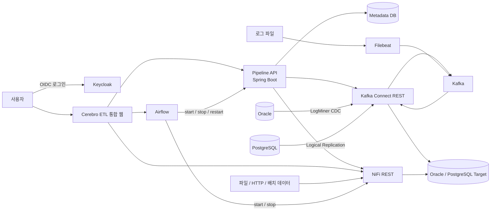
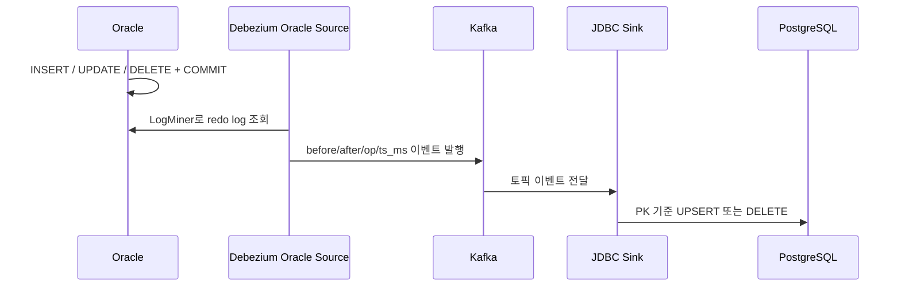
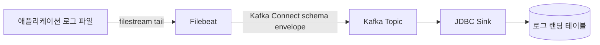

# Cerebro ETL 프로젝트 소개 및 시연 가이드

> 대상: 프로젝트 관계자, 개발·운영 담당자, 의사결정자  
> 권장 발표 시간: 15~20분, 질의응답 5~10분  
> 기준 브랜치: `feature/airflow-oidc` (2026-07-22)

## 1. 발표 목표

이 발표에서 전달할 핵심은 다음 세 가지다.

1. 서로 다른 데이터 소스의 실시간·배치·비정형 데이터를 하나의 플랫폼에서 연계한다.
2. 사용자는 Cerebro ETL에서 파이프라인을 만들고, Airflow에서 실행을 통제하며, 대시보드에서 상태와 이력을 확인한다.
3. Keycloak 통합 계정을 기반으로 향후 프로젝트별 권한과 개인별 감사 이력을 적용할 수 있다.

### 30초 소개 문구

> Cerebro ETL은 Oracle과 PostgreSQL의 변경 데이터를 실시간으로 전달하고, 로그파일과 비정형·배치 데이터까지 함께 처리하는 통합 데이터 파이프라인 플랫폼입니다. Kafka Connect는 실시간 CDC, NiFi는 비정형 및 배치 ETL, Airflow는 실행과 스케줄 제어를 담당합니다. 사용자는 통합 웹에서 이들을 관리하고 Keycloak 계정 하나로 인증합니다.

---

## 2. 전체 시스템 구성

### 2.1 구성도



### 2.2 컴포넌트별 책임

| 구성요소 | 책임 | 발표 시 강조할 내용 |
|---|---|---|
| Cerebro ETL | 사용자 통합 화면 | 여러 도구를 한곳에서 조회·관리 |
| Keycloak | 사용자 인증과 SSO | 포털, NiFi, Airflow에 동일 계정 사용 |
| Pipeline API | 파이프라인 제어 플레인 | 연결정보·파이프라인·배포·이력 관리 |
| Metadata DB | 관리 정보 저장 | 연결정보, 파이프라인 정의, 커넥터, 명령 이력 |
| Kafka | 이벤트 전달 허브 | 소스와 타깃을 분리하고 변경 이벤트를 버퍼링 |
| Kafka Connect | 실시간 CDC 실행 엔진 | Debezium Source와 JDBC Sink를 동적 배포 |
| Filebeat | 로그 tailing | 로그 라인을 실시간으로 Kafka에 전달 |
| NiFi | ETL 실행 엔진 | HTTP·파일·비정형·배치 처리와 시각적 플로우 관리 |
| Airflow | 제어 및 스케줄 | 파이프라인 시작·중지·재시작, 실행 결과 검증 |

### 2.3 Docker 서비스 구성

현재 주요 서비스는 다음과 같다.

```text
인증/통합 화면: keycloak, cerebroetl-ui
제어 플레인: pipeline-api, metadata-db, pipeline-ui
실시간 데이터: kafka, kafka-connect, filebeat
ETL/스케줄: nifi, airflow-apiserver, airflow-scheduler,
             airflow-dag-processor, airflow-db
POC 데이터베이스: oracle-db, target-db
```

---

## 3. 데이터가 흐르는 방식

### 3.1 테이블 CDC: Oracle → PostgreSQL



설명 문구:

> 애플리케이션이 Oracle 테이블을 직접 조회하는 방식이 아니라, Debezium이 Oracle redo log를 읽습니다. 따라서 커밋된 변경 사항을 Kafka 이벤트로 만들 수 있고, JDBC Sink가 이를 타깃 테이블에 반영합니다. 기본 경로에서는 INSERT와 UPDATE는 upsert, DELETE는 실제 삭제로 전달됩니다.

핵심 설정:

- Oracle: ARCHIVELOG, Supplemental Logging, LogMiner 권한을 가진 공통 사용자 필요
- Kafka Topic 예: `oracle-cdc.APPUSER.CUSTOMERS`
- Sink: `insert.mode=upsert`, `primary.key.mode=record_key`, `delete.enabled=true`
- 타깃: PostgreSQL 기반 타란툴라DB 대체 환경

### 3.2 역방향 CDC: PostgreSQL → Oracle

```text
PostgreSQL 변경
→ Debezium PostgreSQL Source(pgoutput, publication, replication slot)
→ Kafka Topic
→ Debezium JDBC Sink + Oracle JDBC Driver
→ Oracle Target Table
```

PostgreSQL은 `wal_level=logical`과 replication 권한이 필요하다. 파이프라인 삭제 시 백엔드가 Debezium이 생성한 publication과 replication slot도 정리한다.

### 3.3 로그파일 실시간 적재



설명 문구:

> Filebeat는 파일의 읽은 위치를 registry에 저장하며 로그를 tail합니다. Pipeline API가 파이프라인별 Filebeat 입력 YAML을 생성하고, Filebeat는 이를 재시작 없이 주기적으로 읽어 적용합니다. Kafka 이후에는 기존 JDBC Sink를 재사용합니다.

현재 범위:

- 한 줄을 하나의 레코드로 저장하는 `PLAIN` 형식
- append-only 적재
- Filebeat 입력 설정은 약 10초 내 동적 반영
- JSON, 정규식, delimiter, multiline 파싱은 후속 확장 대상

### 3.4 NiFi 비정형·HTTP·배치 처리

```text
HTTP JSON 수집
  ListenHTTP → PutDatabaseRecord → unstructured_landing.file_objects

파일 로그 수집
  ListFile → FetchFile → QueryRecord/GrokReader
  → PutDatabaseRecord → unstructured_landing.log_file_lines

Oracle 배치 동기화
  QueryDatabaseTable-employees → PutDatabaseRecord(UPSERT)
  → batch_landing.employees
```

주의 사항:

- EMPLOYEES 플로우는 1시간 주기의 전체 조회 + UPSERT 방식이며 DELETE는 반영하지 않는다.
- NiFi `ListFile + FetchFile` 예시는 진짜 tail이 아니므로 파일이 수정되면 전체 파일이 재처리될 수 있다.
- 운영 로그 tailing에는 Filebeat 방식이 더 적합하다.

---

## 4. 작업이 흐르는 방식

### 4.1 사용자의 파이프라인 작업 흐름


### 4.2 도구별 작업 경계

| 작업 | 담당 도구 |
|---|---|
| 사용자 인증 | Keycloak |
| DB 연결정보 등록 | Cerebro ETL / Pipeline API |
| CDC·로그 파이프라인 생성 및 배포 | Cerebro ETL / Pipeline API |
| Kafka Connect 커넥터 생성·삭제 | Pipeline API |
| Kafka 파이프라인 시작·중지·재시작 | Airflow 동적 DAG |
| NiFi 프로세스 그룹 시작·중지 | Airflow 동적 DAG |
| 비정형 ETL 플로우 설계·수정 | NiFi |
| 상태·오류·최근 이력 확인 | Cerebro ETL 대시보드 |

### 4.3 동적 Airflow DAG 생성

- Kafka 파이프라인마다 `kafka_pipeline_{pipelineId}_control` DAG 생성
- NiFi 최상위 프로세스 그룹마다 `nifi_pipeline_{groupId앞8자리}_control` DAG 생성
- Kafka action: `start`, `stop`, `restart`
- NiFi action: `start`, `stop`
- `apply_action` 다음 `verify_action`이 실제 Kafka Connect 또는 NiFi 상태를 재조회
- 외부 API가 잠시 실패해도 캐시된 NiFi 그룹으로 기존 DAG를 유지

설명 문구:

> 파이프라인의 정의와 배포는 Cerebro ETL이 맡고, 실행 시점과 스케줄은 Airflow가 맡습니다. Airflow 작업은 명령 호출로 끝나지 않고 실제 실행 엔진의 상태가 기대값으로 바뀌었는지 다시 확인합니다.

---

## 5. 권장 시연 시나리오

### 전체 시간표

| 시간 | 내용 |
|---:|---|
| 0:00~1:30 | 프로젝트 목적과 전체 구조 |
| 1:30~3:30 | 컴포넌트 역할과 데이터 흐름 |
| 3:30~5:00 | Keycloak 로그인 및 통합 대시보드 |
| 5:00~7:00 | 연결정보와 파이프라인 정의 |
| 7:00~11:00 | Oracle → PostgreSQL CDC 실시간 시연 |
| 11:00~13:00 | Airflow 중지·시작 및 검증 |
| 13:00~15:00 | 로그 파이프라인과 NiFi 소개 |
| 15:00~17:00 | 모니터링·이력·SSO·권한 발전 방향 |
| 17:00~20:00 | 제약사항, 폐쇄망 배포, 질의응답 전환 |

### 장면 1. 통합 로그인

화면:

1. `https://localhost:13001`
2. Cerebro ETL 로그인 버튼 선택
3. Keycloak 로그인
4. 대시보드 복귀

발표 멘트:

> 사용자는 Cerebro ETL에 별도 비밀번호를 저장하지 않습니다. Keycloak Authorization Code와 PKCE 방식으로 인증하고, 백엔드는 전달된 액세스 토큰을 검증합니다. 같은 Keycloak 세션을 NiFi와 Airflow 로그인에도 사용하도록 구성했습니다.

시연 전 브라우저에서 `https://localhost:8543`의 자체 서명 인증서를 한 번 신뢰해야 한다.

### 장면 2. 통합 대시보드

보여줄 내용:

- Kafka Broker와 Kafka Connect 상태
- 전체/RUNNING/FAILED/PAUSED 파이프라인 수
- 최근 오류와 배포 이력
- Airflow 전체·활성 DAG, 실행 중, 오늘 성공·실패
- NiFi 프로세스 그룹 및 컴포넌트 상태

발표 멘트:

> 대시보드는 각 실행 엔진을 대체하는 화면이 아니라, 운영자가 전체 상태를 빠르게 판단할 수 있는 통합 관제 진입점입니다.

### 장면 3. 연결정보와 파이프라인 생성

경로:

```text
CDC 관리 → 연결정보
CDC 관리 → 파이프라인
```

보여줄 내용:

- Oracle Source 연결: LogMiner 권한을 가진 공통 사용자
- PostgreSQL Target 연결
- 소스·타깃 스키마/테이블
- Topic, Snapshot, DELETE 반영 설정

발표 멘트:

> 비밀번호는 응답이나 화면에 다시 노출하지 않고 암호화해 메타데이터 DB에 저장합니다. 파이프라인 정의를 저장한 뒤 배포하면 백엔드가 사용자 입력을 Kafka Connect 설정으로 렌더링합니다.

안전한 시연을 위해 기존 검증 파이프라인을 사용하는 것을 권장한다. 새 파이프라인을 만들 경우 이름에 `demo-날짜`를 사용해 사후 정리가 쉽도록 한다.

### 장면 4. 배포와 Connector 확인

보여줄 내용:

1. 파이프라인의 배포 버튼
2. Source/Sink Connector 생성
3. Connector 설정과 상태
4. command history의 DEPLOY 결과

발표 멘트:

> 배포 시 Source Connector와 Sink Connector가 동적으로 만들어집니다. 하나라도 실패하면 파이프라인 상태를 FAILED로 바꾸고 실패 원인을 이력에 남깁니다. 외부 REST 호출을 포함하므로 전체를 하나의 DB 트랜잭션으로 오인하지 않고 단계별 결과를 기록합니다.

### 장면 5. Oracle 변경 실시간 반영

발표 화면은 터미널을 좌우로 배치한다.

소스 확인 예시:

```sql
SELECT * FROM appuser.customers WHERE id = <DEMO_ID>;
```

INSERT 예시:

```sql
INSERT INTO appuser.customers (id, name, email)
VALUES (<DEMO_ID>, 'CEREBRO_DEMO', 'demo@example.com');
COMMIT;
```

타깃 확인 예시:

```sql
SELECT * FROM cdc_landing.customers WHERE id = <DEMO_ID>;
```

이어서 UPDATE와 DELETE를 실행하고 타깃의 변경·삭제를 확인한다.

```sql
UPDATE appuser.customers
SET email = 'updated@example.com'
WHERE id = <DEMO_ID>;
COMMIT;

DELETE FROM appuser.customers WHERE id = <DEMO_ID>;
COMMIT;
```

발표 멘트:

> 소스 테이블의 변경이 애플리케이션 배치나 직접 조회 없이 redo log, Kafka 이벤트, JDBC Sink 순으로 전달됩니다. Kafka가 중간 버퍼 역할을 하므로 소스와 타깃이 직접 강하게 결합되지 않습니다.

실제 컬럼은 시연 전 `DESC appuser.customers`와 타깃 테이블 정의를 확인해 위 SQL을 조정한다.

### 장면 6. Airflow 실행 제어

화면:

1. Airflow에서 해당 `kafka_pipeline_{id}_control` DAG 선택
2. `action=stop`으로 트리거
3. `apply_action`, `verify_action` 성공 확인
4. Connector 상태가 `PAUSED`인지 확인
5. `action=start`로 다시 트리거
6. Connector가 `RUNNING`으로 복귀하는지 확인

발표 멘트:

> 웹에서 파이프라인을 정의하고 배포한 뒤 운영 제어는 Airflow가 담당합니다. 이를 통해 수동 실행과 향후 정기 스케줄을 같은 실행 이력 체계에서 관리할 수 있습니다. stop은 Kafka Connect 내부적으로 pause에 대응하며, start는 resume에 대응합니다.

데이터 유실로 오해하지 않도록 다음을 함께 설명한다.

> 중지 중 발생한 이벤트는 Kafka에 남아 있으며, Sink가 재개되면 이어서 처리합니다. 정확한 보존 범위는 Topic retention 정책에 따릅니다.

### 장면 7. 로그와 NiFi 흐름

로그 파이프라인:

```text
ETL 관리 → 로그
또는 CDC 관리 → 파이프라인에서 LOG_FILE 유형 확인
```

가능하면 테스트 로그 파일에 한 줄을 추가하고 랜딩 테이블 적재를 확인한다.

NiFi:

- 최상위 프로세스 그룹을 파이프라인 단위로 설명
- ListenHTTP, 파일 수집, EMPLOYEES 배치 플로우 소개
- Airflow의 `nifi_pipeline_*_control` DAG와 연결 관계 설명

발표 멘트:

> 같은 데이터 연계라도 성격에 따라 실행 엔진을 구분했습니다. DB 변경 캡처는 Kafka Connect, 파일·HTTP·레코드 변환은 NiFi, 파일 tail은 Filebeat가 담당합니다.

### 장면 8. 인증·권한·감사 발전 방향

발표 멘트:

> 현재는 Keycloak을 통한 개인별 통합 로그인까지 구현됐습니다. 최종 구조에서는 최상위 관리자, 프로젝트 관리자, 개발자, 운영자, 조회자 역할을 분리하고 모든 리소스에 프로젝트 ID를 부여할 계획입니다. Keycloak은 인증과 소속의 기준, Cerebro ETL 백엔드는 업무 리소스 권한과 감사 기록의 기준이 됩니다.

현재 상태와 목표를 혼동하지 않도록 다음과 같이 구분한다.

| 항목 | 현재 | 최종 목표 |
|---|---|---|
| 인증 | Keycloak 개인 계정 SSO | 유지 |
| 역할 | 전역 `portal_admin`, `portal_user` | 프로젝트별 admin/developer/operator/viewer/auditor |
| 감사 | command history 중심 | 생성·수정 전후 값, 사용자, 프로젝트, IP까지 통합 기록 |
| 도구 직접 접근 | SSO로 가능 | 관리자·장애 대응자 중심으로 제한 |

---

## 6. 시연 전 점검표

### 6.1 하루 전

- [ ] 브라우저에서 Keycloak 인증서 신뢰
- [ ] Cerebro ETL → Keycloak → Cerebro ETL 로그인 왕복 확인
- [ ] NiFi와 Airflow의 Keycloak 브라우저 로그인 확인
- [ ] `docker compose ps`에서 모든 필수 서비스가 healthy인지 확인
- [ ] WSL2 메모리 여유와 swap 사용량 확인
- [ ] Kafka Connect의 기존 커넥터가 모두 RUNNING인지 확인
- [ ] 시연할 파이프라인 ID와 Airflow DAG ID 기록
- [ ] 시연 SQL의 실제 테이블 컬럼 확인
- [ ] 충돌하지 않는 `<DEMO_ID>` 선정
- [ ] INSERT → UPDATE → DELETE E2E 리허설
- [ ] Airflow stop → start 왕복 리허설
- [ ] 발표 화면에서 비밀번호·토큰·Connector password가 노출되지 않는지 확인
- [ ] 실패 대비 스크린샷 또는 짧은 녹화본 준비

### 6.2 발표 직전

```bash
docker compose ps
curl -ks https://localhost:8543/realms/cerebro/.well-known/openid-configuration
curl -s http://localhost:8083/connectors
```

추가 확인:

- [ ] 불필요한 브라우저 탭과 터미널 히스토리 정리
- [ ] 폰트 확대 및 화면 배율 조정
- [ ] 알림·메신저 비활성화
- [ ] 대시보드 새로고침이 정상인지 확인
- [ ] 데모 레코드가 기존 데이터와 구분되는지 확인

### 6.3 시연 실패 시 복구 순서

1. UI 응답이 없으면 대시보드 대신 준비한 구성도로 설명을 계속한다.
2. 로그인 문제가 발생하면 기존 로그인 세션이 있는 탭을 사용한다.
3. CDC 지연 시 Kafka Connect Connector와 Task 상태를 먼저 확인한다.
4. Airflow 제어 실패 시 Pipeline API 및 Connector 상태를 읽기 전용으로 확인한다.
5. 현장에서 컨테이너 전체를 무리하게 재시작하지 말고 녹화본으로 전환한다.

---

## 7. 발표자가 구분해서 설명해야 할 개념

### Kafka와 Kafka Connect

- Kafka: 이벤트를 저장하고 전달하는 메시지 플랫폼
- Kafka Connect: 외부 시스템과 Kafka를 연결하는 실행 프레임워크
- Debezium: DB 로그를 읽어 변경 이벤트로 만드는 Source Connector
- JDBC Sink: Kafka 이벤트를 DB에 쓰는 Sink Connector

### NiFi와 Airflow

- NiFi: 데이터를 실제로 수집·변환·전달하는 데이터 플로우 엔진
- Airflow: 언제 실행할지, 어떤 순서로 제어할지 관리하는 오케스트레이터

### 제어 플레인과 데이터 플레인

- 제어 플레인: Cerebro ETL, Pipeline API, Airflow
- 데이터 플레인: Kafka, Kafka Connect, Filebeat, NiFi, Source/Target DB

> 데이터 본문이 Pipeline API를 통과하는 것이 아니다. API는 실행 엔진의 설정과 상태를 제어하고, 실제 데이터는 Kafka Connect·Kafka·NiFi를 통해 이동한다.

---

## 8. 예상 질문과 답변

### Q1. Kafka를 중간에 두는 이유는 무엇인가?

소스와 타깃을 직접 연결하지 않고 분리하기 위해서다. Kafka가 변경 이벤트를 일정 기간 보존하므로 일시적인 타깃 장애나 Sink 중지에도 재개 후 이어서 처리할 수 있고, 같은 이벤트를 다른 소비자가 활용할 수도 있다.

### Q2. Kafka Connect와 NiFi의 역할이 겹치지 않는가?

일부 연결 기능은 겹치지만 이 프로젝트에서는 경계를 명확히 했다. DB 로그 기반 실시간 CDC는 Kafka Connect, 파일·HTTP·배치 및 시각적 변환은 NiFi, 작업 실행·스케줄은 Airflow가 담당한다.

### Q3. 초기 데이터도 가져오는가?

CDC 파이프라인의 Snapshot 설정에 따라 초기 데이터를 읽은 뒤 변경분을 계속 처리할 수 있다. Snapshot 없이 생성 이후 변경분만 처리하는 방식도 가능하다.

### Q4. 중지 중 데이터는 유실되는가?

Connector가 멈춰도 이미 Kafka에 들어온 이벤트는 retention 범위 내에서 남는다. 재개 후 마지막 offset부터 처리한다. 단, retention 만료와 소스 로그 보존 정책은 운영 기준으로 관리해야 한다.

### Q5. 양방향 연동 시 무한 루프 위험은 없는가?

현재 검증된 것은 방향별 파이프라인 구성이다. 동일 데이터를 진정한 양방향으로 운영하려면 변경 원천 표시, 충돌 해결 정책, 대상 변경 재수집 방지 규칙이 추가로 필요하다. 단순히 두 방향 Connector를 켜는 것만으로 완성되지 않는다.

### Q6. 스키마 변경은 자동으로 대응하는가?

기본적인 타깃 테이블 생성과 일부 스키마 진화는 JDBC Sink 설정으로 지원할 수 있지만, 운영 환경에서는 컬럼 삭제·타입 변경·제약조건 변경을 자동 적용하기보다 사전 검증과 승인 절차를 두는 것이 안전하다.

### Q7. 비밀번호는 안전하게 관리되는가?

메타데이터 DB에는 암호화해 저장하고 API 응답에는 노출하지 않는다. 현재 `.env` 기반 시크릿은 POC 수준이며 운영에서는 Vault, Kubernetes Secret 또는 사내 비밀 관리 시스템 연계가 필요하다.

### Q8. 개인별로 누가 무엇을 했는지 확인할 수 있는가?

현재 Keycloak 개인 계정과 파이프라인 명령 이력의 기반은 있다. 최종적으로는 모든 리소스에 프로젝트 ID를 부여하고 생성·수정 전후 값, 실행 사용자, 요청 결과를 append-only 감사 이벤트로 남기는 구조로 확장해야 한다.

### Q9. 폐쇄망에서도 설치할 수 있는가?

가능하다. 인터넷이 되는 외부망에서 모든 이미지를 고정 버전으로 빌드·저장하고, 폐쇄망에서는 `docker load` 후 설치한다. 폐쇄망에서는 pull, build, Maven·npm·Gradle 다운로드를 하지 않는다.

### Q10. 현재 가장 큰 운영 과제는 무엇인가?

프로젝트별 세부 권한과 통합 감사 모델, 운영용 시크릿 관리, 모니터링 지표와 알림, 스키마 변경 정책, 고가용성 구성이다. 현재 환경은 기능 검증 중심의 단일 노드 POC다.

### Q11. 장애가 발생하면 자동 복구되는가?

컨테이너 헬스체크와 Connector 재시작 기능은 있지만 전체 고가용성과 자동 장애 조치는 별도 설계가 필요하다. 현재는 대시보드와 Airflow 검증 태스크로 장애를 빠르게 발견하고 운영자가 조치하는 수준이다.

### Q12. 타란툴라DB는 실제 제품을 사용하고 있는가?

현재 저장소에서는 PostgreSQL 기반 제품이라는 전제 아래 표준 PostgreSQL 컨테이너로 대체 검증했다. 실제 사내 제품의 JDBC 드라이버나 SQL 방언 차이가 있으면 이미지와 연결 설정을 교체하고 호환성 검증이 필요하다.

---

## 9. 현재 제약과 향후 로드맵

### 현재 제약

- 단일 노드 POC 구성으로 Kafka·DB·Airflow 고가용성 미구성
- 프로젝트별 세부 권한과 완전한 감사 이벤트 모델 미구현
- Keycloak 자체 서명 인증서와 POC용 trust 설정 사용
- 로그 파서는 `PLAIN` 중심
- NiFi EMPLOYEES 전체 동기화는 DELETE 미반영
- NiFi ListFile 예시는 파일 수정 시 중복 가능
- Consumer Lag, DLQ 재처리, 실시간 알림은 제한적
- 양방향 데이터 충돌·루프 방지 정책 미완성

### 권장 로드맵

1. 프로젝트·멤버·역할 및 API 권한 검사
2. 통합 감사 이벤트와 변경 전후 값 기록
3. Vault 등 운영 시크릿 관리
4. Consumer Lag, DLQ, 알림, 재처리 기능
5. Schema Registry와 스키마 변경 승인 정책
6. Kafka·DB·Airflow 고가용성 및 백업·복구
7. 실제 타란툴라DB와 사내 Oracle 환경 호환성 검증
8. 양방향 동기화 충돌 및 루프 방지 정책

---

## 10. 마무리 멘트

> Cerebro ETL은 하나의 ETL 엔진을 새로 만든 것이 아니라, Kafka Connect, NiFi, Airflow의 장점을 역할별로 조합하고 이를 통합 웹과 API로 제어하는 플랫폼입니다. 현재는 Oracle과 PostgreSQL CDC, 로그 적재, 비정형·배치 ETL, 동적 실행 제어와 통합 로그인까지 검증했습니다. 다음 단계는 프로젝트 단위 권한과 개인별 감사 이력을 강화해 실제 조직 운영 모델로 발전시키는 것입니다.

